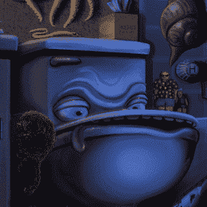

# 深情地拆开一个老式电脑游戏的工具

> 原文：<https://hackaday.com/2022/06/11/the-tools-that-lovingly-tore-apart-a-vintage-computer-game/>

电脑游戏资产的结构可能有点神秘，尤其是越老的游戏，当拆开像 1995 年的 [Night Light](https://voussoir.net/writing/night_light_1995) 这样的游戏时，可以预期会有一些逆向工程。

[vousoir]对 GTE 娱乐公司的这款游戏有着美好的回忆，该公司有一个有趣的“手电筒”机械师来服务于探索主题。在黑暗的房间里，一旦用一个由鼠标控制的手电筒照射，幽灵般的形状就会被发现是非常普通的(因此一点也不可怕)。

 提取游戏资产在一定程度上很简单，这要归功于它们被放置在一个方便的文件夹结构中，每一关都有分辨率适中的`.bmp`文件。但是也有一些不寻常的不到一秒钟长的`.mov`文件，这些需要更多的工作才能弄清楚。

原来，这些不寻常的电影文件有 80 帧长，每一帧都是一幅更大图像的一部分。【voussoir】用`ffmpeg`提取了每一帧，然后写了一个 Python 脚本把瓦片拼接在一起。看哪！结果是每个级别的作品的高分辨率版本。将前 16 帧拼接成一个 4×4 的网格会产生一个 1024×768 的图像，剩余的 64 帧可以放入一个 8×8 的网格中，从而产生一个奇妙的 2048×1376 的版本。最后一块是提取音频，但可悲的是，ISO[vousoir]使用的似乎有错误，并不是所有的音频幸存下来。

有了完整的资产在手，[vousoir]能够重新创建游戏的核心，这可以在报道进行到一半时看到。音频线索简单地播放，而手电筒效果在浏览器中用游戏的原始级别艺术品重新创建，这足以敲响那些怀旧的钟声。这是一个相当成功的项目，尽管并不是所有的资产都被追踪到了，也不是所有的音频都因为损坏而被提取出来了。如果你在这方面有什么见解，不要藏在心里！给[vousoir]发一封电子邮件，或者在这里发表评论。

在游戏方面，逆向工程有着悠久的历史，并且有时以不同寻常的方式表现出来，比如雅达利破解 NES 的时候。如果随后的法律挑战以不同的方式进行，今天的游戏格局可能会非常不同。