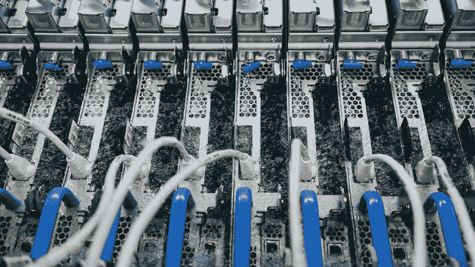

# 数据中心液体冷却的怪异世界

> 原文：<https://hackaday.com/2022/06/14/the-weird-world-of-liquid-cooling-for-datacenters/>

当谈到高性能台式电脑时，特别是在游戏领域，水冷是流行和有效的。然而，在数据中心的世界中，服务器通常依赖传统的空气冷却，并结合巨大的空调系统来保持服务器机房的适当温度。

然而，数据中心也可以使用水冷！它不总是看起来像你所期望的那样。

## 保持冷静

冷却对数据中心至关重要。让硬件过热会增加故障率，甚至会影响服务可用性。它还消耗大量能源，在普通数据中心，冷却消耗的能源占总能耗的 40%。这也会流入运行成本，因为能源并不便宜。

因此，冷却数据中心的任何效率提升都会带来诸多好处。除了通过降低能耗来提高可靠性和减少排放，密度也有好处。可用的冷却越有效，在不出现过热问题的情况下，在给定的空间中可以容纳的服务器和处理能力就越多。

相对于传统的空气冷却，水和液体冷却技术可能提供性能上的阶跃变化。这是因为与水或其他特殊的液体冷却剂相比，空气没有很大的热容量。把大量的热量转移到液体中要容易得多。在一些管辖区，甚至有人谈到利用数据中心的废热[来提供区域供热，](https://www.asetek.com/liquid-cooling/data-center/energy-savings-technology/q-a-with-andre/)与热空气相比，使用携带废热的热液体源要容易得多。

然而，液体冷却也有缺点。如果管理不当，泄漏会损坏电子设备，并且与运行简单的风扇和空调系统相比，这种系统通常会增加复杂性。自然，这种冷却性能的提高是有代价的，否则它已经是标准了。

## 各种方法

Danish company Asetek has experimented with direct water cooling of server hardware, while also exploring using the waste heat for district heating purposes. Credit: [Asetek press release](https://www.asetek.com/press-releases/asetek-delivers-waste-heat-to-the-aalborg-district-heating-network/)

对于数据中心来说，最明显的水冷方法是将服务器中的风扇冷却器换成水块，并将机架连接到水冷回路。这是可以实现的，一些公司提供[直接到芯片的冷却块](https://www.asetek.com/liquid-cooling/data-center/technology-for-data-centers/d2c-ingredient-coolers/)，然后可以连接到支持服务器机架中更广泛的液体冷却回路[。这与用水冷却台式电脑的原理是一样的，只是用水块代替了风扇和散热器。这种直接水冷服务器的方法有一个好处，即它可以提取大量的热量，有些人声称每个机架高达 80 千瓦。](https://www.asetek.com/liquid-cooling/data-center/technology-for-data-centers/inrackcdu/)

然而，这种方法有几个缺点。在安装到机架中之前，需要打开和修改服务器。这对于许多操作者来说是不希望的，并且安装过程中的任何错误都可能引入缺陷，这在时间和设备上都是昂贵的。当移除服务器时，由于需要断开水冷连接，服务和维护也变得复杂，尽管这可以通过特殊的“无滴”快速连接配件得到一定程度的缓解。

一种侵入性较小的方法是使用放置在[特殊水冷机架中的常规风冷服务器。](https://www.edpeurope.com/product/coldlogik-water-cooled-server-rack-2/#)这种方法无需修改服务器硬件。相反，安装在服务器机架背面的空气-水热交换器从热的服务器排气中吸收热量，并将其排放到液体冷却剂中。废气因此被冷却并返回室内，同时冷却剂带走废热。屋顶冷却塔，如本文顶部的图片所示，可以用来在冷却剂返回之前从冷却剂中提取热量。这不如直接从芯片水块中捕捉热量有效，但据称这种系统可以从每个机架中提取高达 45 千瓦的热量[。](https://www.edpeurope.com/product/coldlogik-water-cooled-server-rack-2/#)

除了使用未经修改的硬件，该系统大大降低了泄漏的危险。任何泄漏都将发生在服务器机架的背面，而不是直接在服务器的电路板上。此外，系统通常在负压下运行，因此空气从任何孔或损坏的管道中被吸入，而不是液体被允许泄漏。

Microsoft famously ran an underwater datacenter in a sealed tube back in 2018\. The experiment had several benefits over traditional land-based datacenters. Credit: [Microsoft](https://news.microsoft.com/innovation-stories/project-natick-underwater-datacenter/)

更极端的方法也存在。2018 年，微软通过在苏格兰海岸运行一个完全浸没的数据中心而掀起波澜。通过安装在防水管道中的一组传统服务器，热量被排到周围的水中，从而保持温度非常稳定。该项目运行了两年，发现密封的大气和低温可能是可靠性增加八倍的原因。众所周知，Natick 项目还承诺了其他的好处，比如将硬件设在海外可以降低土地成本。

不过，微软并没有固步自封，最近还研究了更大胆的概念。该公司开发了一种用于数据中心的两相浸入式冷却箱。在这种设计中，传统服务器被浸没在 3M 公司开发的专有液体中，这种液体在仅 50°C(122°F)的低温下沸腾。随着服务器硬件变热，液体也会变热。它吸收了大量的能量，这种能量被称为汽化潜热，是液体沸腾所必需的。气态冷却剂然后到达罐盖上的冷凝器，变回液态，并像雨一样落在下面的服务器上。

Microsoft has been experimenting with dumping servers in a non-conductive liquid which cools the immersed hardware via a phase change to gas. Note the bubbling liquid warmed by the heat of the servers. Credit: [Microsoft](https://news.microsoft.com/innovation-stories/datacenter-liquid-cooling/)

浸入式方法有助于服务器硬件和冷却液之间的良好传热。作为奖励，它不只是通过散热器冷却 CPU 的一小部分。相反，整个服务器可以自由地将热量释放到液体中。希望这将增加数据中心的硬件密度，并提高性能，因为浸没方法的高冷却能力允许在小得多的空间内更好地散热。

当然，这是一个复杂的高端解决方案，在成为主流之前还需要一段时间。数据中心的操作人员只是不习惯将他们的硬件浸泡在液体中，也不习惯在密封的容器中运行它们以允许这样的系统工作。很可能还会有一些令人头疼的维护问题，在打开浸没槽进行内部硬件的物理维护之前，必须关闭浸没槽。

随着人类继续渴望更多的计算能力，我们努力减少能源使用和排放，期待这一领域的进一步发展。纯粹的竞争本身也是一大驱动因素。任何能够降低运营成本、减少土地使用、提高性能的公司都将在市场上比竞争对手更有优势。随着时间的推移，预计水冷系统将变得更加主流，如果它们的主要好处值得所有的争论，一些古怪的想法将会被购买。这是一个在数据中心工程领域工作的激动人心的时刻，这是肯定的。