# 使用 BGA:设计和布局

> 原文：<https://hackaday.com/2022/06/20/working-with-bgas-design-and-layout/>

球栅阵列(BGA 封装)不再是计算机主板上大型复杂芯片的专属领地:今天，即使是简单的微控制器也可以使用这些小焊球。尽管如此，许多爱好者更喜欢 QFP 和 QFN 封装，因为它们更容易焊接。虽然这是一个公平的观点，BGA 封装可以节省大量空间，有时是唯一的选择:随着芯片短缺的持续，一些其他封装版本可能根本不可用。即使焊接也不一定要复杂:如果你已经熟悉焊膏和回流曲线，添加一两个 BGA 就相当容易了。

在本文中，我们将展示使用 BGA 芯片并不像看起来那么困难。重点将放在印刷电路板设计上:如何绘制正确的足迹，如何路由大量信号，以及您的 PCB 制造商应该具备哪些能力。我们将在以后的文章中讨论焊接和返工技术，但首先让我们看看为什么要使用 BGA。

## 这些球栅是什么东西？

随着 20 世纪 90 年代计算机技术的进步，我们电脑内部的主板变得越来越复杂。20 世纪 80 年代的 8 位数据总线让位于 CPU、主内存和扩展卡(如硬盘控制器和显示适配器)之间的 16 位、32 位甚至 64 位宽的总线。这些总线都必须被运进运出各种芯片，因此需要大量的引脚。

当时复杂芯片的典型封装是四方扁平封装(QFP)，每边都有一长排鸥翼形引脚。当引脚数增加到 200 个或更多时，这些封装变得越来越笨重:不仅与内部芯片相比它们变得非常大，引脚也变得非常小和脆弱。大型 QFP 芯片需要小心处理，以避免弯曲任何引脚，使芯片无法销售。

球栅阵列封装(BGA)就是为了解决这两个问题而开发的。将引脚放置在封装底部的网格中，而不是分散在边缘，这样的设计更节省面积。此外，焊球比小间距 QFP 封装上的小引脚坚固得多。尽管制造商最初担心制造和测试问题，但事实证明 BGA 封装非常可靠，并已在所有类型的电子设备中普遍存在。

下图显示了 1997 年老式 PC 主板的一部分，清楚地说明了 QFP 和 BGA 封装在面积效率上的差异。左边的 ATI VGA 控制器采用 208 引脚 QFP 封装，引脚间距为 0.5 毫米。右边的 Ali M1531 系统控制器设法在其 BGA 封装上安装了 328 个引脚，焊球的间距为 1.27 毫米，更加舒适。

[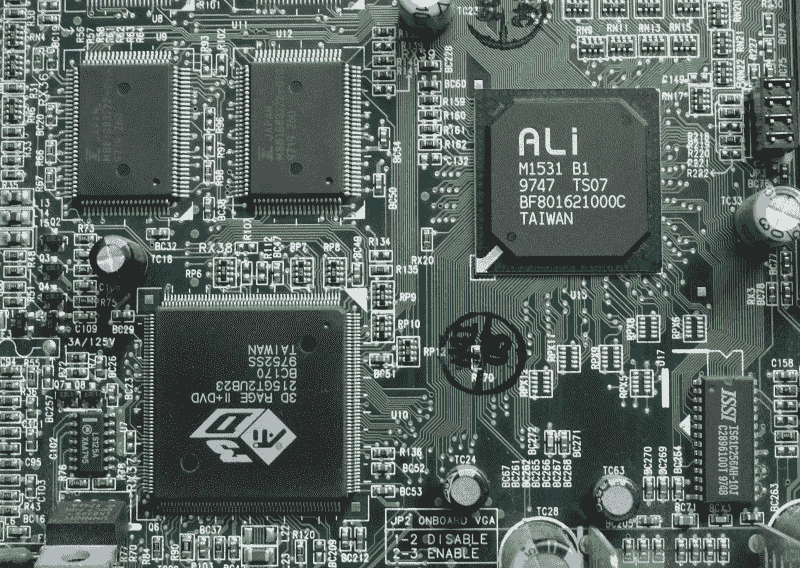](https://hackaday.com/wp-content/uploads/2022/06/QFP-vs-BGA-packages.jpg)

This 1997 PC motherboard sports an ATI 3D Rage II graphics chip in a QFP package and an Ali M1531 system controller in a BGA package. Note how both chips take up roughly the same amount of area, even though the BGA chip has 57 % more pins.

BGA 封装通常围绕中介层构建:一个小的印刷电路板，作为实际芯片和安装芯片的电路板之间的接口。芯片被引线键合到插入器上，并被保护性环氧树脂覆盖。插入器将信号从芯片边缘传送到底部的焊盘阵列，焊盘上附着有小焊球。然后将完成的 BGA 封装放在印刷电路板上并加热。焊球熔化并在板和插入器之间产生连接。

[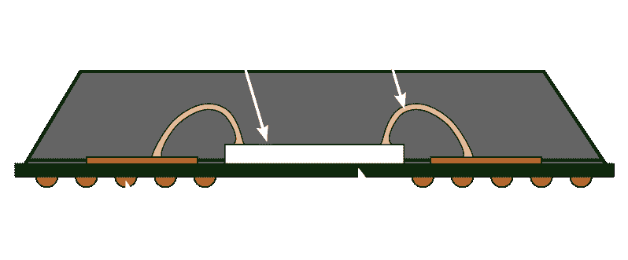](https://hackaday.com/wp-content/uploads/2022/06/BGA_Package_Sideview.png)

The internal structure of a typical BGA package (side view). Credit: [Tosaka, Serenthia, CC-BY-SA](https://commons.wikimedia.org/wiki/File:BGA_Package_Sideview.svg)

早期的典型 BGA 的球节距为 1.27 毫米。随着技术的进步，BGA 封装变得越来越小，直到中介层比内部的芯片大不了多少。这些小型化 BGA 被称为芯片级封装或 CSP，通常具有 1.0 至 0.5 毫米的球间距

然而，对小型化的追求并没有就此结束:半导体制造商最终开发出了倒装芯片 BGA，或晶圆级芯片规模封装(WL-CSP)，完全免除了中介层。相反，倒装芯片设计将焊球直接放置在芯片表面，间距可以小到 0.3 毫米。然后将芯片倒置安装在电路板上，要么背面有环氧树脂保护层，要么根本没有封装。

[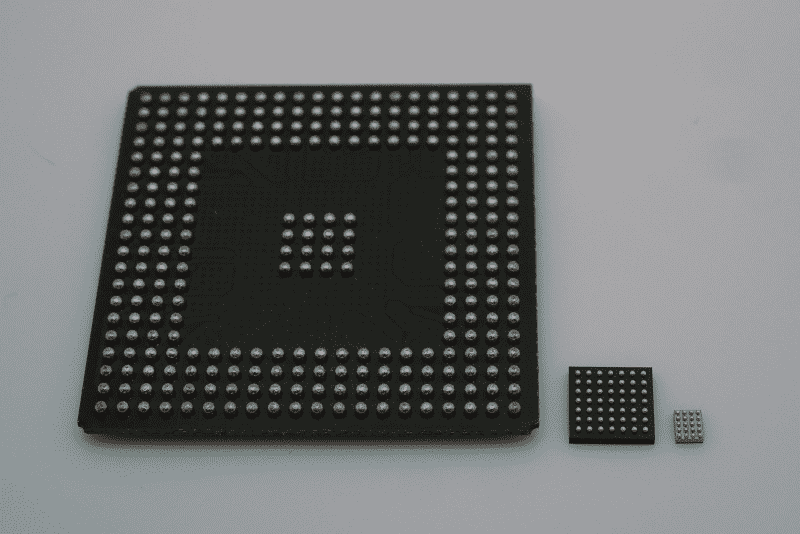](https://hackaday.com/wp-content/uploads/2022/06/BGA-vs-CSP-vs-WL-CSP.jpg)

Different BGA types: a classic BGA (272 pins, 1.27 mm pitch), a chip-scale package (49 pins, 0.65 mm pitch) and a wafer-level chip scale package (20 pins, 0.4 mm pitch).

不同的 BGA 型封装有各种各样的市场名称，制造商之间几乎没有标准化。但是如果你只是想使用 BGA 芯片，它叫什么甚至是如何制造的都不重要:所有类型的 PCB 布局技术都是一样的。那么让我们来看看如何为他们设计 PCB 布局。

## BGA 基础:焊盘和封装

想象以下场景:您正在设计一个最先进的激光雷达设置，并且您选择了 [TI 的 TDC7201](https://www.ti.com/product/TDC7201) 时间数字转换器来执行飞行时间测量。与它的前身 TDC7200 不同，这款芯片仅提供 25 引脚 nFBGA 封装，因此您别无选择，只能制作 BGA 板。你还需要一个微控制器来做一些数据处理，并决定用一个[微芯片 ATmega164](https://www.microchip.com/en-us/product/ATmega164A) 。不幸的是，今天的芯片短缺意味着 QFP 和 QFN 版本无处可寻，所以你最终只能使用 49 引脚 VFBGA 版本。至于为整个事情提供动力的 LDO 监管机构，你偶然发现了一个很好的交易:你最喜欢的供应商有 [ONSemi 的 NCP161](https://www.onsemi.com/products/power-management/linear-regulators-ldo/ncp161) 在售。你可能已经猜到了，它也采用 BGA 封装，在这种情况下是一个微小的四引脚版本。

那么，如何着手为这三个 BGA 芯片设计 PCB 呢？一如既往，制造商的数据手册是一个很好的起点。让我们先来看看 ON Semiconductor 如何为他们的 NCP161 绘制合适的尺寸:在数据手册[的第 21 页](https://www.onsemi.com/pdf/datasheet/ncp161-d.pdf)中，我们找到了推荐的焊盘图形，该图形使用 *NSMD* 型焊盘指定了 0.15 mm 的焊盘直径。

[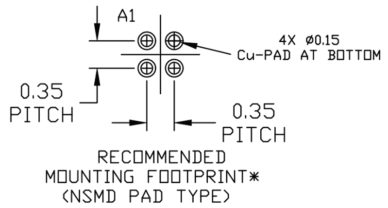](https://hackaday.com/wp-content/uploads/2022/06/NCP161-recommended-footprint.png)

The PCB footprint for the NCP161, as recommended in the datasheet. Credit: ON Semiconductor

NSMD 代表“无阻焊层定义”，指的是没有被阻焊层部分覆盖的焊盘。另一种选择是焊料掩模限定的焊盘，其中焊料掩模覆盖焊盘的一部分。虽然这两种类型都有其应用，但制造商的 BGA 芯片数据手册中通常推荐 NSMD 型，因为它能够实现更牢固的焊接连接:焊球可以夹住焊盘的侧面和顶部。

The difference between solder mask defined (left) and non-solder mask defined BGA pads (right)

如果我们在 KiCAD 中为我们的小型四引脚 BGA 封装绘制一个封装，两个选项如下所示。铜焊盘显示为红色，阻焊层开口为紫色。粉色轮廓是组件的庭院，它决定了其他组件可以安装的距离。

[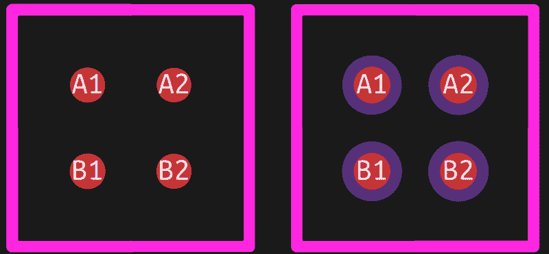](https://hackaday.com/wp-content/uploads/2022/06/4-pin-BGA-SMD-vs-NSMD-pads-in-KiCAD.png)

A four-pin BGA package with solder mask defined pads (left) and non-solder mask defined pads (right)

对于 NSMD 版本，阻焊层开口应略大于铜焊盘；在这种情况下，我们在 0.15 mm 焊盘上使用 0.25 mm 开口，这意味着焊料掩模开口在焊盘两侧仅延伸 0.05 mm。你应该和你的 PCB 制造商核实他们的阻焊膜是否足够精确；典型值为 2 密耳(0.05 毫米)，这意味着在最差的情况下，阻焊膜将几乎接触到焊盘的边缘。如果制造商无法提供更精确的对齐，您可能需要将焊盘开口放大一点。请记住，焊盘之间剩余的阻焊膜仍应满足最小阻焊膜碎片规则。

请注意，BGA 的焊盘不是按顺序编号的，而是按行列格式编号的:行从上到下标记为 A、B、C 等，而列从左到右编号。左上角的引脚 A1 通常由芯片顶侧的一些标记表示，以帮助您正确定位器件。

组装 PCB 时，尤其是手工组装时，有一点非常有用，那就是在丝印层上标出封装轮廓。由于你在放置芯片时看不到焊球和焊盘，丝网印刷是判断你是否正确放置芯片的唯一方法。不要忘记画出某种指示器来指出哪一个管脚是 A1，否则你仍然会猜测四个方向中的哪一个是正确的。

[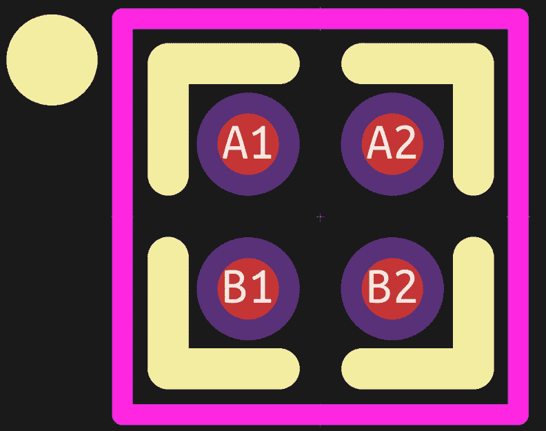](https://hackaday.com/wp-content/uploads/2022/06/4-pin-BGA-complete-footprint.png)

The complete PCB footprint for our four-pin BGA package

只需四个焊盘，就可以轻松地将这个电压调节器芯片连接到电路的其余部分。虽然为输入、输出和接地连接绘制几个大的电源层并与焊盘重叠可能很有吸引力，但通常最好先为每个焊盘绘制一条细线，然后将该线连接到任何更大的结构。

其原因是可焊性。当焊球熔化时，它会试图粘附到它能看到的任何铜上，这意味着焊盘和连接到它的走线。因此，在焊接过程中，芯片会受到沿迹线方向的轻微拉力。使连接径向对称应该抵消每个焊球施加的力，并确保更可预测的焊接过程。

[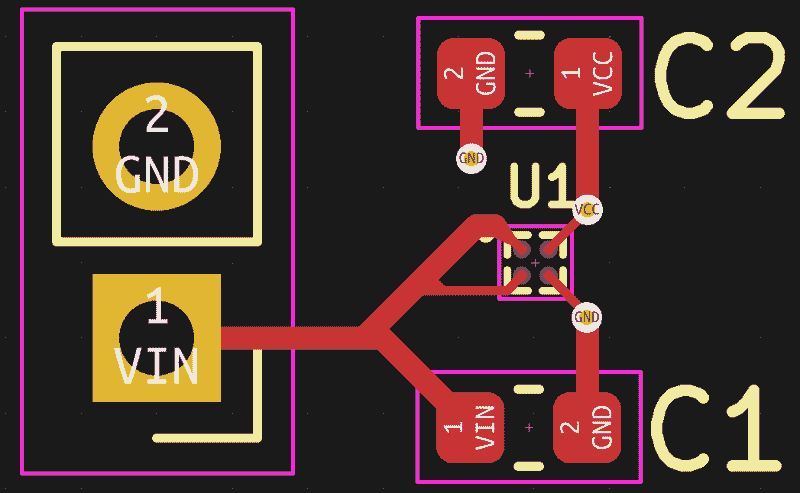](https://hackaday.com/wp-content/uploads/2022/06/4-pin-BGA-finished-routing.png)

The full layout of our LDO, with surrounding components. VCC and GND both drop down to power planes in the inner layers. Note how tiny the chip is, even compared to the 0603 sized capacitors.

## BGA 布线:狗骨式布局

当我们放置带有 7×7 焊球网格的微控制器时，事情变得有点复杂。将走线布线到所有 49 个焊盘并不那么简单，所以让我们从最简单的部分开始:外部引脚。我们可以简单地使用水平和垂直轨迹将它们向外布线。

[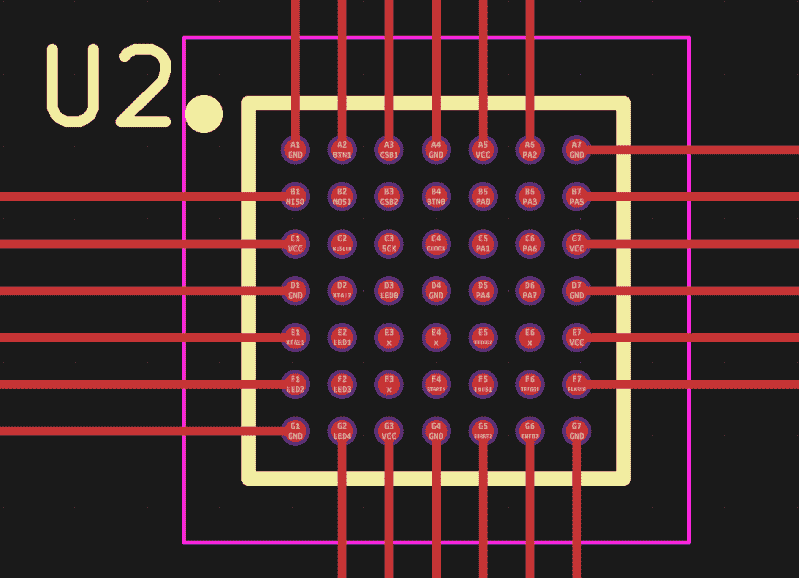](https://hackaday.com/wp-content/uploads/2022/06/49-pin-BGA-outside-routing.png)

第二层引脚可以通过外部焊盘之间的走线来布线。当然，我们的 PCB 设计规则应该允许这样:最小走线宽度和间隙应不超过 c = (p-d)/3，其中 p 为焊盘间距，d 为焊盘直径。在本例中，间距为 0.65 毫米，直径为 0.35 毫米，最小间隙和走线宽度降至 0.1 毫米:虽然紧凑，但对许多制造商来说仍然可行。

[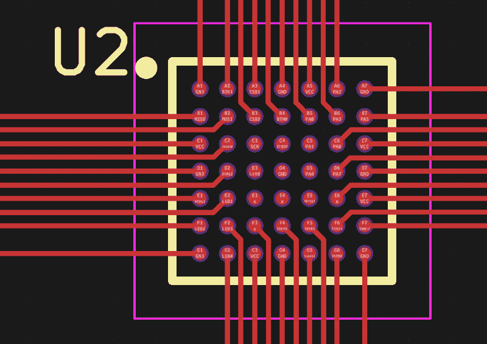](https://hackaday.com/wp-content/uploads/2022/06/49-pin-BGA-second-layer-routing.png)

从第三层开始，情况变得更加有趣，因为从这一点开始，我们将需要过孔来输出信号。最常见的方法是在每四个焊盘中间放置一个过孔，并从其中一个焊盘走一条对角线。

当然，我们首先应该确保我们有足够的空间来放置过孔。一点几何告诉我们到底需要多少:如果焊盘间距为 p，那么两个焊盘中心点的对角线距离为 p√2。焊盘内边缘之间的距离为 p√2–d，其中 d 为焊盘直径。

[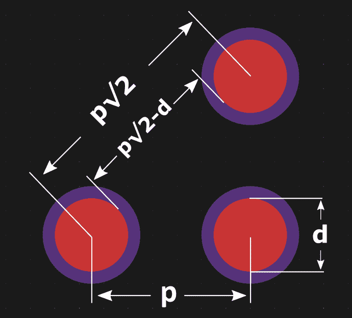](https://hackaday.com/wp-content/uploads/2022/06/dog-bone-via-geometry.png)

对于 ATmega164，p = 0.65 mm，d = 0.35 mm，这意味着焊盘之间有 0.57 mm 的空间。我们需要在焊盘和过孔之间留出至少 0.1 毫米的间隙，因此我们的最大过孔尺寸为 0.37 毫米。这几乎是大多数制造商能够提供的极限；您可以通过将过孔稍微移近它所连接的焊盘来获得一点空间，但对于像这样的小间距器件，您必须选择更昂贵的制造方案。

放置通孔后，我们最终得到如下所示的布局。这是**狗骨式布局风格**，因焊盘-迹线-通孔组合而得名，看起来有点像漫画中的骨头。在这个简单的例子中，我们只有九根狗骨形电缆和足够的空间在底层传送信号。如果我们有一个 8×8 的球封装，那么我们将有 16 个狗骨，底层将和顶层一样拥挤。

[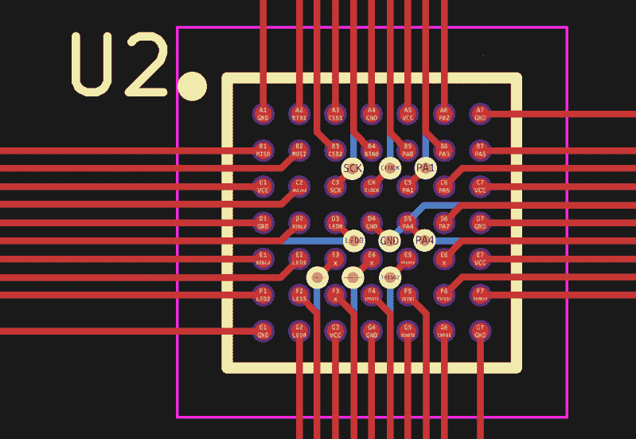](https://hackaday.com/wp-content/uploads/2022/06/49-pin-BGA-full-layer-routing.png)

狗骨式布局可以扩展到任何 BGA 尺寸。但是随着焊盘数量的增加，路由所有信号所需的层数也会增加。7×7 或 8×8 BGA 只需两个信号层即可布线，但 9×9 或 10×10 芯片至少需要三个信号层。一般来说，每增加两行焊盘就需要一个新的布线层。实际上，许多信号是电源和接地引脚，可以直接连接到内部电源层，不需要进一步布线。也可能有未使用的引脚，这又给了你更多的布线空间。

重要的是要确保你的 BGA 芯片下的所有过孔都被*固定*，或者被阻焊膜覆盖。如果不是这样，熔化的焊球可能会流到过孔和预期的焊盘上，导致错位和短路。您必须与您的 PCB 制造商核实他们是否支持拉幅过孔:这通常需要一个额外的处理步骤，在应用阻焊膜之前，用一些材料填充过孔。

## BGA 布线:焊盘过孔布局

BGA 布线的另一种布局方式是**焊盘内过孔**。这通常适用于间距非常小的 BGA，因为无法在四个焊盘之间安装过孔。基本思想很简单:在每个内层焊盘内放置一个过孔，并将信号从下层向外发送。问题是，你不能简单地在你的 BGA 焊盘上放置普通过孔，因为熔化的焊料会通过毛细作用被吸入过孔内部，导致不可靠的连接。因此，您的制造商需要填充过孔，并在顶部覆盖一层金属，以确保表面平整、可焊接。对此的官方术语是 IPC-4761 VII 型，通过填充和封盖。

过孔需要足够小，以适合 BGA 焊盘的内部，并且通常最终会成为微孔:通过激光而不是机械钻来钻孔。您也可以使用盲孔来简化布线，盲孔不会完全穿过电路板，而是在您希望的位置停止。这通常是一个成本高昂的选择，但如果您的设计使用最小的 VII 型微过孔和最紧密的间隙，那么您可能已经在使用包括盲孔在内的最昂贵的方案。下面是一个布局示例，显示了应用于 TDC7201 的过孔/焊盘技术，尽管在如此简单的 25 引脚器件上我们通常不需要这种技术。

[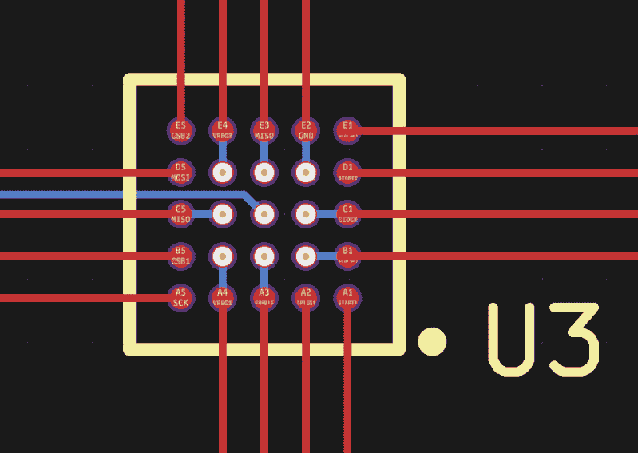](https://hackaday.com/wp-content/uploads/2022/06/25-pin-BGA-routed-via-in-pad.png)

无论您使用狗骨式布局还是焊盘过孔式布局，一旦您成功地将所有信号带到 BGA 的边缘(这一过程称为“逃逸布线”)，PCB 设计的其余部分将几乎就像您使用 QFP 或 QFN 封装一样。最终结果可能类似于本文顶部显示的图像。

如你所见，为中小型 BGA 封装设计 PCB 并不复杂。只要 PCB 制造商提供的最小走线间距、间隙和过孔尺寸与您计划使用的芯片的焊盘尺寸和间距相匹配，就万事俱备了。几乎所有制造商都可以生产 1.27 mm 间距的经典 BGA，而间距低至 0.65 mm 的更小芯片尺寸封装通常需要一种更先进的工艺选项，并有更严格的设计规则。

最小的晶圆级封装，球间距为 0.5 mm 或更小，只能在最先进的生产线上加工。如果你发现自己试图为这么小的芯片设计 PCB，那么继续寻找 QFN 或 QFP 版本可能是值得的，因为用不可制造的 PCB 代替不可获得的芯片没有什么意义。