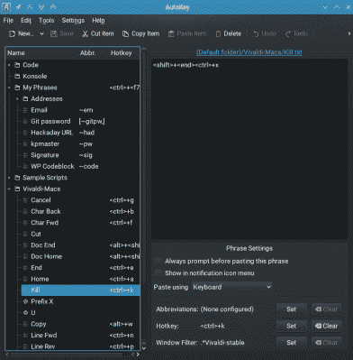
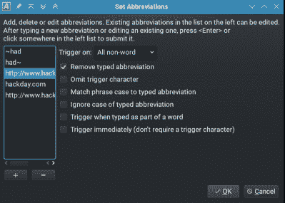
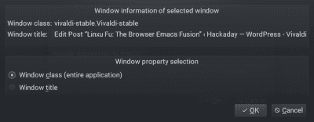

# Linux Fu:浏览器 Emacs 融合

> 原文：<https://hackaday.com/2022/07/06/linux-fu-the-browser-emacs-fusion/>

众所周知，我有一些东西永久地烙印在我的神经元中:1802 指令集、WordStar 的命令和 emacs 的命令。曾经有一段时间，emacs 几乎是我的操作系统。没有 X11，emacs 提供了一种在一个窗口中使用 shell、检查邮件和保持工作开放的方法。

我仍然经常使用 emacs(尽管我对带有 emacs keybinding 扩展的 vscode 越来越满意)。但是我也花了很多时间——就像现在——在网络浏览器中写作。尤其是如果我写的是代码，很难记住你必须使用哪一组键，而我很久以来就想做些什么。答案是一个非常酷的程序，叫做 Autokey。(你可以[为它下载我的文件](https://drive.google.com/drive/folders/14zrEW0xB1mqKde4s_FI-VmQ8Q2PZJ62w?usp=sharing)，但你可能想先读更多。)如果你换成了 Wayland，它可能就不起作用了，但它可以帮你做很多事情，从帮你节省一些打字时间，到重新编程你最喜欢的程序，让它拥有不同的按键。然而，它也不是没有问题，我会告诉你我所知道的。

## 价值主张

Autokey 位于您的系统托盘中，它会观察您键入的内容。最简单的用法是，你可以设置不同的短语来代替你输入的内容。

例如，我可能会重新编程，为了节省打字时间，我必须以黑客身份出现。我通常在开头或结尾使用一些奇怪的字符，这样我就不会意外触发事件。所以也许我厌倦了打字或者打错。我可以设置`~had`自动为我输入正确的 URL。

## 脚本与短语

如果这就是 AutoKey 所做的一切，那就非常方便了。但它的作用远不止于此。另一方面，如果这就是你想要的，使用短语很容易设置。一个短语有两部分:一个触发器和一些文本。触发器可以是热键(比如 Alt+Shift+F6)，也可以是你输入的文本，比如`~had`。可以添加多个缩写，所以如果我想让程序自动纠正我的拼写错误，我可以额外触发`had~`和`[http://www.hakday.com](http://www.hakday.com)`。



Autokey is easy to set up for simple text replacement, but can also accommodate complex Python scripts

一个短语只能有一个热键，但是你可以有一个热键和缩写；任何一个都会触发这个短语。当然，您也可以支持具有多个相同条目的多个热键。最后，您可以将匹配限制在与正则表达式匹配的特定窗口类。所以有可能你的文字处理器有一套快捷方式，而你的网络浏览器有另一套快捷方式。

然而，真正的力量在于你可以创建脚本*而不是短语*。除了不是键入短语，而是运行一段 Python 代码之外，它们完全相同。有一些[类](https://autokey.github.io)可以帮助你从脚本中控制键盘和鼠标。你甚至可以使用 QT 或 GTK 创建 GUI 对话框。然而，我发现使用脚本有一个小小的缺点，但是对于许多事情来说，它们工作得很好。你马上就会明白我的意思。

除了脚本之外，短语还可以包含某些动态内容，比如日期、文件，甚至是程序的输出。还提供了在文本输入完成后将光标定位在某一点的功能，这对于创建代码片段很有用。

## 电源缩写



There are many options for processing triggers for abbreviations

有几个有用的选项可以应用于缩写。首先，您可以控制它们如何向目标程序发送文本。我通常使用键盘方法来模拟打字，因为我将使用特殊字符，但您也可以使用几种常见的快捷键之一粘贴文本。也就是说，程序可以用你的短语加载剪贴板，然后用 Control+V 粘贴。

当你设置缩写时，真正的力量就来了。通过一个对话框，您可以选择触发词列表，并可以设置选项。默认情况下，缩写不会展开，直到您键入一些非单词字符。您也可以要求空格或制表符。然而，还有其他选择。例如，您可以让 Autokey 立即触发，或者即使文本是另一个单词的一部分。有忽略或尊重大小写等选项。

## 窗口类

您可以用来控制触发逻辑的最后一件事是将脚本或短语限制为匹配正则表达式的窗口类。这很好，因为你可能不想把奇怪的东西映射到所有的窗口。当然，让`!address`在每个程序中输入你的邮件地址是很方便的，但是如果你想让`main`扩展成一个样板 main 函数，你可能不喜欢在 LibreOffice 中出现这种情况。

在我的例子中，窗口类特性非常重要，因为我不想在每个程序中重新映射像 control+s 这样的东西，只在浏览器中。

## 一起

那么，如何将所有这些放在一起模拟 emacs 呢？大多数命令都非常简单。例如，在 emacs 中，control+s 启动一个搜索，因此使用该热键创建一个阶段就足够了，该热键键入: <ctrl>+f，浏览器知道这是一个搜索。显然，你不能轻易做浏览器不知道如何做的事情。例如，使用 Control+r 进行反向搜索是不可行的。我以这种方式映射了十几个基本的 emacs 命令。我确实禁用了 ctrl+w 热键来复制剪贴板，因为浏览器用它来关闭标签页，我不想阻止它。</ctrl>

我使用内置工具来查找我使用的 Vivaldi 浏览器的类。我后来发现我需要在这方面做出改变，正如你将看到的。

目前，这已经解决了一个关键的命令。但是，也有双字符命令。我有一个计划，但那个计划并不太奏效。目前，我只是没有它们，但我在代码中留下了一个禁用的示例供您查看。

因为您可以执行一个脚本，并且脚本有一个全局变量存储机制，所以我的计划很简单。考虑 control+xu，这是用于撤销的电子邮件。您不能在缩写中使用非打印字符，因此您必须使用单个热键来处理这种情况。我的计划是设置 control+x 来打开脚本全局存储中的前缀标志。然后，我可以使用 Autokey 将 u 视为热键——只是字母 u——并根据标志的状态发送 u 或 control+z。巧合的是，代码也会重置标志。

## 问题

即使一切顺利，这也存在问题，但事实并非如此。例如，如果您按下 control+x，然后按下一个意外的键，标志将保持设置，下次 Autokey 看到 u 时，您将得到一个撤销。那会让你大吃一惊！看起来正确的做法应该是启用一个无所不包的规则，或者让脚本读取一个密钥。然而，似乎不可能做到这一点，至少，不容易。

然而，我愿意接受这个限制。我为 control+x 写了一点 Python 代码:

```

store.set_global_value("vmacs-prefix-x","true");

```

然后，为了一次只测试一件事，我对字母 u 做了如下操作:

```

state=store.get_global_value("vmacs-prefix-x");
if state == "true":
   keyboard.send_keys("<ctrl>+z");
   store.set_global_value("vmacs-prefix-x","false");
else:
   keyboard.send_key("U");  # note send key will respect shift, etc.

```

我很高兴它奏效了。算是吧。当我在打字的时候，我注意到有什么不对劲。我打字相当快，但有些东西一直让我分心，我不知道是什么。我终于意识到，当任何 Autokey 脚本或短语运行时，浏览器会在一瞬间失去焦点。当你按下光标指令时，你不会注意到，但当你快速打字时，小心！我留下了脚本，但是像用 control+w 一样关闭了它们。您可能对短暂的断开不太敏感，如果是这样，您可能希望以类似的方式实现其他两个键的组合。

## 避免失望

我遇到的另一个问题是非常失望。宏在多行编辑器或 WordPress 中不工作，我在那里花了太多时间。快速检查显示编辑框有一个不同的窗口类。我最终把过滤器变成了一个正则表达式:`.*Vivalid-stable`。当然，如果你使用的是不同的浏览器，你需要进行调整。

[](https://hackaday.com/wp-content/uploads/2022/07/window.png)

AutoKey can probe Window properties for you.

我仍然有点失望，虽然两个键的组合是可行的，但对我来说不实用。我怀疑，如果你试图模拟 vi，它也会咬你一口，因为你必须抓住几乎所有正常的键。

尽管如此，我还是用 emacs 语义写了整篇文章，除了偶尔忘记用 control+y 粘贴之外，一切都很顺利。我可能还会把 control+w 变回 no，因为我在粘贴的时候不小心关闭了几次窗口。

有些浏览器扩展声称可以让你在自己选择的编辑器中编辑文本字段。它们确实可以工作，但是它们只不过是将文本来回复制给编辑器。这对于小事情来说很棒，但是试图用 WordPress 的特性写一篇大文章并不实际。有了这个系统，你可以在编辑文本和在地址栏中使用 emacs 语义。让这个系统适应几乎任何程序都是微不足道的。

您可能不关心 emacs，但是使用 Autokey 这样的程序，您可以做很多节省时间的事情。从 URL 的快捷方式，到 bash 一行程序，再到你一遍又一遍输入的东西，Autokey 对于简单的事情设置起来很简单，对于处理大任务又足够复杂。我只希望它能在韦兰管用。