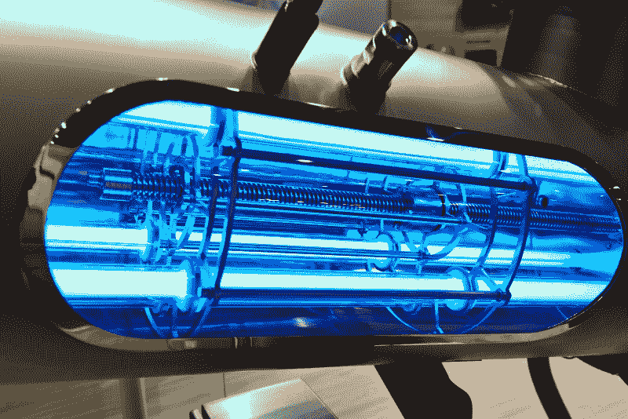

# 大化学:超纯水

> 原文：<https://hackaday.com/2022/07/07/big-chemistry-ultrapure-water/>

我毕业后的第一份工作是在马萨诸塞州剑桥的一家生物技术公司。这是一个小团队，每个人都有一份“实验室工作”,除了他们被雇来做的任何科学工作——维护实验室的公共区域。我的工作是维护水净化系统，确保每个人都有充足的纯净去离子水。这项工作主要包括更换最终抛光装置的过滤器和离子交换盒，从而将自来水净化到足以用于科学研究。

当我更换过滤包时，我总是对其中的黏液和沉积物层感到惊讶和厌恶。窗外查尔斯河岸的一瞥——我喜欢那脏水——足以解释我所看到的一切，这是一个教训，告诉我在你饮用、烹饪和洗澡的水中混入了多少其他物质。

虽然我们人类通常可以很好地处理相当纯净的水，但我们的工业过程却完全是另一回事。从发电厂到制药工厂，一切都需要纯度高得多的水，但没有什么比半导体工厂的专业纳米操作需要更纯净的水。但是，普通的自来水是如何转变成如此纯净的化学物质，以至于污染物可以用万亿分之一来衡量呢？晶圆厂如何生产足够的超纯水来满足他们的需求？一些大的化学反应。

## 请给我水

虽然不同行业的标准不同，但一般来说，超纯水(UPW)达到的纯度几乎令人难以置信，与饮用水相比，它的纯度更低。即使是最纯净的饮用水实际上也是溶解在水中的矿物质和气体的复杂混合物，其中还悬浮着相当数量的颗粒。作为 UPW 与饮用水有多么不同的一个例子，美国环境保护署将饮用水中的铬含量限制在百万分之 0.1。但是对于半导体级的 UPW，极限是万亿分之二——少了五万分之一！

当你想到半导体制造中涉及的规模时，严格的 UPW 标准是完全合理的。蚀刻在硅晶片上的特征的尺寸因工艺节点而异，但当前的工艺很容易被直径只有几纳米的颗粒杀死。就规模而言，一个冠状病毒粒子的数量级为 100 纳米。在 UPW 控制颗粒物可能是件棘手的事情，主要是因为颗粒物可能来自管道、水箱、泵和净化过程中使用的化学品桶中的任何地方。

颗粒不是唯一需要处理的污染物。虽然工厂 UPW 设备光滑、干净的表面看起来不适合生命繁衍，但细菌已经被证明有能力在最不可能的生态位定居。生物膜会给 UPW 系统带来巨大的问题，它们可以在任何允许积水的地方形成。生物膜会导致颗粒污染和总可氧化碳(TOC，又名总有机碳)，后者本质上是死细菌的残余。

除了颗粒和总有机碳，UPW 污染的其他主要贡献者往往是水溶性物质，如矿物质和气体。钠是一个大问题，主要是因为它往往是用于处理 UPW 的离子交换树脂出现问题的主要指标——下文将详细介绍。硅酸盐也是一个问题，溶解气体也是如此——氧气具有很高的活性，可以很容易地氧化构建芯片所需的金属层，二氧化碳在水中很容易离解形成碳酸，这增加了水的导电性，对晶片工艺有害。

## 涂上指甲油

简而言之，用于制造芯片的水需要尽可能接近“纯水”。然而，要做到这一点，需要付出巨大的努力。不仅仅是纯度，还有体积。一家半导体工厂每天使用令人难以置信的大量 UPW——200 万至 300 万加仑(700 万至 1200 万升)。建立能够净化如此大量的水达到如此严格的要求，在需要之前保持这种纯度，并在可能的情况下回收利用的工艺是一个巨大的挑战。

UPW 生产始于原水的批量处理。这里的步骤包括在大多数城市废水处理厂出现的过程——添加絮凝剂和凝结剂化合物以将任何悬浮固体聚集在一起，沉淀以让团块沉淀下来，并通过大量过滤去除其余部分。相对而言，这些步骤是为了去除最大、最脏的部分；大多数晶圆厂的给水是适合人类饮用的市政水，并为后续去除更细微污染物的过程准备水。

下一步通常是一两个阶段的反渗透，或 RO。顾名思义，反渗透与渗透的自然过程相反，当半透膜上的两种溶质浓度不平衡时，就会发生反渗透。溶剂倾向于从溶质浓度低的一侧迁移到浓度更高的一侧，以消除不平衡。在反渗透中，渗透压是通过用泵将能量输入系统来克服的，这迫使溶剂(水)穿过膜迁移到溶质浓度较低的一侧，留下溶质。半透膜由无纺布支撑层设计而成，上面覆盖有聚合物层，如聚砜和聚酰胺，形成水可以通过但较大的溶质不能通过的屏障。

 [https://www.youtube.com/embed/aVdWqbpbv_Y?version=3&rel=1&showsearch=0&showinfo=1&iv_load_policy=1&fs=1&hl=en-US&autohide=2&wmode=transparent](https://www.youtube.com/embed/aVdWqbpbv_Y?version=3&rel=1&showsearch=0&showinfo=1&iv_load_policy=1&fs=1&hl=en-US&autohide=2&wmode=transparent)

紫外线用于 UPW 生产的几个阶段。正确波长的紫外线不仅能杀死预处理步骤后留下的任何细菌，还能降解细菌残余物中的生物聚合物，如蛋白质、DNA 和 RNA。这些大分子在这一阶段被切碎得越多，在以后的加工阶段就越容易被除去。

Cutaway view of a UV water treatment system. Source: Adobe Stock

为了从工艺用水中去除带电污染物，使用离子交换处理。离子交换使用特殊的聚合物树脂珠，其表面有结合位点。结合位点要么带正电荷(阳离子交换剂)，要么带负电荷(阴离子交换剂)。当工艺用水流过一桶离子交换树脂时，溶液中的带电离子倾向于与带有相反电荷的树脂结合，有效地将它们从工艺用水中清除。

有时也使用离子交换的变体，称为电去离子(EDI)。EDI 基本上将离子交换与反渗透和电解结合起来，利用电流通过由半透膜隔开的多个树脂床，从工艺用水中去除离子。

 [https://www.youtube.com/embed/AFTWjU04yg4?version=3&rel=1&showsearch=0&showinfo=1&iv_load_policy=1&fs=1&hl=en-US&autohide=2&wmode=transparent](https://www.youtube.com/embed/AFTWjU04yg4?version=3&rel=1&showsearch=0&showinfo=1&iv_load_policy=1&fs=1&hl=en-US&autohide=2&wmode=transparent)

## 测量不可测量的事物

经过一些最终的脱气步骤后，UPW 最终纯净到足以进入 fab 工艺。或者是？这很难知道，因为 UPW 足够干净，可以满足制造工艺的要求，但太干净了，不能用任何现有的技术来测量。这让工程师们陷入了困境，因为通常知道 UPW 工艺是否有缺陷的唯一可靠方法是通过观察芯片产量的下降，至少可以说是昂贵而浪费的检测。

尽管如此，仍有一些计量方法用于监控 UPW 过程。主要测量的是水的电导率，可用于判断是否存在多种污染物。出于实际原因，通常测量电导率的倒数，即电阻率，纯水在 25°c 时的读数为 18.18 mω⋅cm。电阻率非常敏感，添加十亿分之 0.1 的钠会使电阻率降至 18.11 mω⋅cm，这样的下降可能表明上游离子交换床需要注意。如前所述，系统中的空气泄漏可以通过 CO [2] 溶解到系统中引起的电阻率变化来检测。

但是当谈到测量颗粒时，没有多少方法可以检测出像 fab 级 UPW 所要求的这样稀释和微小的颗粒。一项即将实现的技术是动态光散射(DLS)，它将偏振光从水样中反射出来。散射光通过另一个偏振器到达探测器，在探测器上拍摄散射光的快照。这个过程在很短的时间后重复进行，大约在微秒到纳秒之间，然后对图像进行比较。这两幅图像之间的差异可以归因于样品中任何粒子的布朗运动，以及由粒子运动引起的相长干涉或相消干涉。这导致颗粒计数和尺寸分布的测量，潜在地下降到亚纳米范围。

晶圆厂的 UPW 系统还有很多，包括极其复杂的回收系统，在晶圆厂流程中使用废水后，回收废水以供进一步使用。UPW 标准也是一个不断变化的目标。过去在较大的工艺节点中未被注意到的污染物现在被认为是 5 纳米节点的杀手颗粒，因此随着工艺节点的发展，UPW 标准将变得更加严格。工程师们将不得不跟上，以某种方式建立系统，可以生产出比可测量的水更纯净的海洋。