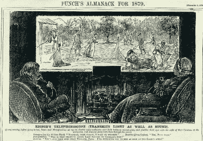
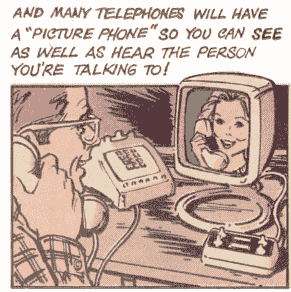
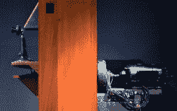
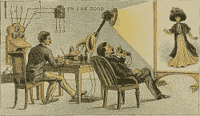

# 我们的可视电话在哪里？

> 原文：<https://hackaday.com/2022/07/11/where-are-our-video-phones/>

视频会议已经以这种或那种形式存在了一段时间，但直到疫情才在几乎所有人面前凸显出来。在某种程度上，这是电话公司、未来主义者和科幻作家长期承诺的东西的交付:可视电话。但是很少有人想象出可视电话实际上会是什么样子。我们认为看看一些历史预测和将这项技术推向大众市场的尝试可能会很有趣。

事实是，我们没有真正的可视电话。我们的电脑有足够的带宽来传输现场视频和音频。您的 FaceTime 通话将通过数据网络进行。相比之下，比方说，通过电话线发送传真实际上是一份文件。

 那么人们是如何想象图片手机的呢？它们是什么时候出现的？答案可能会让你大吃一惊。我们不确定多久以前人们就想象出了这样一个装置，但是我们知道早在 1930 年就有一个这样的装置。

早在 19 世纪 70 年代，科幻小说就提到了电话望远镜，一位漫画家将这一意图归因于未来版的托马斯·爱迪生。亚历山大·格雷厄姆·贝尔确实认为这样的事情是可能的，甚至写道使用硒作为一种感知光并将其转化为电的方法。不过，他知道传感器必须非常小。这是在 20 世纪早期机电电视开始出现之前的几年。

## 可视电话概述

From the Radio Shack comic: The New Science Fair Story of Electronics” from 1978.

你可以争论到底是什么构成了一部可视电话。美国电话电报公司在 1992 年提供了一款商用可视电话——我们很快会谈到它——它以每秒 10 帧的速度显示黑白图像。虽然以今天的标准来看这很粗糙，但大多数人会同意这是视频。但是一些老的尝试使用了类似于业余无线电操作员所说的慢扫描电视的东西。照相机会捕捉黑白图像，并通过音频像传真一样发送。这意味着你有 6 或 8 秒的延迟，你可以看到图片。大多数人不会考虑这个视频，但这是一个滑坡，你必须划清界限。

我们记得 Radio Shack 曾短暂地为这些手机做过广告，尽管我们现在找不到任何证据。但我们认为它们是三菱 Luma 手机。无论如何，这些类型的手机大多是新奇的，在消费者领域卖得不好。

## 古代史

众所周知，电话公司本身对可视电话(一种商标)最感兴趣，事实上，每个人都认为到 2001 年，每个付费电话都会有一个摄像头和一个屏幕。没有多少人认为付费电话本身是濒危物种。甚至 1927 年的经典 *Metropolis* 也有视频电话。

 [https://www.youtube.com/embed/ZXokqxBQsFM?version=3&rel=1&showsearch=0&showinfo=1&iv_load_policy=1&fs=1&hl=en-US&autohide=2&wmode=transparent](https://www.youtube.com/embed/ZXokqxBQsFM?version=3&rel=1&showsearch=0&showinfo=1&iv_load_policy=1&fs=1&hl=en-US&autohide=2&wmode=transparent)

1927 年，当电话公司将时任商务部长的赫伯特·胡佛的演讲从华盛顿发送到纽约时，它开始致力于视频通话。视频是单向的，并且帧速率有限。《纽约时报》指出，胡佛的脸无法清晰辨认。

 所使用的设备看起来很像这里看到的 1927 年的原型。图像的扫描是用机械磁盘完成的，这是有限制的。

在有办法压缩信号之前，通过电话线获取这么多数据将是一个挑战。事实上，图像通过多条电话线传输。对于机械系统，发送和接收盘上的电机也需要同步，这提出了另一个技术挑战。这家电话公司和一个大约 200 人的团队持续研究这个名为 Ikonophone 的系统好几年了。在第二次世界大战期间，工作放缓，但到了 20 世纪 50 年代，该公司将恢复工作的系统，现在被称为可视电话。

与此同时，在世界其他地方，德国人早在 1936 年就在柏林和莱比锡的邮局之间开通了公共可视电话服务。一条 100 英里长的专用电缆连接了两部结合了飞点扫描仪和阴极射线管的电话。视频相当不错，每秒 25 帧，分辨率 150 线。该系统最终增加到 180 线的分辨率和其他路线，包括汉堡，慕尼黑和纽伦堡。每个城市有两个电话亭，一次通话的费用大约是普通工人周薪的 1/15。法国也有类似的系统。这些邮局的可视电话，像美国版本一样，在战争期间停止使用。

## 电视电话

到 20 世纪 50 年代中期，使用信号压缩的原型可视电话可以通过普通电话线每两秒钟传输一次图像。这部手机包含一个存储管或磁鼓。到 1964 年，帧速率更好的第一代可视电话出现在纽约世界博览会和迪斯尼乐园。到 1964 年，出现了几个可视电话亭，但它们并不十分受欢迎，主要是因为三分钟的费用可能高达 27 美元——今天超过 250 美元。到 1968 年，电话亭消失了。

然而，Mod II 在 1970 年被用于视频会议。成本很高。这款手机售价 150 美元，第一部手机的服务费约为每月 160 美元，每增加一部手机的服务费为 50 美元。以这个价格，你可以打整整 30 分钟的电话，之后每分钟支付 25 美分。最终，价格降了下来，但在 70 年代初是一大笔钱。

以这个价格，你可以以每秒 30 帧的速度获得大约 250 行的分辨率。看起来你还需要一个扬声器来播放音频和信号——通过一个额外的盒子。视频有两条独立的电话线。早期的模型不是彩色的。

## 最终分析

不幸的是，对于美国电话电报公司来说，他们几十年来开发的可视电话是一个商业失败。仅官方项目就历时 15 年，耗资约 5 亿美元。电话公司曾预测到 1975 年将有 10 万部电话投入使用。真实的数字是数百。

他们在 20 世纪 90 年代初再次尝试向消费者销售可视电话 2500。每张 1500 美元，从每秒 10 帧到每秒 1/3 帧不等，卖得不是很好。令人惊讶的是，他们显然卖出了约 30，000 套，但这还不足以收回投资。

其他国家尝试了类似的系统，结果相似。法国、瑞典和英国都有某种形式的视频电话，并且都有同样的问题——电话线的低带宽不利于视频直播。

Villemard’s 1910 drawing of life in the year 2000 shows a video call in progress.

答案是数字网络和技术，尽管这并不总是显而易见的。例如，以太网的早期竞争对手 ARCNET 可以在某些配置中为模拟视频信号保留带宽。

你可以用数字技术压缩视频，网络带宽一直在上升。因此，随着压缩变得更好，带宽也增加了，今天，同时与大量参与者进行视频会议并不罕见。虽然它看起来不太像 Villemard 在 1910 年对 2000 年的视频会议的想象，但也不远了。

如果你想黑掉一些相关的东西，你可以创建一个镜像系统，让你在看屏幕的同时进行眼神交流。或者，做一个真正的黑客，在文本模式下进行你的[会议](https://hackaday.com/2020/12/15/real-hackers-videoconference-in-terminal/)。我们只是很高兴今天的视频电话版本不会让你看到我们在控制室里踱步等待电话，就像在大都会(见下文)那样。我们仍然不确定从那些手机里出来的纸带是干什么用的。

 [https://www.youtube.com/embed/griiRL8Yvu0?version=3&rel=1&showsearch=0&showinfo=1&iv_load_policy=1&fs=1&hl=en-US&autohide=2&wmode=transparent](https://www.youtube.com/embed/griiRL8Yvu0?version=3&rel=1&showsearch=0&showinfo=1&iv_load_policy=1&fs=1&hl=en-US&autohide=2&wmode=transparent)

