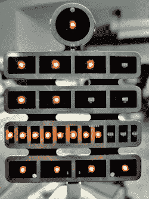

# 柏林钟的灵感来自科幻小说，看起来不可思议

> 原文：<https://hackaday.com/2022/07/07/berlin-clock-takes-inspiration-from-sci-fi-sources-looks-incredible/>

如果 HAL9000 的眼睛是黄色的，放在受 Altair 8800 启发的前面板上，会是什么样子？你会看到今天的特写， [[Stephan]的柏林之钟](https://github.com/designer2k2/BerlinUhr)，一个柏林钟的华丽小特写。

在 Hackaday，我们对时钟制作情有独钟。他们从早期就给我们的页面增色不少。当我们看到这个超酷的柏林钟时，我们忍不住想和所有读者分享它。对于那些不熟悉柏林钟的人来说，这是一个由 24 个灯组成的钟，[是 1975 年第一个这种类型的钟](https://en.wikipedia.org/wiki/Mengenlehreuhr)。

 【斯蒂芬】的建造引人注目，不仅因为它是一个美丽的设计，而且是设计和建造中的工作。几英寸高的 BerlinUhr 仅由 USB-C 连接支撑，但也可以挂在墙上。RTC 由 CR1216 支持，ATtiny167 为操作提供大脑。

KPS-3227 光传感器是该建筑的一个简洁部分，用于根据环境照明调整 LED 亮度。KiCad 的封装不是直接插入 PCB，而是有一些引脚颠倒了，这让[Stephan]学会了如何纠正它，并为 KiCad 做出了贡献。干得好！

顺便说一句，我们没有拿时钟开玩笑——看看这个帖子上 2005 年的[原子手表的链接，还有这个 2006 年](https://hackaday.com/2005/10/01/hackaday-links-14/)[俄罗斯 VFD 时钟——带视频](https://hackaday.com/2006/10/10/russian-vfd/)！

你有你自己最喜欢的钟吗？你想在我们的网页上看到吗？请务必[提交小费](https://hackaday.com/submit-a-tip/)！