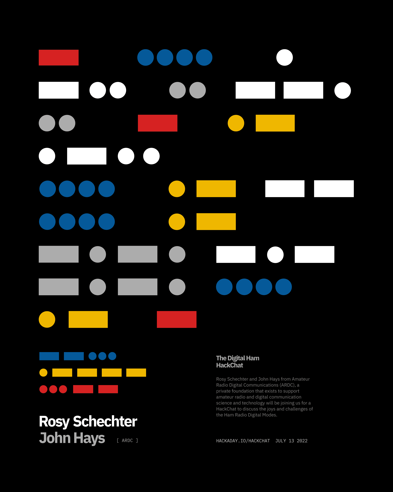

# 数字火腿黑客聊天

> 原文：<https://hackaday.com/2022/07/11/the-digital-ham-hack-chat/>

加入我们 7 月 13 日星期三中午太平洋时间与 Rosy Schechter 和 John Hays 的[数字火腿黑客聊天](https://hackaday.io/event/185924-the-digital-ham-hack-chat)！

在其存在的大部分时间里，业余无线电一直是模拟艺术的精髓。从无线电诞生之初，业余爱好者们就一直在拼凑电路以提供无线电频谱，一路上使用他们设法获得或发明的任何射频魔法。从无线电的结构到他们通过无线电波进行的对话的性质，业余无线电在很大程度上是一种模拟体验。

但是如果火腿是什么的话，他们是足智多谋的，而且他们有很长的历史来利用当前的艺术状态。因此，当电气工程开始进入数字世界时，火腿也开始进入数字世界。无线电打字、传真和其他文本和数据模式导致了像分组无线电这样的东西，这反过来又给了我们像 APRS、FT8 和 PACTOR 这样的强大工具，在这些工具上建立了当前丰富的位置报告基础设施、[弱信号数字接触](https://hackaday.com/2021/02/10/the-50-ham-digital-modes-with-wsjt-x/)和[信标](https://hackaday.com/2021/04/15/the-50-ham-a-simple-wspr-beacon/)，以及独立于互联网连接的电子邮件服务。甚至有一个完整的 TCP/IP 网络使用业余无线电作为物理层，这甚至比广泛的公共互联网早了许多年。

业余无线电一直处于数字通信的最前沿，但要保持业余无线电爱好者在该领域的领导地位还需要努力。为了帮助他们，业余无线电数字通信公司(ARDC)成立了。ARDC 是一个非营利组织，致力于支持业余无线电和数字通信科学与技术，主要通过他们的资助项目，可用于资助业余无线电技术创新的开放和非营利项目的发展。

 在这次黑客聊天中，ARDC 执行董事 Rosy Schechter (KJ7RYV)和工作人员领导 John Hays (K7VE)将加入我们，共同探讨火腿乐队的数字通信世界。现在，您有机会分享您的数字模式体验，了解数字通信的新功能，了解如何参与 ARDC 资助计划，并有可能资助数字火腿的下一个大项目。

我们的黑客聊天是在 [Hackaday.io 黑客聊天群发消息](https://hackaday.io/messages/room/2369)中的实时社区活动。本周，我们将在太平洋时间 7 月 13 日星期三中午 12:00 坐下来讨论。如果你被时区束缚住了，我们有一个[方便的时区转换器](https://www.timeanddate.com/countdown/generic?iso=20220713T12&p0=224&msg=The+Digital+Ham+Hack+Chat&font=cursive)。

特色图片:

[收缩](https://commons.wikimedia.org/wiki/File:FT8%2BJT65.png)，CC0，通过维基媒体共享

[托勒密](https://commons.wikimedia.org/wiki/File:HamNet_DB0MOT.jpg)，CC BY-SA 4.0，通过维基媒体共享