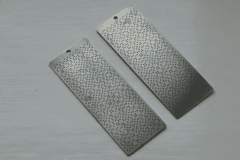

# 物理钥匙圈的视觉加密

> 原文：<https://hackaday.com/2022/07/14/visual-cryptography-for-physical-keyrings/>

视觉密码术是那些看起来似乎是个好主意的不寻常的例子之一，但事实证明它充满了问题。这个想法很简单——对要加密的图像进行采样，产生一系列分发给多个独立图像的亚像素模式。当单个图像被打印到透明胶片上，并且该组中的所有胶片都被对齐时，图像会随机出现。没有至少最小数量的这种图像，原始图像就不能被分辨。嗯，算是吧。【错综复杂】想要在一个稍微不同的媒介中玩视觉密码术的[概念，那是一组金属板，形状像一组钥匙圈。](https://www.anfractuosity.com/projects/cryptokeyring/)

Two image ‘share pairs’ needed as a minimum to form an image when combined

金属坯被激光切割，当正确对齐时，图像由穿过两个板对中重合的孔的透射光形成。我们听到你问，这种加密技术有什么问题？一个问题是伪造信息。给定密钥对中的任何一个密钥，恶意的第三方都有可能构造一个匹配的密钥，组成一个完全不同的消息，然后用这个密钥替换第二个密钥，杜平原始双方。显然，这需要双方在物理上妥协，但是如果双方都不知道最初加密的消息，则双方都不一定会注意到替换。对于那些有兴趣更深入研究的人来说，可以看看这篇由 Wiezmann 研究所的 Naor 和 Shamir 撰写的经典论文。尽管存在这些问题，对于一个视觉黑客来说，这仍然是一个非常有趣的技术！

想学习更多的加密技术吗？这是我们的导游。加密太难破解，但需要一种方法来窃听？[只要踢出一个有缺陷的系统，](https://hackaday.com/2020/03/02/project-rubicon-the-nsa-secretly-sold-flawed-encryption-for-decades/)你就可以走了。

 [https://www.youtube.com/embed/emIE3CzYke8?version=3&rel=1&showsearch=0&showinfo=1&iv_load_policy=1&fs=1&hl=en-US&autohide=2&wmode=transparent](https://www.youtube.com/embed/emIE3CzYke8?version=3&rel=1&showsearch=0&showinfo=1&iv_load_policy=1&fs=1&hl=en-US&autohide=2&wmode=transparent)

