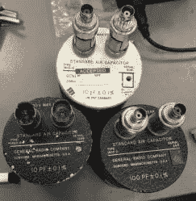

# 报废的精密电容器找到新家，拒绝成为垃圾

> 原文：<https://hackaday.com/2022/07/24/condemned-precision-capacitors-find-new-home-refuse-to-become-refuse/>

啊，翻垃圾箱的古老传统！有时我们碰巧发现一些不太垃圾，但也不太完美的东西。当 EEVblog.com 论坛的用户[dzseki]发现一些高精度电容器在他们雇主的电子废物堆中被废弃时，[dzseki]做了任何一个优秀黑客都会做的事情:把它们带回家，测试它们，并把它们拆下来了解，或者修复或者重新使用它们。他们在这个[EEVblog.com 论坛帖子](https://www.eevblog.com/forum/metrology/genrad-1403-standard-air-capacitors/)中解释了他们的出轨和分手。

High-precision capacitors with RF connectors.

如果你不熟悉电容器，它们实际上是由绝缘体分隔的两块或更多金属板，对于这些非常大的电容器，绝缘体主要是空气。铝板用标准螺栓连接，根据需要使用塑料绝缘体。还有一种叫做因瓦的特殊合金的讨论，这种合金有助于电容器的热稳定性。

[dzseki]指出，这些电容器正在走向圆形锉，因为它们超出了规格，但只是非常非常小的一点。它们可能无法用于它们最初所在的精密设备，但很明显它们在其他方面仍然非常有用。[dzseki]

当然，翻垃圾箱寻找酷部件并不是什么新鲜事，我们已经报道过一些很棒的项目，比如这个 [frankenmonitor 是从两个垃圾箱中找到的](https://hackaday.com/2020/03/06/dumpster-finds-combined-into-4k-desktop-monitor/)拼凑而成的。

感谢[David]的精彩提示，别忘了在[提示栏](https://hackaday.com/submit-a-tip/)留下你自己的提示。