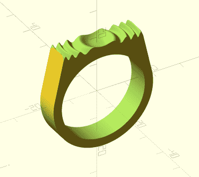

# 开放式珠宝，不需要钳子

> 原文：<https://hackaday.com/2022/07/25/openjewelry-no-pliers-required/>

他们说如果你想把事情做好，你必须自己去做。通常情况下，完成一件事要付出双倍的代价。尽管有些人可能只是哀叹缺乏一个(稳定的)类似 Thingiverse 的网站，比如珠宝设计，但这些人并不是 Hackaday 的人。由于没有地方可以在以工程为导向的朋友之间分享设计，[Adam]采取主动，创建了 [OpenJewelry](https://open.jewelry/) ，这是一个发布开源珠宝和可穿戴艺术设计以及技术、材料和工艺知识的网站。

 【亚当】已经在网站上发布了一些他自己的漂亮设计，从传统的银器制作技术到 3D 打印，再到带闪光灯的别致印刷电路板。你真的应该去看看，并且一定要考虑投稿。

即使你没有任何珠宝设计可以分享，[代码也是开放的](https://github.com/azzeloof/osj)，或者你甚至可以编辑[维基](https://open.jewelry/wiki/)。请务必先通读[投稿指南](https://open.jewelry/wiki/contribution/)。如果你没有时间做这些，也欢迎捐款来帮助维护网站。

我们喜欢这里的可穿戴艺术，尤其是当它有其他用途时，比如这个[紫外线感应护身符](https://hackaday.com/2021/11/14/tiny-talisman-warns-wearer-about-uv-exposure/)，或者这个[空气质量项链](https://hackaday.com/2022/03/23/breathe-easy-with-this-led-air-sensor-necklace/)。