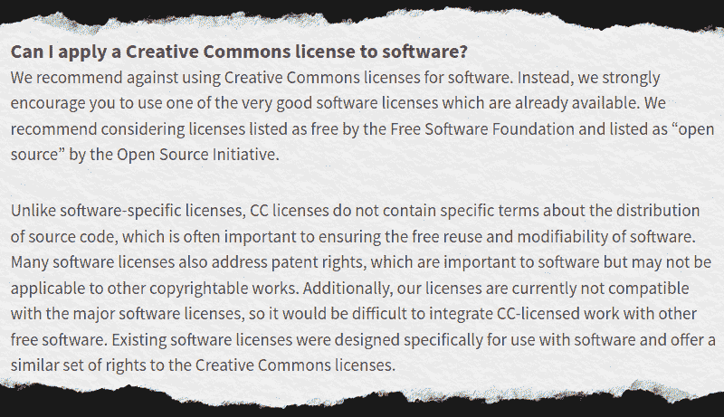
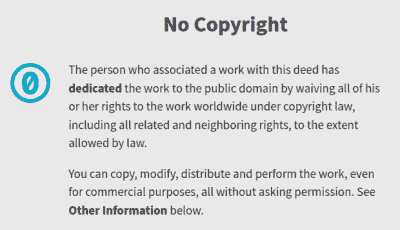

# 为什么 Fedora 决定放弃 CC0 授权代码

> 原文：<https://hackaday.com/2022/07/29/why-fedora-decided-to-give-cc0-licensed-code-the-boot/>

“开源”这个术语可能有些棘手。对许多人来说，这意味着一个特定的软件是免费的，他们可以用它做任何他们想做的事情。但是现实要复杂得多，作为用户，您所获得的实际权利完全取决于开发人员选择发布代码的许可。开源代码可能要花钱，开源代码可能会限制你如何使用它，在某些情况下，开源代码甚至会给你带来麻烦。

这正是 Fedora 项目试图避免的，他们最近决定[拒绝所有在 Creative Common 的“公共领域专用”CC0 许可下授权的代码](https://lists.fedoraproject.org/archives/list/legal@lists.fedoraproject.org/thread/RRYM3CLYJYW64VSQIXY6IF3TCDZGS6LM/)。它仍将被允许用于艺术作品等内容，甚至可能会根据具体情况对现有的软件包进行例外处理，但 CC0 将很快从所有新提交的[可接受代码许可证列表中删除](https://fedoraproject.org/wiki/Licensing:Main#Good_Licenses)。

Fedora 对软件许可证嗤之以鼻通常不会有新闻价值。事实上，有一个[相当长的许可证列表](https://fedoraproject.org/wiki/Licensing:Main#Bad_Licenses)被该项目认为是不可接受的。这里令人惊讶的是，CC0 曾经是一个被接受的许可，现在由于更大的自由和开放源码(FOSS)社区中不断发展的思维模式，它被重新分类。

那么 CC0 说服 Fedora 与其保持距离的问题是什么，这是否意味着你不应该在自己的项目中使用该许可证？

## 适合这项工作的工具

那些熟悉 Creative Commons 和他们的许可证家族的人可能会发现这个故事中最令人惊讶的元素是 Fedora 项目曾经在第一时间接受 CC0 作为软件。毕竟，它的意图总是为创造性作品创建一系列许可证。该组织的目标和它的许可证就在名称中。

作为早期开放内容项目的继承者，Creative Commons 成立于 2001 年，旨在通过提供个人和组织可以发布音乐、艺术作品或教育材料等内容的免费框架来“克服知识和创造力共享的法律障碍”。但是软件从来不是等式的一部分。为什么会这样？开创性的软件许可证，如 GNU 通用公共许可证和 MIT 许可证，在那时已经存在了十多年。

为了避免任何歧义，[知识共享甚至在他们的 FAQ](https://creativecommons.org/faq/#can-i-apply-a-creative-commons-license-to-software) 中解决了这个问题，明确表示不仅他们的许可证不是软件的好选择，而且更好的选择已经存在:

## 专利陷阱

如果一个组织不厌其烦地告诉你他们开发的东西不适合某个特定的目的，那么不言而喻，你应该相信他们的话。Creative Commons FAQ 列出了他们的许可证不应该用于软件的几个很好的理由，但其中有一个理由对像 Fedora Project 这样的用户来说特别突出——专利权。

The terms seem simple, but remember the fine print…

这可能看起来违反直觉，因为 CC0 许可证是为公共领域作品设计的，并且明确声明创作者通过使用它“放弃他或她在版权法下对作品的所有权利”。但问题是专利不受版权法保护。事实上，[查看许可的全文版本](https://creativecommons.org/publicdomain/zero/1.0/legalcode)可以发现，CC0 在“限制和免责声明”中包含了一个令人不安的条款，该条款明确指出:“*声明人持有的商标或专利权不受本文件的放弃、放弃、放弃、许可或其他影响。”*

换句话说，尽管创作者可能愿意放弃 CC0 许可的任何东西的版权，但他们仍然可以自由申请专利。更麻烦的是，他们仍然保留以他们认为合适的方式利用该专利的权利。从理论上讲，这意味着最初在 CC0 下发布一段源代码的开发者可以在后来声称任何使用该代码的人侵犯了他们的专利，并可能要求版税。

## 玩火

很明显为什么 Fedora 项目会担心这样的事情。想象一下，一段 CC0 授权代码与系统的一个核心包合并，并最终分发给数百万用户。突然，最初的开发者从阴影中出现，声称专利侵权，并要求赔偿。Fedora 的律师，或者更有可能是 Red Hat 的律师，能击败这样的声明吗？也许吧。使用 CC0 代码值得冒被发现的风险吗？没门儿。

值得一提的是，这绝不是新的关注点。事实上，专利条款使得开源倡议(OSI)许可证审查委员会无法最终确定 CC0 是否真正符合他们在 2012 年对开源许可证的定义。委员会未能达成共识，因为成员们担心在软件许可中使用这样的语言会开创一个危险的先例。考虑到其混乱的历史，Fedora 最初接受 CC0 的决定更加令人费解。

但是这对黑客个人来说意味着什么呢？您应该在自己的项目中使用 CC0 吗？这取决于你想要完成什么。如果你想放弃一个创造性的作品(比如一首歌、一首诗或一件艺术品)并且不关心它的未来会发生什么，CC0 是一个很好的选择，但是根据 Creative Common 自己的文档，它根本没有考虑到软件许可的独特方面。

一个更好的问题可能是，你应该使用你在互联网上找到的 CC0 代码吗？这个问题的答案更加微妙，但是考虑到我们刚刚讨论的所有内容，人们一定想知道什么样的开发人员仍然会选择使用它。除非你准备好处理发现的后果，否则我建议你不要管它。