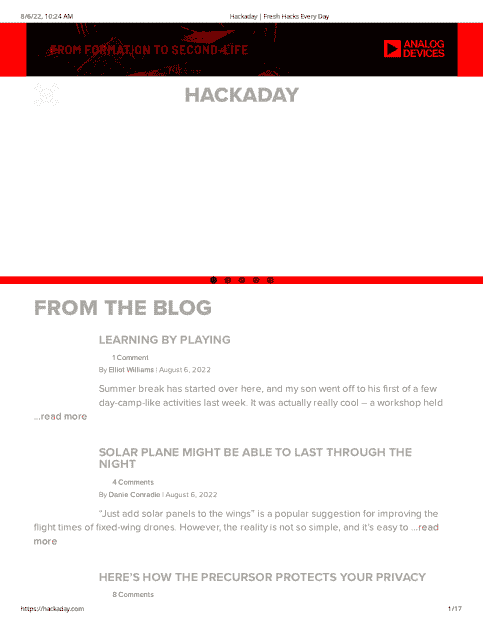

# 直观比较 pdf

> 原文：<https://hackaday.com/2022/08/06/compare-pdfs-visually/>

有时一个问题看起来很难，但是正确的洞察力可以让它变得容易。如果让你写一个程序来比较两个 PDF 文件并显示它们的不同，你认为这有多难？如果你是[serhack]，你会比你想象的更容易做到[。](https://github.com/serhack/pdf-diff)

当然，有时候让事情变得简单取决于做出简化的假设。如果您期望一个“类似 diff”的实用程序来显示插入和删除，那么这不是这里正在发生的事情。相反，您会看到一个 PDF 图像，其中的更改用红框突出显示。这很容易，因为该程序使用可用的工具将 pdf 渲染为图像，然后简单地比较结果图像中的像素，在不匹配的部分画出红框。

显然，这最适合只做了少量修改的 pdf。例如，插入一个段落会使输出变得毫无用处。为此，您可以考虑使用类似 pdf2text 的东西从 PDF 中提取文本(它使用与生成图像相同的底层库)。

这个程序有很多关于丢失文件的信息，但似乎还是完成了任务。以下是两个版本的 Hackaday 主页的比较结果，这两个版本分别在几分钟后被捕获为 PDF 格式:

但是，你可以看到，如果一篇新文章发表了，所有的东西都下滑了一个，你除了一个巨大的红色块什么也没有。

这仍然是一个聪明的想法。令人惊讶的是，这方面的工具很少，尽管我们确实[找到了一些其他的工具](https://github.com/vslavik/diff-pdf)。当然，有很多用于操作 pdf 的 [Linux 工具](https://hackaday.com/2021/07/06/linux-fu-pdf-for-penguins/)。他们中的许多是其他工具的[混搭](https://hackaday.com/2022/05/28/annotate-pdfs-on-linux-with-pdfrankenstein/)就像这个一样。