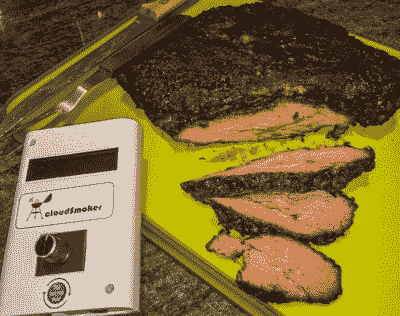

# 熏肉在云中找到了天然的家

> 原文：<https://hackaday.com/2022/08/09/smoking-meat-finds-natural-home-in-the-cloud/>

你知道后院烧烤现在有无线网络吗？考虑到云设备在家庭中的普及，这并不奇怪。然而[Carl]并不准备放弃他那可靠但又如此模拟的 BBQ 吸烟器，所以他发明了一种[可负担得起的基于 WiFi 的温度监控器](https://github.com/cwgstreet/cloudSmoker/wiki)来与它的商业对手竞争。

 从口味*和*安全角度来看，准确的温度测量对熏肉至关重要。在本项目中，两个特立独行的 ET-732/733 热敏电阻探头负责实际温度监控。一个探头插入肉中，另一个测量肉坑的环境温度。结合起来，这两个计量器确保肉被烟熏的时间正好合适。[Carl]提到增加一个额外的温度传感器对于较大的设置来说是微不足道的，但是他用两个数据点就能应付自如。

自然，ESP8266 在弥合烟雾和云层之间的差距方面承担了大部分重任。这个项目的核心是实用性和实用性——可以在任何带有网络浏览器的设备上查看温度统计数据。能够以这种方式研究温度趋势也使得预测烹饪时间变得更容易。电子警报也用于通知厨师温度是否太热或太冷(等等)。整个装置装在一个看起来很智能的项目箱里，里面有一个 LCD 和旋转编码器用于配置。

如果这激起了你对烹饪的兴趣，可以在 GitHub 和[项目维基](https://github.com/cwgstreet/cloudSmoker/wiki)上查看大量的文档食谱。W e 也推荐看看[这个项目](https://hackaday.com/2019/09/04/open-source-smart-smoker-brings-the-heat-slowly/)把自动化熏肉提升到了一个新的水平。