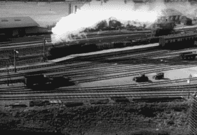
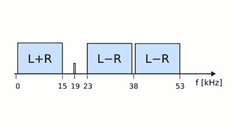
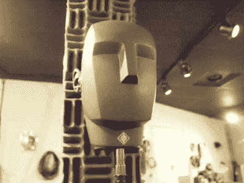

# 了解音频:立体声

> 原文：<https://hackaday.com/2022/09/21/know-audio-stereo/>

在我们偶尔制作的音频和高保真技术系列中，我们在技术层面上介绍了家庭音频系统的主要组件。在[我们上次参观布线](https://hackaday.com/2022/02/02/know-audio-a-mess-of-cables/)时，我们承诺会涵盖仪器仪表，但现在是时候稍微偏离一下话题，进入另一个话题:立体声。这个词与 Hi-Fi 联系如此紧密，以至于“立体声”几乎是任何音乐系统的替代词，但它真正的意思是什么呢？什么构成了立体声录音，它是如何传到你耳朵里的？

## 从伦敦西部的火车，到 3D 音响

The driver of this Great Western Railway train had no idea that [he was making audio history](https://www.youtube.com/watch?v=O8hOOuVtcX4).

大多数人都知道，单声道录音使用单个麦克风和单个声道，而立体声录音使用两个麦克风同时记录左右声道。然后，这些声音通过一对扬声器播放出来，给听众带来一种空间感。乐器在录制时似乎来自它们的相对位置，并且增强了在演奏中的存在感。

正如我们所知，立体声录音作为归功于艾伦·布卢姆莱因的众多发明之一首次得到完善，当时他在伦敦的百代唱片公司工作。我们有他的一个立体声演示电影“[海斯](https://www.youtube.com/watch?v=O8hOOuVtcX4)的火车”，从 EMI 实验室俯瞰大西部铁路拍摄，以一系列蒸汽火车穿越视野为特色，并带有相应的立体声声场。他的工作奠定了立体声录音的基础，包括麦克风配置和将成为磁盘上立体声录音标准的东西，这些声道位于 45 度凹槽的相对两侧。

## 不仅仅是混合

从表面上看，立体声录音只传递左右位置信息，因此可以通过调整它们在立体声混音中的位置，从一系列单声道轨道创建。例如，乐队可以将低音吉他主要放在左声道中，而将主音吉他放在右声道中，鼓手和歌手在两个声道中的位置相同，以将他们放在中央。听“黄色潜水艇”完全被洗白了。

在现代，真正的立体声录音拾取的不仅仅是不同声音的相对强度，它记录了声音中复杂的时间和相位差，包括背景噪音中的时间和相位差。因此，从单声道录音的混合中创建的立体声录音最好被称为伪立体声，因为它缺少赋予立体声录音如此深度的相位信息。

在模拟磁带走带设备或黑胶唱片中，立体声声道被分别录制为磁带轨道或凹槽的相对面。同时，在数字音频系统中，左声道和右声道以比特流的形式到达，或者来自 CD 播放器等交错 [i2S](https://hackaday.com/2019/04/18/all-you-need-to-know-about-i2s/) 源，或者来自 MP3 播放器或互联网流软件等解压缩算法。然而，有一个地方你仍然会经常遇到使用模拟编码系统的立体声源，即 FM 收音机。该系统的特点是主广播是单声道的，但立体声信息在传输中以听不见的频率单独编码，以便在接收机中解码。

## 模拟立体声的最后堡垒

All the information in an FM stereo broadcast, represented as a spectrum. Aboce the audio on the left is a 19kHz pilot tone, then the stereo difference signal modulated on a 38kHz carrier. Wollschaf ([CC BY-SA 3.0](https://commons.wikimedia.org/wiki/File:Fm-mpx.png)).

出于 FM 广播的目的，左声道和右声道被合并为 sum(表示单声道分量的 L+R)和声道之间的差值(表示 L-R)，这可以通过简单的运算放大器电路快速产生。L+R 被调制为您在单声道接收器上听到的音频，而 L-R 被单独编码为音频范围之外的 38 kHz 双边带信号。一个 19 khz 的导频音被添加到音频带和立体声信息之间，在解调器中，它与倍频器一起使用，以提供一个 38 kHz 的音来解调 L-R 差分量。然后从单声道信号中加入和减去该信号，以重建左右声道。该系统起源于 20 世纪 60 年代早期的 Zenith 提案，今天仍在世界范围内使用。

有各种各样的信号处理技术来增强立体声体验或产生立体声效果。杜比全景声就是一个例子，你会在许多电脑游戏和电影中听到它们的声音。所有这些数字魔法并不是播放立体声的唯一方式，一个 20 世纪 70 年代最受欢迎的项目是[立体声扩展器](https://sound-au.com/project21.htm)。这些设备的工作原理是从右边减去少量的左边，反之亦然，其效果是减少 L+R 的比例，增加 L-R 在输出中的比例。在这些廉价 DSP 的日子里，一些专业音频正在走向类似的[中/侧编码](https://www.uaudio.com/blog/mid-side-mic-recording)。

## 双耳，都在耳朵里

A dummy head studio microphone for binaural recording. EJ Posselius, [CC BY-SA 2.0](https://commons.wikimedia.org/wiki/File:Georg_Neumann_Ku_100_Dummy_Head.jpg).

立体声拼图还有最后一块，如果你曾经遇到过被描述为“双耳”的录音，你可能已经注意到了。立体声录音通常旨在使用一对扬声器向听众播放，在理想情况下，扬声器和听众头部形成等边三角形的点。通过这种方式，每只耳朵都能听到左右两边的声音，而最靠近哪一边的耳朵是左右两边的主导者。

在双耳录音中，每个声道只适用于一只耳朵，所以它被设计成用一副耳机来听。双耳录音通常使用麦克风进行，这些麦克风设计用于复制人类头部的声学特征，并将麦克风放置在耳道中，旨在产生真实世界定向声场的幻觉。YouTube 上有很多这样的例子，我们选择了[这段穿越伦敦市中心的旅程](https://www.youtube.com/watch?v=7rU1BpdLmk0)来给你一个思路。

因此，无论你是一个音频发烧友，还是对一元店最便宜的扬声器感到满意，我们希望你已经享受了我们进入双声道音频世界的高保真旅程。请继续关注，因为我们将在这个 Know Audio 系列中带来另一个。