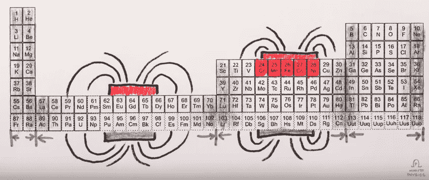
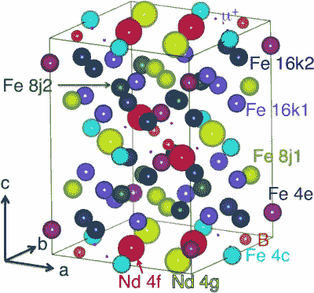
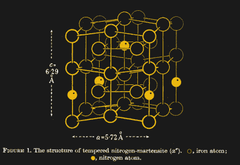
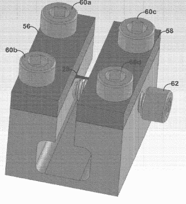

# 氮化铁:不含稀土元素的强力磁铁

> 原文：<https://hackaday.com/2022/09/01/iron-nitrides-powerful-magnets-without-the-rare-earth-elements/>

自从稀土磁体最近出现在商业领域以来，它在公众的想象中引起了不小的轰动。这些微小而闪亮的物体中包含的大量磁能导致了技术飞跃，这在它们出现之前是不可能的，比如手机中的振动马达，或者耳塞和助听器中的微型扬声器。更不用说电动汽车中的电机和风力涡轮机中的发电机，以及无数的医疗、军事和科学用途。

然而，这些进步是有代价的，因为制造它们所需的稀土元素越来越难获得。这并不是说像钕这样的稀土元素在地质学上很稀有；相反，矿藏分布不均，使得金属很容易成为永无休止的地缘政治棋局中的棋子。此外，在一个对环境因素越来越敏感的时代，从矿石中提取它们是一件棘手的事情。

幸运的是，制造磁体的方法不止一种，而且很快就有可能制造出像钕磁体一样坚固的永磁体，但不含任何稀土金属。事实上，制造它们唯一需要的是铁和氮，加上对晶体结构的理解和一些工程上的独创性。

## 一切都准备好了

首先，什么是永久磁铁？就像许多关于自然的简单问题一样，没有简单的答案不需要挥挥手。即使是物理学家最终也会得出这样的结论:“我们就是不知道。”但这并不意味着磁性是一个完全的谜，我们对它的了解非常简单，实际上有助于理解稀土磁体及其替代品的工作原理。

我们以前尝试过磁学的基础知识，但是总结一下，任何带电粒子，像电子一样，都有所谓的固有磁矩，这意味着它们就像小磁铁一样。在充满电子层的原子中，这些磁矩相互抵消，因为每对电子都有指向相反方向的磁矩。但是在外层有不成对电子的原子中，没有什么可以抵消磁矩，这意味着这些元素是有磁性的。这些元素往往来自元素周期表的两个特定区域:d 区金属，如钴、镍和铁，以及 f 区~~锕系元素~~镧系元素，包括稀土金属，如钐、钕和镨。

Ferromagnetic elements tend to have unpaired electrons, like those from the middle of the d- and f-blocks of the periodic table. But what about nitrogen, all the way over there in the p-block? Source: [Minute Physics](https://www.youtube.com/watch?v=hFAOXdXZ5TM)

然而，磁铁不仅仅是元素周期表上的成分来源。磁力就是让所有的固有磁矩排成一行，并朝着同一个方向运动。就像磁性元素的原子中的电子不得不彼此争斗一样，原子也必须排列它们自己，以便它们的磁矩都指向同一个方向。这被称为具有高磁各向异性，并且是强磁体的特征之一。钕等稀土金属具有非常高的磁各向异性，这有助于稀土磁体的强度。

但是稀土金属本身实际上并不是很好的磁体，至少在实用层面上是如此。这是因为它们的居里点相对较低，高于这个温度物质就会失去磁性。在室温下，一根纯钕棒根本不是磁铁。事实上，它需要被冷却到 20 K 以下才有磁性。为了解决这个问题，稀土金属与其他铁磁元素混合形成合金，这种合金具有很强的矫顽磁性，同时还具有体面的居里点。最常见的稀土磁体合金是铁、钕和硼的混合物，居里温度在 300-400°C 之间，这取决于元素的确切组合。

## 水晶的力量

Crystal structure of Fe[14]Nd[2]B. If you can figure it out, good luck to you. Source: Jun Sugiyama, *et al* [DOI: 10.1103/PhysRevMaterials.3.064402](https://www.researchgate.net/publication/333584271_Magnetic_moment_of_rare-earth_elements_in_R2Fe14B_estimated_with_mSR)

要深入到磁学的兔子洞，需要熟悉结晶学的概念。这是一个极其复杂的主题，命名和术语令人困惑，因为它看起来像是标准的化学公式符号，但显然不是。要完全理解如何在铁中添加钕来制造强大的永磁体，以及如何在没有任何稀土的情况下制造强大的磁体是可能的，将需要更深入地钻研结晶学，我们在这里没有足够的空间。幸运的是，基本的就够了，只要挥挥手就行了。这要归功于我的朋友 Zachary Tong，他帮助我解决了这些困难的问题。

一种物质的晶体结构是关于它的原子如何排列成有序的排列。晶体的构建块被称为晶胞，它是晶体的最小可能重复单位。对于钕磁体，晶胞公式是 Nd [2] Fe [14] B。当你看晶体结构的示意图时，这是令人困惑的，其中显示远远超过两个钕原子和十四个离子。但这里重要的是 Nd [2] Fe [14] B 的晶胞形状是所谓的简单四方(ST)，听起来它应该是一个金字塔，但实际上是一个沿一个轴拉伸的立方体。这种轴向不对称使每个晶体具有高度的磁各向异性，这也是钕磁体如此强大的部分原因。另一个因素是，与纯铁相比，钕增加了合金中不成对电子的数量，这使得整体磁矩更强。

## 铁锈加肥料

考虑到所有这些，如何在铁中加入氮来制造具有与稀土磁体相当性能的磁体呢？同样，这部分与晶体结构有关，部分与合金中元素的电子结构有关。铁通常有一个晶胞，要么是体心立方(BCC)，其中八个铁原子位于完美立方体的中心，一个原子位于死点，要么是面心立方(FCC)，每个角和每个面的中心各有一个原子。但是当氮与铁形成合金时，立方晶胞结构被扭曲成所谓的体心四方(BCT)结构。发生的情况是氮原子进入晶体的间隙，拉长一边。这种不对称类似于钕磁体的四方晶体结构。加上铁的铁磁性，结果是一种无需稀土金属的强磁化合金。

Crystal structure of α”-Fe[16]N[2]. Note how the nitrogen distorts and expands the cubic structure in one dimension. Source: “The occurrence and the crystal structure of α”-iron nitride”, [doi:10.1098/rspa.1951.0155](https://doi.org/10.1098/rspa.1951.0155)

氮化铁并不新鲜。渗氮工艺，如将加热的钢暴露于氨中进行气体渗氮，已用于钢的表面处理一个多世纪了。更复杂的氮化铁α”-Fe[16]N[2]最早发现于 1951 年；在 20 世纪 70 年代早期和 90 年代，作为寻找新的和更好的硬盘驱动器和其他磁记录介质磁头的一部分，人们对它的磁性进行了探索。

这种合金在磁学方面显示出了前景，但事实证明很难处理，结果不容易重现，所以对α”-Fe[16]N[2]的兴趣减弱了，直到 2000 年代末，生产这种材料薄膜的方法被开发出来。这些实验表明，这些薄膜的磁能积可能是钕磁体的两到三倍，磁能积是决定磁体强度的关键指标。除了已经发现的所有其他特性，这使得氮化铁成为一种不含稀土元素的新型磁体的绝佳候选材料。

## 如何制作磁铁

对于大多数科学发现来说，在实验室和实际商业产品之间还有很长的路要走，氮化铁磁性材料就是如此。氮化铁永磁体的许多最新进展来自明尼苏达大学电子和计算机工程系的王建平实验室。那里已经开发了四种不同的合成块体α”-Fe[16]N[2]材料的方法，其中一些在工业环境中显示出一些前景。

Device for straining FeN wire samples during annealing. Sample is #28, strain is supplied by tightening screw #62\. Source: [US Patent application US20180294078A1](https://patents.google.com/patent/US20180294078A1)

最早的制造α”-Fe[16]N[2]的方法需要对氮化样品进行快速淬火的高温处理，这不利于工业生产的规模化。解决这个问题的第一个尝试是使用离子注入。这项技术中，离子在真空中被强电场加速并撞击目标衬底，这在半导体制造中很常见，用于掺杂硅晶片。为了制造氮化铁磁铁，将 500 纳米厚的纯铁箔放在硅衬底上，用氮原子离子轰击。接下来是一系列退火步骤，激活注入的氮，并在材料中产生热应变，将氮限制在箔的晶体结构中，产生必要的变形。以这种方式制成的α”-Fe[16]N[2]箔片显示出硬磁行为，并且可以通过将箔片堆叠成层并将它们结合成单一结构来制造实用的磁体。

使用氧化铁纳米颗粒作为起始材料，低温氮化也是可能的。在这种方法中，用氨气处理颗粒，使氮进入晶体结构。或者，氧化铁可以与硝酸铵在行星式球磨机中混合；在 600 rpm 下研磨几天后，不锈钢球将硝酸铵分解成元素氮，元素氮扩散到铁纳米粒子中。产生的α”-Fe[16]N[2]然后被磁铁分离，可以形成固体形状。这种方法似乎很容易扩大到工业生产。

铁箔和线的高温氮化也是可能的。该方法使用铁-铜-硼合金带，并将其暴露于 550℃的氨和氢气氛中 28 小时，随后在 700℃快速处理并进行冰水淬火。这种方法的一种变体是应变线法，在这种方法中，高纯度的铁与尿素一起在坩埚中熔化。尿素分解出的氮扩散到铁中，混合物经过热处理和淬火步骤，然后被锤平并切成条状。将条带放入应变装置中，并在退火步骤中拉伸，这用于拉长晶体结构并捕获扩散的氮。

强大的永磁体并不是氮化铁唯一可能有用的东西。软磁材料是矫顽力较低的材料，适用于变压器和电感器的磁芯，或磁介质的读写头，也可以通过在α”-Fe[16]N[2]中掺杂碳、氧或硼等元素来实现。这些掺杂剂降低了晶体结构的磁各向异性，使得在保持高饱和磁化的同时更难永久磁化它们。

所谓的“清洁地球”磁体有很大的前景——以至于明尼苏达大学已经成立了一家名为 Niron Magnetics 的公司，将概念和过程转化为产品。我们很想知道这项技术的发展方向，并期待用铁锈和肥料制造出强大的磁铁。