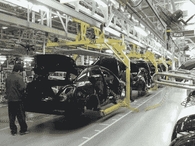

# 在我们得到更多的铜之前，我们不能改用电动汽车

> 原文：<https://hackaday.com/2022/08/31/we-cant-switch-to-electric-cars-until-we-get-more-copper/>

减少人类活动的排放需要许多不同部门的巨大努力。当谈到陆地交通时，一般的想法是淘汰内燃机驱动的车辆，代之以电动汽车。乍一看，这项工作很简单。我们知道如何制造电动汽车，而且这种技术正在发展到能够在许多应用中取代传统汽车的地步。

当然，现实并没有这么简单。要理解将交通工具全部转换为电力驱动的问题，你必须看一看这些巨大的数字。关注铜的指标，你会发现这是一个令人担忧的故事。

## 原材料是关键

转向电动汽车不仅仅是为新车型绘制蓝图并大量生产那么简单。不幸的是，世界工业基础设施已经在过去一个世纪左右的时间里建立和完善，以制造足够多的汽车、卡车和公共汽车来满足世界需求，在过去几年里供应链出现了一些波动。世界各地都有庞大的工厂，专门生产这些车辆的发动机、燃料系统和底盘，每年数量达数百万。

“[Geely assembly line](https://commons.wikimedia.org/w/index.php?curid=18168648)” by Siyuwj

到目前为止，还没有足够多的工厂生产电机、电池组和辅助硬件来取代所有这些燃烧传动系统。这是假设世界上现有的车身厂能够首先制造足够的电动车底盘。更糟糕的是，我们根本没有挖掘出足够的原材料来养活这些根本不存在的工厂。

我们最缺乏的材料是铜。作为一种优秀的导体，它是一切电气和电子产品的基本成分。对于效率至关重要的电动汽车，用铝等其他导体来代替它通常也不现实。

事实上，现代电动汽车所需的铜大约是传统内燃机汽车的两倍。因此，如果我们想最终让整个汽车行业只生产电动汽车，这将使汽车行业的铜需求增加 150%。

不仅仅是电动汽车增加了对铜的需求。电动汽车充电器也需要大量的铜。再加上可再生能源领域的需求，比如太阳能电池板和风力涡轮机来驱动这些充电器，这个数字会越来越大。

分析公司 S&P 全球预测，到 2035 年，全球铜需求将翻一番。这一增长趋势将持续到 2050 年，预计世界需求量为 5300 万公吨。该公司的报告基于各国实现现有净零排放目标所需的铜量得出这些数字。在最好的情况下，该公司预计未来几十年铜供应将出现小幅短缺，前提是采矿业务加大努力，并认真进行回收。

根据美国地质调查局的数据，地球上已发现的铜的总量在 28 亿公吨左右。据估计，还有 35 亿公吨的铜在某处等待我们去发现。这足以满足我们未来的需求，但首先需要把它从地下挖出来，加工成可用的材料。

“[Chuquicamata copper mine](https://www.flickr.com/photos/72482589@N07/44451282134)” by Alexander Gerst. (Taken from the ISS!)

目前，世界上最大的铜生产国是智利，2020 年产量为 570 万吨，这一数字在过去几年的报告中基本保持稳定。这个国家拥有世界上大多数最大的铜矿。秘鲁和中国分列第二和第三位，产量分别为 220 万吨和 170 万吨。40%的铜产量来自智利和秘鲁，与市场上的其他材料相比，铜的来源相对高度集中。

为了提高产量，必须建立新的矿井，扩大现有的矿井。当然，要让矿业公司采取行动，首先这些铜的其他来源在账面上必须是有利可图的。就目前情况来看，最近新发现的矿藏很少，而且从财务角度来说，这些矿藏的品位较低，对我的矿来说不那么有吸引力。按照世界大宗商品市场的运行方式，我们可能会看到，在矿商涌入开发目前有利可图的新铜矿床之前，随着短缺的影响，铜价将会飙升。

目前，立法已经在几个司法管辖区通过，禁止内燃机汽车，并强制转换到电动汽车。同样，对新的可再生能源项目也有巨大的被压抑的需求，特别是在今年供应中断导致化石燃料价格飙升之后。铜的需求不会消失，所以迟早，世界将不得不开始挖掘，而且要快。如果我拥有一家矿业公司，我会想先下手为强。