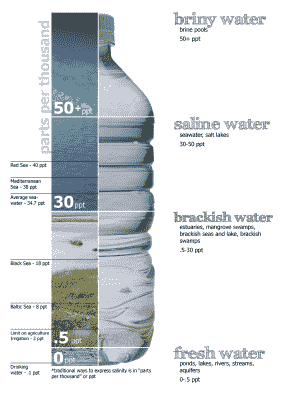
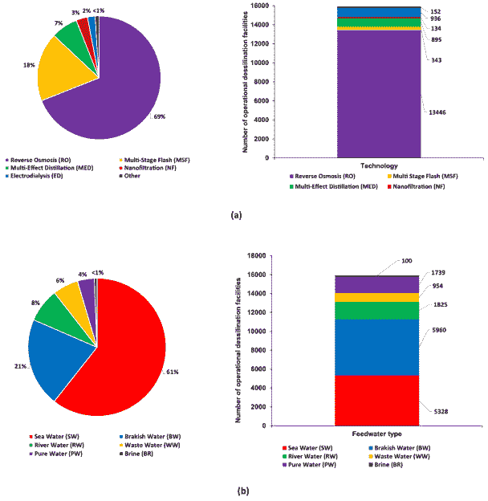

# 不要咸:如何让海水淡化在未来的世界发挥作用

> 原文：<https://hackaday.com/2022/09/08/dont-be-salty-how-to-make-desalination-work-in-tomorrows-world/>

尽管人类消费和农业用水通常很少，但这个星球有四分之三被水覆盖。问题是如何将盐排出去，这通常是由地球的水循环来完成的，地球的水循环会产生降雨和类似的现象，补充淡水的数量。地球上大约 3%的水是淡水，其中一小部分是饮用水。

在过去的几十年里，海水淡化的使用逐年增加，特别是在沙特阿拉伯、以色列和阿拉伯联合酋长国，但是像加利福尼亚这样干旱的美国也越来越关注海水淡化技术。海水淡化面临的明显障碍——不考虑使用的具体技术——包括运行这些系统所需的能源，以及生产的饮用水相对于从其他地方进口的最终成本。

脱盐过程中出现的其他问题包括对环境的影响，特别是来自盐水废物和吸入进水管的海洋生物。随着海水淡化需求的增加，有哪些选项可以减少电力需求和环境影响？

## 加热、过滤和废物

Water salinity diagram. (Credit: Peter Summerlin)

一种常见的脱盐方法是蒸馏，这基本上也是通过地表水的蒸发来实现的。当水被加热时，它会蒸发，留下盐和其他溶解的固体物质。当这个过程使用强烈的热量分阶段完成时，它被称为多级闪蒸( [MSF](https://en.wikipedia.org/wiki/Multi-stage_flash_distillation) )，这是三种最常见的蒸馏类型之一，另外还有多效蒸馏( [MED](https://en.wikipedia.org/wiki/Multiple-effect_distillation) )，它使用带有加热蒸汽的阶段，这些蒸汽耦合到下一个阶段，有效地重复利用热量。然而，到目前为止，最常见的蒸馏类型(~69%的份额)是反渗透( [RO](https://en.wikipedia.org/wiki/Reverse_osmosis) )，它利用膜上的压差，允许水分子通过，但不允许盐和许多其他溶解的固体通过。

重要的是要记住，这些大规模的海水淡化过程中，没有一个过程的产出是完全分离成水和其他物质的。取而代之的是淡水输出(反渗透约为 40%)，浓缩水流基本上是盐水，允许任何污染物进入盐水或微咸水。这种浓缩水流是指返回到海水或其他水体中的水，这些水是从海水中提取的。

除了这种浓缩水流的高得多的含盐量(大约是海水的两倍)之外，它还具有比热力脱盐设备的进水高得多的温度。虽然排放的盐水温度升高对当地海洋生物有明显的负面影响，但据报道，在一些地方，盐水羽流持续到距离排放地点 5 公里处。这将使该地区不适合一些不适应海水的物种生存。

Number and capacity of operational desalination facilities by (a) technology and (b) feedwater type.
(Ihsanullah et al., 2021)

Ihsanullah 等人在 2021 年 8 月的一篇评论中强调了这一点，详细介绍了当今海水淡化设施的已知环境影响，以及使海水淡化更加环保的策略。该审查还涵盖了通常添加到进水中的添加剂，这些添加剂可能最终进入环境，包括:

*   防垢剂。
*   生物污垢控制添加剂(如氯和次氯酸钠)。
*   抗泡沫添加剂。
*   清洗化学品，例如用于膜清洗的化学品。

此外，废物流可能包括各种其他污染物，例如由于脱盐设备的热交换器和其他部件的腐蚀而产生的铜和镍。由于脱盐过程的性质，重金属浓度也会增加。为了减少这种废物流对环境的影响，来自脱盐工厂的废弃物流在被释放回环境之前越来越多地被处理。

## 膜的能源优势

Ihsanullah et al. (2021)

直到 20 世纪 80 年代，热脱盐的使用才变得普遍，那时 RO 已经商业化。反渗透的一个巨大优势是每立方米产出淡水的能源需求低得多( [Elsaid 等人，2020](https://www.sciencedirect.com/science/article/abs/pii/S019689042030649X) )，而 MSF(在 120°C 下运行)需要的能源最多，尤其是热能。MED 由于在连续的阶段中重复利用热量，使用的能量要少得多。从 Ihsanullah 等人(2021 年)复制的表格中可以看出，对于反渗透而言，热能需求的缺乏使其默认效率显著提高，仅需要电能来产生跨膜压力梯度。

由于需要电力，而不是电力和热能，基本上可以使用任何恒定的电源，使反渗透非常通用，适用于小型和大型装置。考虑到热脱盐装置的市场份额迅速下降，在可预见的未来，RO 和类似的基于膜的技术可能会继续主导市场。

电容电离(CDI)和电渗析/反向电渗析(分别为 ED 和 EDR)是一些正在使用的新技术，尽管主要用于更多的微咸水。除了纳滤(NF)和类似的过滤技术，这些技术还受到材料问题和高能耗的制约(尤其是 CDI 和 ED/EDR)。根据 WNA 的说法，其他列出的技术有电去离子、膜蒸馏和正向渗透。

为海水淡化厂提供动力的一种有吸引力的能源——无论是热能还是膜能——是核反应堆。它们可以提供电力和热量，例如，日本 JAEA 展示了一个由名为 GTHTR300 的高温反应堆驱动的 MSF 海水淡化厂。由于 MSF 可以比 RO 更容易地处理例如严重污染的水，而不需要对进水进行预处理，因此来自核反应堆(包括当今现有的轻水反应堆)的废热可以使 MSF 和 MED 与 RO 相比更具竞争力，同时防止来自当今主要以天然气为动力的 MSF 和 MED 脱盐设备的污染。

这一点在过去几十年里已经在哈萨克斯坦(BN-350 快堆)和日本得到证明，在日本，十个海水淡化厂由压水反应堆提供动力，主要采用 MED 和 RO。在韩国，它的一些压水堆也运行 MED 海水淡化厂，主要为它自己的冷却系统产生水。在埃及和巴基斯坦，他们的新核电站也用于运行 MED 和 RO 设施。

## 回收废物

尽管通常情况下，海水淡化厂的废水会被排放到环境中，但有充分的理由尽可能多地使用这种浓缩盐水。特别是在海水用作进水的情况下，脱盐过程输出的浓缩物将含有大量的镁、金、铀、溴、钾、铯、铷和锂，其中至少一些可以经济地回收。

最近，我们着眼于从海水中回收[铀，这是一个挑战，因为溶解的铀只有百万分之几，其他可能感兴趣的金属和矿物也是如此。尽管海洋中的铀含量比地壳中可开采的铀含量高，但事实是，海洋中稀释了更多的水。](https://hackaday.com/2022/08/23/optimizing-the-mining-of-uranium-from-coal-ash-and-seawater/)

由于海水淡化厂大大减少了水量，因此从逻辑上讲，由此产生的“废物”将含有更高浓度的铀、锂等，这可能使其从这种浓缩流中过滤出来更具吸引力。这样做的结果可能是，我们可以使用很多(如果不是大部分)这种浓缩物，这将减少最终进入环境的含盐量，可能是被污染的水。

## 人生永远充满希望

如果我们的海水淡化厂使用更便宜、更环保的能源，并尽可能多地利用这些工厂产生的“废物”,我们最终可能会节省资金，并减少其他地方采矿造成的环境破坏。也许这种观点对任何关于海水淡化的讨论都是最有帮助的。

如前所述，核电厂参与海水淡化是很常见的。当这个过程可以使用 med 技术进行，使用的基本上是废热，并且含盐废物得到适当处理，那么它就可以为数百万人提供大量的饮用水。海水淡化的一个重要部分是很难低估的，那就是它需要通向海洋或其他重要的咸水或咸水来源。

当一个城市位于沙漠的中部时，那么所述饮用水将总是必须通过管道或类似物来提供。但那完全是另一回事。