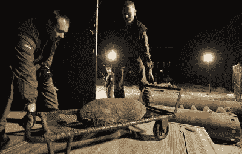
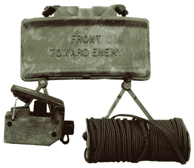
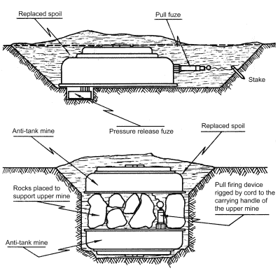
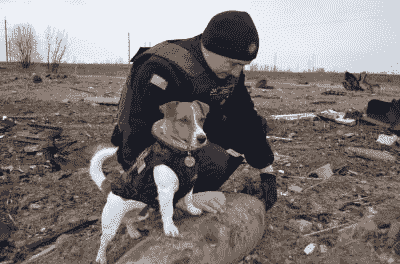

# 战争的长尾理论:在未爆弹药找到我们之前找到它

> 原文：<https://hackaday.com/2022/09/19/the-long-tail-of-war-finding-unexploded-ordnance-before-it-finds-us/>

在敌军放下武器、签署和平协定和庆祝胜利之后很久，仍有沉重的代价要付出。其中大部分以未爆弹药的形式出现，包括地雷和重金属及其他污染物的严重污染，这些污染物会使大片区域进入起来有致命危险。也许这种持久影响的最极端的例子是法国的[红区](https://en.wikipedia.org/wiki/Zone_Rouge)(红区)，它在第一次世界大战结束后立即被覆盖了 1200 平方公里。

在这个区域内，重金属污染非常严重，以至于一些区域无法支持生命，而未爆炸的炮弹——有些含有致命气体——和其他未爆炸的弹药遍布土壤。直到今天，原始区域的大部分仍然是禁区，尽管在边界附近经常会有旧的伤害，但仍然是非常有效的武器。清理红色区域预计需要数百年时间。可悲的是，这种模式在世界许多地方重复出现。当欧洲国家被两次世界大战遗留下来的武器绊倒时，非洲、亚洲和其他地方的国家却在为最近的冲突遗留下来的问题而挣扎。

目前，在欧洲最近的战场上，埋下了更多的地雷，设置了诱杀装置，未爆炸的炮弹和其他弹药散落在人们曾经居住的地方。乌克兰已经开始清理这些地区，使其居民能够安全返回，但就像在世界其他地方一样，这是一个艰巨和高度危险的过程，往往会带来致命的后果。

## 稍后繁荣

Bomb-disposal experts load a bomb after defusing it on Museum Island in Berlin. (Credit: Gero Breloer/AP)

一定比例的弹药——无论是炮弹还是其他爆炸物——在使用后无法引爆。这些哑弹是意料之中的事，因为它们不是故意隐藏的，一般来说很容易被发现。即便如此，它们也可能被埋在地下几厘米甚至几米深的地方，就像 UXO 红区附近的许多不幸的农民发现的那样。在欧洲的建筑工程中，通常会在几米深的土壤中发现重达 500 公斤的大型炸弹，这些炸弹最初是由轰炸机携带的。

虽然这些哑弹有可能仍然无法完成它们的设计任务，但也有很大的可能是撞击的冲击和进水等环境因素使它们变得不稳定。2010 年，三名德国拆弹专家在试图拆除一枚 1100 磅的二战盟军炸弹时丧生，去年，另一枚二战时期的飞机炸弹[在慕尼黑爆炸](https://www.reuters.com/world/europe/three-injured-after-explosion-munich-police-2021-12-01/)，导致四人受伤，这是在它们被投掷 60 多年后。

集束弹药在这方面形成了一个特殊的群体，因为这类弹药的特点是有大量(可能有数百枚)子弹药，其中一般有 1%或更多的子弹药没有引爆。这些子弹药中的一些具有突出部分，使它们能够在下降时武装起来，但由于 UXO 可能[对将捡起它们的儿童来说看起来像玩具](https://www.reuters.com/article/us-global-arms-clusterbombs-idUSKCN1173YY)，经常导致严重伤害。

The M18A1 Claymore mine with the M57 firing device and M4 electric blasting cap assembly.

虽然由于制造、部署或其他原因，许多这类弹药最初没有引爆，但有些弹药被设计成只有在满足某些参数时才会引爆。地雷就是一个很好的例子，具有多种配置。许多地雷是压力触发的，反坦克地雷需要很大的重量(100 多公斤)才能触发，而杀伤人员地雷则要小得多，被设计成一脚踩上去就会引爆，内含的炸药足以造成大面积伤害。

美国 M18A1 克莱莫地雷的设计目的是当远程触发或由绊网触发时，将金属球的有效载荷推向目标。当设置在例如森林地区时，这样的地雷在触发绊网之前很难被发现。这里更阴险的是[弹跳地雷](https://en.wikipedia.org/wiki/Bounding_mine)，它们被埋在土壤中，但在引爆、伤害或杀死杀伤区内的任何人之前，会将地雷的主体推到空中。美国 AP [M16 弹跳地雷](https://en.wikipedia.org/wiki/M16_mine)和它的许多复制品可以在无数以前和现在的战区找到。

使问题更加复杂的是，地雷很少只在平地上使用，而是往往被用在山坡上、森林和丛林中、河边以及认为敌军可能经过的任何地方。在冲突期间和之后，雷场有时会遭受洪水和其他大规模的土壤扰动，这可能会使它们分散在很大的区域，埋在不同的深度，并使定位变得复杂。

根据联合国儿童基金会，78 个国家每年有 15，000-20，000 人被地雷炸死或致残，其中大约 80%是平民。这些平民大多数是儿童。

## 面临危险

The typical configuration of anti-handling devices used with [M15 anti-tank landmines](https://en.wikipedia.org/wiki/M15_mine "M15 mine"). The upper diagram shows a pull-[fuze](https://en.wikipedia.org/wiki/Fuze "Fuze") screwed into a secondary fuze well in the side of the mine. Additionally, an M5 anti-lift device has been screwed into another fuze well, hidden under the mine. An inexperienced deminer might detect and render safe the pull-fuze, but then be killed when he lifted the mine, triggering the M5 pressure-release firing device underneath.
The lower diagram shows two anti-tank landmines connected by a cord attached to the upper mine’s carrying handle. The cord is attached to a pull fuze installed in a secondary fuze well in the bottom mine.

在使前战区变得安全，便于平民返回的过程中，任何 UXO 都必须被追踪和清除，或者就地引爆。最容易找到的 UXO 可能是哑弹、集束子弹药和类似的东西，因为这些东西可能就在附近，或者会在它们的最终深度留下一个清晰的弹坑。更危险的是诱杀装置和地雷，因为它们无法区分士兵、平民和拆弹专家。

有些地雷会有防排装置，或者在地雷旁边安装一个诱杀装置，当地雷被提起时就会爆炸。这使得检查每一枚探测到的地雷是否有这种诱杀装置变得至关重要。因为这种诱杀装置只不过是一根与另一枚地雷、手榴弹或其他爆炸装置的引信相连的电线。

实际上，这意味着找到 UXO 只是挑战的一部分，即使考虑到找到特别是现代的最小金属矿可能非常困难。尽管老式地雷倾向于使用金属作为外壳和机械部件，但现代[排雷](https://en.wikipedia.org/wiki/Demining)由于拒绝使用金属探测器等工具而变得更加困难。即使对于常规地雷，使用金属探测器也不能保证探测到。特别是在富含铁或金属碎片的土壤中，金属探测器的有效性可能为 75%或更低。

排雷的核心是首先检查绊网，然后用金属探测器检查该区域，接着用一根小角度插入的刺棒。运气好的话，刺棒会碰到地雷的一侧，之后就可以把它挖出来并使其失效。自然，如果土壤发生了移动，或者如果地雷被布雷机器和亲属粗略地插入，地雷可能会以一定角度放置，在这种情况下，如果施加足够的压力，刺棒可能会触发地雷。

## 伸出援助之手

Ukrainian [sapper](https://en.wikipedia.org/wiki/Sapper "Sapper") with [landmine finder](https://en.wikipedia.org/wiki/Demining "Demining") dog [Patron](https://en.wikipedia.org/wiki/Patron_%28dog%29 "Patron (dog)") in [Ukraine](https://en.wikipedia.org/wiki/Ukraine "Ukraine") after battle during the [2022 Russian invasion](https://en.wikipedia.org/wiki/2022_Russian_invasion_of_Ukraine "2022 Russian invasion of Ukraine").

凭借其灵敏的嗅觉，狗可以被训练来探测地雷爆炸释放的化学物质，以及其他独特的成分。这些探雷犬可以显著加快 UXO 地区的排雷速度，尽管树叶密度和气候等因素会阻碍它们。

尽管新的探测方法正在开发中——包括地面穿透雷达和各种类型的红外线和 x 射线方法——但明确清除一个地区几乎所有地雷的最可靠和最有效的方法仍然是*派一组人带着探测棒、金属探测器和嗅探犬。*

让事情变得复杂的是，并非所有的地雷都是一样的，使用的炸药、雷管和弹壳种类繁多。它们所处的土壤也会影响某些检测方法的有效性，这可能会影响从土壤中泄漏的爆炸物蒸汽量，或者在某些电磁频率下成像时的发射光谱。

这就是地面穿透雷达作为一种通用的地雷探测方法最有希望的地方，即使它会受到信号衰减的影响，例如土壤中的水分(限制了有效探测深度)，而且它的分辨率不够高，无法分辨细节。即便如此，自 2006 年以来，雷达结合金属探测器的手持式远距离地雷探测系统(HSTAMIDS)已经成为美国陆军地雷探测的标准使用。

在柬埔寨进行人道主义排雷的[试验中，发现它在各种土壤类型中表现相当好，尽管探测率低于 100%。类似的，但商业上可获得的双传感器 Cobham VMR3 Minehound 也在排雷方面受到限制。Cobham 在 2014 年的一篇文章中介绍了该探测器的 VMR2 版本在](https://commons.lib.jmu.edu/cisr-globalcwd/1096/)[阿富汗和](https://commons.lib.jmu.edu/cgi/viewcontent.cgi?article=1074&context=cisr-journal)柬埔寨的使用情况，并描述了该系统在这些国家的使用情况和性能。

注意到的问题是在岩石地面周围性能差，因为探地雷达要求探测器头移动到离地面相当近的地方，旧的土壤扰动会使解释探地雷达信号变得复杂。即便如此，将金属探测器读数与探地雷达信号相结合的能力被证明是非常有益的。虽然它可能不是探测地下每一颗地雷的终极探测器，但它是除了探测棒和人类最好的朋友之外的又一个有用的工具。

大约每清除 1，500 枚地雷就有一起事故，排雷是一项危险的职业。考虑到清除现有雷场仍需数百年或更长时间的工作，任何能够改善探测和整体安全的新工具和技术都是非常受欢迎的。

[标题图片:1944 年 7 月 15 日，工兵在清理一家前法国豪华酒店海滩前的最后一颗地雷，这家酒店现在被用作第三师部队的休息俱乐部。]