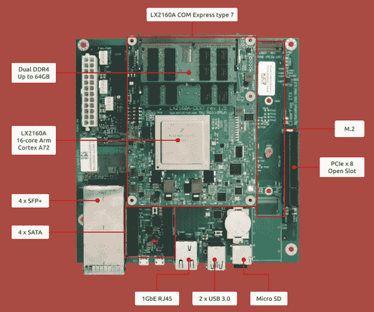

# 探索桌面 ARM 硬件的前沿

> 原文：<https://hackaday.com/2022/10/06/exploring-the-cutting-edge-of-desktop-arm-hardware/>

虽然 x86 架构肯定不会很快消失，但似乎每年我们越来越多的计算都是在 ARM 处理器上完成的。它从我们的智能手机开始，蔓延到低成本的 Chromebooks，现在苹果公司全力以赴开发他们的 M1/M2 芯片。但到目前为止，我们还没有看到桌面领域有太多的变化，这一事实可以说减缓了 ARM 兼容软件和操作系统的发展。

但这并不意味着没有其他选择，不，我们不是说要用树莓派。[Wooty-B]一直在记录他们转换到 ARM 桌面的努力，即使你目前对自己的架构选择感到满意，这也是一篇引人入胜的文章。关键是 HoneyComb LX2K，一种迷你 ITX ARM 开发板，提供足够的扩展和原始功率来满足大多数日常计算需求……假设你愿意付出努力。

 我们通常认为 ARM 板是相对单片的单板计算机，但 LX2K 更像是传统的台式机主板。它可以采用两组 DDR4 RAM，具有 PCI Express 和 m.2 插槽，加上 SATA II、USB 3 和千兆以太网。也就是说，至少有一个相当大的缺陷——[Wooty-B]指出，虽然如果你只是四处闲逛，主板上简陋的散热器已经足够好了，但当试图将硬件作为日常驱动时，热管理系统需要一些升级。

[Wooty-B]提供的文档介绍了如何设置 HoneyComb LX2K 并安装您选择的操作系统。正如您所料，为了获得最佳体验，您需要跟踪一系列补丁和解决方法。该指南还解释了如何安装像 Box86/64 和 WINE 这样的软件包，以大大扩展您能够在新系统上运行的软件数量，其中包括玩游戏的能力，如具有高图形设置的*辐射 3* 、*孤岛危机*和*天际*。虽然大部分信息都是关于 Linux 的，但也有一些提示适合那些对在 ARM 硬件上运行 Windows 感到兴奋的人。

插播之后的视频来自制造商 SolidRun，为勇于走出 x86 舒适区的引领潮流者提供了蜂巢 LX2K。虽然公平的警告…这并不便宜。如果你想加入[Wooty-B]的 ARM wonderland，你需要支付超过 800 美元的特权。

 [https://www.youtube.com/embed/lxdRSCQfhyw?version=3&rel=1&showsearch=0&showinfo=1&iv_load_policy=1&fs=1&hl=en-US&autohide=2&wmode=transparent](https://www.youtube.com/embed/lxdRSCQfhyw?version=3&rel=1&showsearch=0&showinfo=1&iv_load_policy=1&fs=1&hl=en-US&autohide=2&wmode=transparent)

