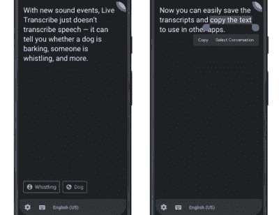

# 大声草书:对付龙

> 原文：<https://hackaday.com/2022/10/28/cursive-out-loud-dealing-with-dragons/>

当我们最后一次离开这个关于手写、草书和活字印刷的广阔话题时，我威胁要对语音转文本程序大加赞赏。对我来说，这些似乎是这些天来把思想投入到所谓的纸上的高峰。

人类织锦中的一个共同线索是，我们都在走来走去，脑子里有太多事情要做，没有真正的机会以意识流的方式不漏掉一个字——直到我们开始彼此交谈。我不在乎你的英语老师告诉你什么——谈话很容易变成写作；所需要的只是愿意遵守足够多的规则，并以可读的方式记录下来。

但是，唉！这表明线性思维不仅是可能的，而且很容易，其他人都已经在这么做了。虽然这(通常)是不正确的，但简单地大声思考可以让你在很多精神载体中走得很远。你只需要以某种方式记录下来。如果你的最终目标是把单词打出来，为什么不跳过录音机，走语音到文本的路线呢？

## 通信故障

有些程序比其他的好，但是你投入进去的东西会得到回报——特别是像 Dragon Dictation 这样高端的、超级可训练的程序。如果你听过我的播客，你可能会理解机器人 100%的时间理解我说话的细微差别有多困难。

虽然这并不意味着是任何特定服务或软件包的广告，但有几天我手臂的神经损伤和手术后的长期恢复使我无法在没有痛苦和遗憾的情况下进行任何打字或鼠标操作。那么一个职业作家应该做些什么呢？雇个打字员口述？那我就得分享我的薪水。不管怎样，有一个打字员硬塞在他们的大脑和数字页面之间，谁能成为他们自己呢？如果好的作品是作者和读者之间的对话，那么真的没有第三方的空间，甚至没有转录的空间。

## 必要的邪恶

Google’s Live Transcribe is, of course, smart about sounds. Image via [VentureBeat](https://venturebeat.com/ai/google-open-sources-live-transcribes-speech-engine/)

我使用语音转文本程序的问题是，为了达到最佳效果，我必须说得慢一点，像机器人一样。不，事实上，这不是真正的问题——我开始做一些事情，建立了一个良好的流程，但龙在这里和那里发现了一些错误的单词。然后当我回顾谈话写作时，我会看到一些我不认识的东西，这样思想就迷失了。

因此，我要么需要使用足够多的听写程序，让他们百分之百地完全理解我的意思，要么我需要检查自己的每一段，确保我所说的没有被混淆。通常，答案是两者的某种结合。

Dragon 比我以前用的要好得多，我以前用的是谷歌内置的语音到文本转换器，可以在谷歌文档中找到。尽管就实用性而言，这并不可怕，但我不喜欢我写作的最粗糙的草稿就在谷歌的手中。或者说是耳朵。我知道，我知道，反正任何程序都会把我的话传到网上，但这是原则。有趣的是，[谷歌在 2019 年开源了](https://opensource.googleblog.com/2019/08/bringing-live-transcribes-speech-engine.html)他们的[转录引擎](https://github.com/google/live-transcribe-speech-engine)。我想如果龙对我不轨，我可能会走那条路。

除了复杂性，对于像我这样的人来说，任何语音到文本的转换都像是天赐之物。它帮我度过了一些黑暗的、神经受损的日子，我的雇主慷慨地报销了我的费用，这是非常值得的。当我有很多话要说的时候，我会用录音机。偶尔，我会把录音放入 Dragon 中，惊叹技术的结合为我服务。只要能把话说出来就行。