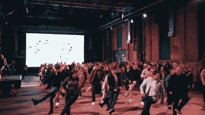
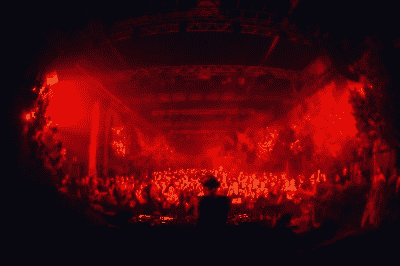

# 舞者现在帮助格拉斯哥夜总会供电

> 原文：<https://hackaday.com/2022/10/24/dancers-now-help-power-glasgow-nightclub/>

迄今为止，人类通过燃烧东西来满足大部分电力需求，这些东西大多是非常古老的东西，燃烧起来很厉害，但很难替代。那些东西越来越贵，污染也是一个麻烦，所以可再生能源越来越受欢迎。

虽然风力或太阳能通常用于电网层面，但格拉斯哥的一家夜总会却采取了不同的策略。它从它的顾客那里获取能量来维持灯的亮着。

## 增加热量

Heat energy from dancers will be captured and stored by the Bodyheat system installed at SWG3\. *Credit: SWG3 news page*

该设施名为 SWG3，举办各种俱乐部之夜和其他艺术活动。它拥有多个空间，容量超过 1000 人，建在曾经是镀锌设施和仓库的地方。当音乐流动时，在舞池中切割形状的赌客通常会产生大量的热量，这导致了一个想法。

当 TownRock Energy 的创始人大卫·汤森(David Townsend)遇见 SWG3 的董事总经理安德鲁·弗莱明·布朗时，这个基本概念就产生了。弗莱明-布朗在寻找可持续能源系统来帮助俱乐部供电，而汤森从事地热业务。

这一合作的结果是一个可再生能源系统的建立，以利用舞蹈中释放的能量。它被称为 Bodyheat，可以捕捉俱乐部中舞者发出的能量。热泵吸收顾客释放到房间的能量，通过地下 200 米深的钻孔将热量储存在夜总会地下的一块岩石中。

这与在俱乐部里运行常规的制冷循环空调几乎是一样的，但舞者的热量被泵入地热储存，而不是简单地散发到更广阔的大气中。储存这种能量的好处是，它可以用来加热热水，为俱乐部服务，或温暖其他房间，这些房间可能没有太多的旋转体来保持温度。该系统主要是捕捉废热，然后将其转移到更有用的地方。

The Bodyheat launch event saw a huge crowd bouncing to the tunes, putting out plenty of heat in the process. *Credit: Michael Hunter, TownRock Energy News Page*

至于数字，有了满满的人群，应该有足够的能量去收获。据估计，普通成年人在休息时发出大约 100 瓦的能量，或者在中等强度的体育活动中，比如随着沉闷缓慢的音乐跳舞，发出接近 250 瓦的能量。但是用一些顶尖的高节奏的摇滚乐来让观众兴奋起来呢？你可以看到地板上的每个人发出高达 500 或 600 瓦的能量。有 1000 人出席，还有一三个优秀的 DJ？至少可以捕获几十千瓦小时的热能。只要确保他们在夜晚结束时降下沙暴让岩石变热就行了。

可再生能源被用来运行热泵，使整个系统的碳排放量为零。希望该系统能及时使俱乐部完全停止使用市政燃气。这将每年节省大约 70 吨二氧化碳。

这个系统花了三年时间才完成，花费超过 60 万英镑(67.2 万美元)。根据 Fleming-Brown 的说法，这比安装传统空调要贵十倍左右。然而，据信节省的能源应该可以让该系统在大约五年内收回成本。鉴于目前巨大的能源成本，这一预测实现的可能性比以往任何时候都大。

欧洲其他高科技俱乐部已经有兴趣实施这项技术。Townsend 报道说，柏林的 SchwuZ 夜总会特别热衷于实施自己的类似系统。

这不是第一个探索从俱乐部舞者身上获取能量的项目。先前的努力包括使用压电元件捕捉机械能并将其转化为电能。然而，Bodyheat 概念的好处在于，它可以直接消除热量，取代现有的常规空调系统，从而使俱乐部直接受益。它也不需要安装一个潜在的维护繁重、机械复杂的舞池。

这个概念并不局限于夜总会，也可以在其他大量人群聚集的地方使用。热泵技术已经得到验证和充分理解，因此我们可能会看到更多类似的地热储存解决方案在储存热量有价值的地区激增。目前，SWG3 将作为一个有用的测试案例，检验这样一个系统在现实世界中是否可行，在经济上是否可行。

横幅照片:416style 的“[深空-cielo NYC](https://www.flickr.com/photos/20532289@N00/96601739)”。詹姆斯·金的《[夜店 2](https://www.flickr.com/photos/44768990@N00/58707688)