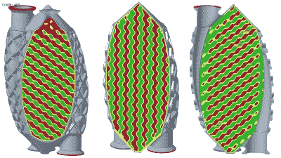

# 3D 打印热交换器使用回转体填充物进行冷却

> 原文：<https://hackaday.com/2022/10/31/3d-printed-heat-exchanger-uses-gyroid-infill-for-cooling/>

3D 打印允许物理制造一些独特的几何形状，而这些几何形状是其他工艺无法实现的。如果你围绕这些优势进行设计，就有可能创造出明显优于传统替代品的零件。考虑到这一点,[高级工程解决方案]创造了一种[金属 3D 打印热交换器](https://www.youtube.com/watch?v=1qifd3yn9S0),它的尺寸是其设计替代产品的一半，效率是其四倍。休息后的视频。

Gyroid infill splits an internal volume in two, perfect for heat exchangers.

该热交换器由铝合金制成，使用激光粉末床熔化(LPBF)机，旨在通过使用燃油作为冷却剂来冷却军用直升机上的传动油。它看起来有点像 Fabergé egg，实际的热交换部分使用了 gyroid“填充物”。gyroids 的一个有趣特性是它创建了两个独立的相互啮合的体积，使它们非常适合这种应用。

它被打印成一体，没有任何可移动的支撑，只有一个内部网格来支撑入口和出口的回转体。唯一需要的后处理是端口上的螺纹和表面清理。由于金属 3D 打印仍然过于昂贵，无法真正实现多次迭代打印，因此在首次打印之前投入了大量的设计和模拟时间。

 [https://www.youtube.com/embed/1qifd3yn9S0?version=3&rel=1&showsearch=0&showinfo=1&iv_load_policy=1&fs=1&hl=en-US&autohide=2&wmode=transparent](https://www.youtube.com/embed/1qifd3yn9S0?version=3&rel=1&showsearch=0&showinfo=1&iv_load_policy=1&fs=1&hl=en-US&autohide=2&wmode=transparent)

无论你是打印热交换器、[外壳](https://hackaday.com/2017/05/24/practical-enclosure-design-optimized-for-3d-printing/)，还是[翅膀](https://hackaday.com/2022/08/26/a-guide-to-3d-printing-model-aircraft-wings/)，一定要记住 3D 打印的优点(和缺点)。

感谢提示[基思奥尔森]！