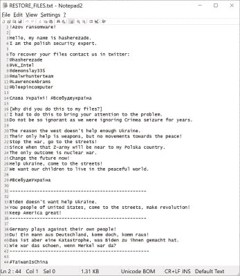

# 本周的安全:OpenSSL Fizzle，Java XML，什么都没有

> 原文：<https://hackaday.com/2022/11/04/this-week-in-security-openssl-fizzle-java-xml-and-nothing-as-it-seems/>

本周早些时候，安全世界为 OpenSSL 漏洞公告而屏息以待。原来这是两个独立的问题，都与 punycode 处理有关，并且它们已经被降级为高严重性，而不是严重。顺便说一下，Punycode 是在域名中使用非 ASCII Unicode 字符的系统。第一个漏洞 CVE-2022-3602 是一个向堆栈写入四个任意字节的缓冲区溢出。值得注意的是，易受攻击的代码仅在证书链被验证后运行。恶意证书需要由证书颁发机构正确签名，或者在没有有效签名的情况下手动信任。

一对消息人士已经[发现了这个漏洞的细节](https://github.com/colmmacc/CVE-2022-3602)。这是循环中的一个错误，在循环中，缓冲区长度的检查早于长度变量的增加。由于逻辑错误，循环可能会运行太多次。该循环处理编码在 punycode 字符串末尾的 Unicode 字符，并将它们注入适当的位置，结果是将字符串的其余部分滑过内存中的一个字节。如果总输出长度是 513 个字符，那就是单个字符溢出。一个 Unicode 字符占用四个字节，所以这就是四个字节的溢出。

现在，这个溢出的可利用程度取决于这四个字节中的内容。当 Datadog 的研究人员在 Linux 上测试该漏洞时，他们发现基本上每个编译的二进制文件都有一个 4 字节的空闲内存区，只有在溢出后才会初始化。换句话说，在那些二进制文件上，这个漏洞完全是良性的。在 Windows 上，由于不同的优化，编译器对这部分内存的处理是不同的。这里，它包含一个[堆栈金丝雀](https://www.sans.org/blog/stack-canaries-gingerly-sidestepping-the-cage/)。这是一个特殊的值，存在于堆栈的最后一个缓冲区，指针和返回值之间。在使用堆栈金丝雀的函数结束时，值在返回到父函数之前被验证，如果它被篡改，进程就会崩溃。这个想法是，覆盖返回地址的缓冲区溢出将无法预测金丝雀值，金丝雀往往故意包括像 0x00 这样的终止符字节，以使利用更加困难。请注意，Linux 二进制文件也使用堆栈加那利，这将防止利用，但由于内存布局和有限的溢出长度，这些从来没有被修改。

第二个修复的问题是 CVE-2022-3786，[安检处尝试解释这个问题](https://blog.checkpoint.com/2022/11/01/openssl-vulnerability-cve-2022-3602-remote-code-execution-and-cve-2022-3786-denial-of-service-check-point-research-update/)。在 Punycode 后跟一个点的情况下，该点被附加到输出字符串的末尾，可能会超过缓冲区的末尾。这与之前的漏洞正好相反。这里溢出的长度几乎是任意的，但是值被锁定为点符号。因此，这是一个严格的拒绝服务问题。

值得庆幸的是，天没有塌下来，但是仍然可能出现未预料到的情况，即 OpenSSL 没有使用堆栈加那利编译，或者崩溃可能被用作更复杂的利用链的一部分，所以如果您运行的是易受攻击的库，版本 3.0.0-3.0.6，请务必获取更新或反向移植的补丁。

## 安全研究人员转向黑暗面？

贝特里奇的头条定律肯定在这里起作用。这个故事很奇怪，因为有人发起了勒索软件攻击，这也是抗议软件，并声称是一些著名的安全研究人员的工作。那么，哔哔声计算机真的是这场勒索活动的幕后黑手吗？这场勒索活动也是在抗议西方对乌克兰缺乏支持吗？哦，这里有很多东西要打开。

首先，它似乎甚至不是勒索软件，因为没有办法购买解密密钥。所以更确切地说是雨刷。雨刷笔记中使用的名字是“亚速海”，这是乌克兰的一个特种部队团，有着古怪的新纳粹过去，这恰好符合俄罗斯关于他们在那里的战争的言论。然后这封短信声称来自 [Hasherezade](https://twitter.com/hasherezade/status/1586669961036046337) ，并列出了几个安全研究员的 Twitter 账号。然后提到克里米亚，抱怨对乌克兰的帮助不够。这是给美国人民的一个特别的信息，呼唤拜登总统，呼吁革命，然后放下“保持美国伟大”的口号。然后，谷歌翻译给我们发了一条对德国很有帮助的信息:“你！一个德国人，快，出来！
但那是拜登给他们带来的一场灾难。默克尔在的时候多好啊？”更奇怪的是，这封信以“#TaiwanIsChina”标签结尾，这似乎是 CCP 赞助的台湾宣传的口号。

很难弄清楚这场运动到底是怎么回事。显然不是它声称的那样。一个亲俄或反俄的黑客试图获得支持？完全是另一回事，利用地缘政治做掩护？这些感染似乎都是 SmokeLoader 的结果，smoke loader 是一种恶意软件即服务僵尸网络。付点钱，把你的有效载荷推给僵尸网络上的机器。只是提醒一下，如果你或你认识的人被这些运动袭击了，执法部门想得到它的记录。为了定位和起诉这些企业背后的犯罪分子，他们需要一些具体的案例来着手。尽管勒索软件罪犯似乎永远不会被抓住，但他们确实会被识别并被抓住。

## Project Zero 拒绝称之为 XML4Shell

[Felix Wilhelm] [发现了一个 Java 问题](https://googleprojectzero.blogspot.com/2022/11/gregor-samsa-exploiting-java-xml.html)，让我们共同高兴的是，他觉得没有必要为它发明一个“4shell”的绰号。这个故事从安全断言标记语言 SAML 开始，它是一种基于 XML 的协议，为 web 的单点登录提供了强大的支持。您想访问服务提供商(SP)网站 X，并从身份提供商(IdP)网站 Y 使用您的帐户。SP 生成一个 XML 文档形式的 SAML 请求，您的浏览器将该文档发送给 IdP。IdP 确认您在那里有一个帐户，并通过浏览器发回一个 XML 签名。由于用户的浏览器处理登录数据是一个明显的潜在问题，数据本身作为签名的一部分进行验证。整个过程是复杂的，其中一个复杂性是一个签名可以包含对其他签名的引用。在完全验证签名之前，签名的 XML 文档可能需要经过几个转换步骤，并且支持可扩展样式表语言转换(XSLT)语言。是的，它是一种图灵完全语言，就在你的 SAML 对象中。如果执行验证的代码没有打开`secureValidation`，代码会被编译成 Java 代码以提高性能。

这个编译过程的一部分是将 XSLT 输入中的值转换成 Java 常量池。该池的大小有限，编译过程不能正确地进行边界检查。当你写超过池的末端时会发生什么？这些数据被理解为类字段——类似于方法定义的字段。为这个溢出会影响的三个字段生成有效值，这样就可以运行任意的字节码了。理论上，这适用于任何处理 XML 签名的 Java 应用程序。最大的警告是`secureValidation`禁用了所有的 XSLT 转换，但是在 JDK 17 中这只是默认开启的。

## urlscan.io 拥有秘密

由 [urlscan.io](https://urlscan.io/) 提供的服务实际上非常有用。给它一个 web 链接，它就会加载它，为你预览页面，并给出一些相关的统计数据。有人发了一个奇怪的链接，你不想在你的机器上打开它？这是你的解决方案。唯一需要记住的是，除非您明确地将扫描标记为私有，否则链接和结果是公开可见的。Github 去年就受到了这种影响，不小心将私有的存储库名称泄露给了服务。这让[FABIAN brun lein]想知道，[其他服务是否犯了类似的错误](https://positive.security/blog/urlscan-data-leaks)？是的。有链接到私人谷歌文档，API 密匙，Sharepoint 和 Zoom 邀请，等等。显然，一些自动化安全服务在没有任何用户交互的情况下将链接推送到服务，并且没有正确使用 API。哎呦。