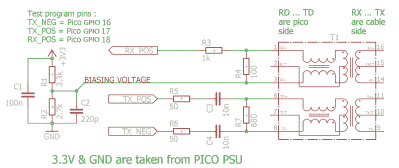

# Pi Pico 上的位碰撞双向以太网

> 原文：<https://hackaday.com/2022/12/03/bit-banging-bidirectional-ethernet-on-a-pi-pico/>

如今，即使是非常便宜的微控制器板也可以选择以太网或 WiFi 接入。但是，如果你有一个 Raspberry Pi Pico 板，并且你真的想给自己一个网络连接呢？你可以做得比[holysnippet]的这个项目更糟，它只使用废弃的无源元件和软件给你一个[位碰撞的双向以太网端口。](https://github.com/holysnippet/pico_eth_doc)

这个项目类似于我们在 8 月份由[kingyo]分享的项目，但不同之处在于[holysnippet]实现的是一个全功能(尽管只有 7 Mbps 左右)的以太网端口，而不是一个简单的 UDP 传输设备。以太网连接本身由 [lwip 栈](https://lwip.fandom.com/wiki/LwIP_Wiki)处理。只要 TX_NEG 后面紧跟 TX_POS，就可以从任何 Pi Pico 引脚连接到 RJ45 插座，但真正棘手的是硬件。

Schematic showing the empirically-determined passive component values required.

这种设计没有开发保护 Pico 的硬件，而是承认它“可耻地依赖 Pico 的输入保护设备”将以太网电压限制在 3.3 V。

你需要一个来自一些旧的以太网设备的隔离变压器(独立的或作为磁性插孔的一部分)，但它只是电阻和电容。有警告称，由于显而易见的原因，不要将它连接到 PoE 网络，并且组件布局需要记住所涉及的~20 MHz 频率，但要让它工作起来感觉像是一个壮举。

通常情况下，没有理由走这么远，但看看是否能做到这一点总是有教育意义的，而且，在当前组件短缺的情况下，这是另一个保持紧急状态的技巧！

当然，将端口放在不该放的地方并不是一个新想法。过去，我们甚至分享了一个不可取的完全没有保护的位碰撞以太网的实现。

感谢[比恩斯特]的提示