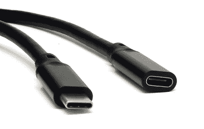
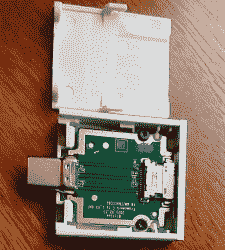
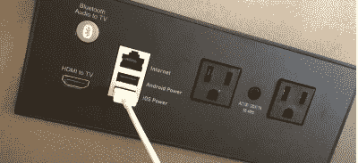
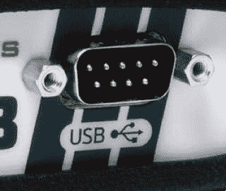

# 所有关于 USB-C:非法适配器

> 原文：<https://hackaday.com/2022/12/27/all-about-usb-c-illegal-adapters/>

让我们明确一点，只有 USB-C 到 USB-C 电缆是不够的。在我们仍然拥有一些没有配备 USB-C 连接器的设备时，我们可能需要大量的电缆用于日常使用，也许是为了过渡。然而，USB-C 规范只考虑了有限种类的电缆，明确或隐含地排除了您可能想要购买或制作的一系列电缆。

我坚信，作为一名黑客，你应该能够买到任何你可能需要的 USB-C 装置。黑客不需要由营销驱动的限制——他们需要了解一项技术如何能够或不能够被使用，基于它的内部运作方式。我希望你能提供这样的理解，以便你能做出明智的决定。

另一方面，USB-C 是为不熟练的人设计的，即使它经常失败。(有人要电缆标签吗？)对什么符合标准的明确定义有助于执行标准。下面是一个臭名昭著的故事，一根 USB-C 电缆杀死了一台 Chromebook，并开始了为[Benson Leung]在线解释 USB-C 细节的职业生涯。事实上，有很多这样的失败故事。今天，我们将讨论 USB-C 装置，它可能会也可能不会让你失望，这取决于你如何使用它们。

## 延伸——拥抱还是熄灭？

USB-C 延长线不符合 USB-C 规范。或者他们是？即使它们不符合标准，它们在实践中是个问题吗？让我们来看一个不好的例子。比如说，你想在一个树莓 Pi 4 上扩展电源端口。

这是[一种 C 型延长线](https://shop.pimoroni.com/products/right-angle-panel-mount-extension-cables-25cm)，可以转发 VBUS 和 USB 2.0 数据线——但不能转发 CC 引脚。如果您将此扩展与 Raspberry Pi 4 配合使用，Raspberry Pi 端口上的 5.1kω电阻将无法在扩展的母端使用，C 型电源也无法再为相关的 Raspberry Pi 供电。嗯，除非是官方的 Raspberry Pi“Type-C”电源，它没有办法检测电阻的存在——当然，违反了 Type-C 规范，但在所有意图和目的下都作为 USB-A 到 USB-C 电缆运行，这使得违规不那么严重。

如果延长线上有一个 CC 引脚，而线缆内有一根单独的电线，那会怎么样呢？确实可以；有些扩展可以做到这一点。可悲的是，这意味着它们只能旋转一次，每当你将电缆插入这样的延长线时，你可能必须翻转它才能工作。对于 F-F 耦合器来说更是如此——如果你想让耦合器工作，你必须将电缆旋转 50%

如何转发两个 CC 引脚，每个引脚都有单独的线路？这确实有用，而且这些也在网上出售。事实上，这就是框架笔记本电脑上的 USB-C 扩展卡的工作方式-由于笔记本电脑上的扩展卡连接器是 USB-C，这些卡只是一个非常短的 USB-C 扩展，一对一地转发引脚。那和有线电视延长线有区别吗？是的。

And some failure modes just straight up escape me. How is this possible?

## 够好吗？不完全地

扩展有什么问题？首先，这种电缆不符合规范，这是一个难题，大多数知名制造商不生产这种电缆，因为他们不想失去 USB 标准小组的青睐，这意味着你经常不得不依赖声誉不佳的制造商，质量控制不达标。鉴于我们使用 USB-C 的一切，这可能会很快出错。为什么不合法呢？

Framework laptop USB-C expansion card, lid off

比方说，你有一个“通过每个引脚”的 USB-C 扩展，它只能在内部处理 3 A。如果你试图用一根 5 A 的 PSU 和一根 5 A 的带这种延长线的串联电缆给你的 100 W 功率的设备充电，PSU 会提供 5 A，这并不明智，但你可能会发现自己处于一个危险的境地，你的电缆绝缘开始融化。另一方面，我的理解是，一个树莓派 4 永远不会消耗超过 3 A，所以在这种情况下，你可能会侥幸逃脱，但这是你的责任。

说到高速信号，就有更多的陷阱。USB-C 电缆已经必须按照一定的标准制造，才能在 40 Gbps 的数据速率下工作，而不是局限于 20 Gbps。如果您使用转发高速电线的扩展来连接高速外围设备，您可能会发现您的设备变得更容易出故障，不时地重新连接。

USB-C 规范可能已经用额外的 e-marker 逻辑解决了这些问题，这将为 USB-C 扩展创造一种和平共存的方式，但他们决定不去打扰。框架 USB-C 扩展卡不会困扰任何人，因为它们被验证在其使用场景中工作良好，不会导致信号问题。作为一个黑客，如果需要的话应该能买到 USB-C 延长线吧？是的。你应该知道相关的陷阱吗？也是的。我们再来谈谈电缆陷阱。

## 数据阻断电缆

You might think there’s different resistors in there, but in fact, there’s different exploits

要求每根电缆至少有一个 USB 2.0 线对。然而，我们确实知道不希望出现这种情况的案例——我们见过恶意的 USB 充电器、电缆和简单的漏洞，当你的手机连接到 PC 时，它们会破坏你的手机。你可能会伸手去拿“数据隔离器”电缆上的速卖通立即购买按钮，同样，如果你知道这种电缆有什么问题，它会有所帮助，这样你就可以作为黑客做出明智的选择…而不是那种黑客。

当连接到 USB-A 端口时，协商功耗(特别是电流，有时还有电压)的唯一方法是使用数据线。这些充电电缆旨在促进这一点，它们往往会将数据线短接在一起，向设备发出信号，表明它可以汲取高达 1.5 A 的电流。然而，由于数据线与充电器端口断开，手机不知道充电器是否真的短接了这些线，从而发出 1.5 A 供电能力的信号。绝大多数端口都可以做到 1.5 A，笔记本电脑和充电器都一样。一些非常旧的端口(或智能手机 USB-OTG 端口)只有 500 mA，其中一小部分端口没有 USB 标准要求的过流保护。

这些情况非常罕见。然而，这个难题让人们在网上对数据屏蔽电缆的存在感到失望。有的充电器不费事协商，有的却费事。这就产生了有趣的情况，比如索尼 PlayStation 控制器不能从某些充电器充电。

无论如何，我不知道你，但对我来说很清楚，USB-C 对数据阻断电缆的限制是世界上所有情报机构的阴谋，他们以看不见的合作水平一致工作，无论如何，你有责任坚持他们并购买数据阻断电缆。更严重的是，只有 500 mA 的端口很少见，没有过流保护的只有 500 mA 的端口更是如此，如果使用数据阻断电缆，当然可以有意识地避开这种端口。

顺便说一下，如果你的数据阻断电缆有 CC 线(如果你想进行数据传输，就应该有 CC 线)，请记住，许多 USB-C 控制器芯片允许通过 CC 连接进行固件更新，众所周知，它们对此并不完全安全。也就是说，如果你想保护自己，你可能只是想轻声细语，并携带一个大的 powerbank。

## USB-C 到 USB-any 适配器

根据经验，大多数带有 USB-C 母插座的适配器都不兼容。它仍然不会阻止我建立一堆这样的电缆，并把它们邮寄给我的朋友，它也不应该阻止你。同样，是什么使这种适配器不合规？

这里有一个 USB-A 公头转 USB-C 母头无源适配器，在我的笔记本电脑唯一的 USB-C 端口因机械原因损坏后，我经常使用这个适配器，但我仍然需要定期使用 USB-C 设备。现在，我用这个适配器从我的 USB-A-only powerbank 给 USB-C 设备充电。这种适配器通常只连接到 USB 2.0 由于 USB-C 中的高速信号双向处理需要有源电子设备，如果你找到这样一种实际上适用于 USB 3.0 的适配器，我敢打赌，它只会在 USB-C 插头的一个方向上适用于 USB 3.0，在另一个方向上回落到 2.0。

两个这种适配器，或者一个适配器和一个 USB 交流电缆，也可以让您建立一个 USB-A 到 USB-A 公-公电缆。你不应该需要，但理论上有人可以做到，USB-C 组真的不喜欢这种可能性。如果您用 A-A 电缆将两个设备插在一起，将导致两个 5 V 电源之间的电流冲突，这可能会导致不可预知的后果——开关模式电源不喜欢您用它们做这种事情，端口保护芯片也可能无法处理这种问题。

问题不在于黑客会不可避免地建立一条 A-A 电缆，然后烧掉他们的笔记本电脑。问题是不太了解的用户可能会这样做。使这些适配器不兼容对于任何希望构建这些适配器的人来说都是一种挫折，尤其是大型制造商。哦，我展示的适配器也有 USB-C 电源端电阻(上拉电阻)的足迹，但甚至懒得填充它。这也是相当不礼貌的。也就是说，这个适配器非常有用。

## USB-C 适配器的桶形插头

有时，你会看到一个桶形插头母到 USB-C 适配器出售。我在这里说的不是触发板，即你将 USB-C PSU 插入板中，它通过桶形插孔为你提供高电压——我说的是你将桶形插孔 PSU 插入其中，然后将其连接到 USB-C 设备的适配器。显然，这里涉及零保护，我甚至不再谈论电阻。

当使用 5 V 电源时，该适配器相当于 USB-A 到 USB-C 电缆。这种适配器无法保证只能在 5 V 电源下使用。当然，黑客可能永远不会把除了 5 V 电源之外的任何东西插入其中。对于普通用户来说，你真的真的不能指望这种情况，他们会终止他们的一些设备。总有一天，任何黑客最终都会表现得和普通用户一样；你不能总是保持警惕。

然而，并非所有器件在 USB-C 端口接受高电压之前都需要协商。例如，Pinecil 烙铁就没有。我建立了一个女性桶插孔到女性 C 型适配器，这样我就可以用我的 Pinecil 和桶插孔 20 伏电源很好的硅软电缆。

如果您将这种适配器的 C 型电缆插入笔记本电脑，同时为其提供 20 V 电压，笔记本电脑很可能会死机。事实上，已知有多起笔记本电脑在这种情况下死亡的案例。有时，USB-C 端口可以防止这种情况，因为一些早期的 USB-C 电源可以单独产生这种情况——不切换回来，并愉快地为下一个插入的设备提供 20 V 电压。也就是说，我们稍后也会谈到这一点。

现在，我已经在我与此适配器一起使用的电缆的电缆插头上写下了“不要”，以确保我永远不会将此电缆插入其他任何东西。如果你希望我有更好的主意，我确实有。还有像这个这样看似合法的适配器[，据说是为笔记本电脑设计的，速卖通关键词好像是“USB PD Step Down”。(道具给@Ralimtek！)它们只能达到 60 W，但它们似乎在进行协商，如果协商后它们实际上只能将电压提高到 20 V，那么它们应该可以完美地从桶形插孔为您的 USB-C 笔记本电脑充电。我还完全打算构建自己的适配器来进行协商，甚至可能使其成为 100 W 的适配器——老实说，我有太多的 20 V 电源，我想好好利用它们。](https://www.aliexpress.com/item/1005004330628933.html)

## 双刃剑

USB non-compliance will keep you on your toes

符合 USB-C 标准还有很多。如果古老的 C 型触发板因为触发 IC 不提供的一些信号而不兼容，我不会感到惊讶。尽管如此，我们黑客还是大量使用它们，而且随着时间的推移，我们只会使用更多。USB-C 不兼容并不妨碍我们享受构建酷炫 USB-C 的乐趣。

有时，人们认为像亚马逊这样的地方应该关闭不合规的电子产品。事实上，破坏 Chromebook 的电缆没有被出售的理由，因为它是伪装成无辜的恶意设计。然而，不起眼的 A-C 阴阳适配器无疑值得保留，即使它真的不应该在大盒子商店中出售。

你最喜欢的不符合标准的设备是什么？