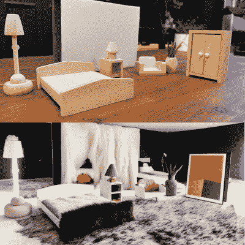

# 给予稳定的扩散一定的深度

> 原文：<https://hackaday.com/2022/12/28/giving-stable-diffusion-some-depth/>

在过去的几个月里，你可能已经听到了很多关于稳定扩散的讨论。新版本(v2)已经出来了，除了标准的图像到图像和文本到图像模式，它还具有非常有用的深度图像到图像模式。[Andrew]有一篇介绍如何使用这种模式的文章。

基本的想法是，你可以将图像和深度带入模型，这允许你控制什么被放在哪里。稳定的扩散有点令人困惑，但是我们已经有了一些很好的资源来帮助你理解它。在输入方面，你可以使用来自激光雷达相机的深度图(许多最近的手机都包括这一功能)，或者让另一个模型(如 MiDaS)从 2D 图片中估计它。当你可以保留一个特定的构图时，比如一部著名电影中的一个标志性场景，这就变得非常强大。你可以在屏幕上保持角色的姿势，但是把场景的风格转换成你想要的样子(如上所示)。

 我们已经[介绍了一种在 blender](https://hackaday.com/2022/12/18/image-generating-ai-can-texture-an-entire-3d-scene-in-blender/) 中生成纹理的技术，但是这种新的深度信息已经被实现来提供更好的纹理精确度。

贾斯汀·阿尔维用它从玩具屋家具中创作建筑照片。使用 MiDaS 模型，他通过将去噪强度设置为最大来估计深度并丢弃 RGB 方面。简化的玩具屋家具很容易被模型识别，这有助于产生很好的效果。

然而，唯一的缺点是透视产生一种相当玩具屋的感觉。改变焦距和移动得更远会有所帮助。总的来说，这是对新的人工智能模型的巧妙利用。这是一个快速发展的领域，所以这很可能在几个月后就过时了。