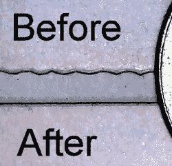

# 调试激光切割抖动，科学的方法

> 原文：<https://hackaday.com/2022/12/29/debugging-laser-cut-wobble-the-scientific-way/>

[PWalsh]正在用他的激光切割机切割丙烯酸树脂，希望切割出令人愉快的光滑边缘。唉，边缘变得摇摆不定，像砂纸一样，一点也不光滑。真扫兴。互联网建议交换步进电机，但没有太多的洞察力——这肯定会是一个皇家的痛苦。您将如何调试这样的问题？嗯，[PWalsh]不想随意交换关键部件，[而是走科学的道路](https://hackaday.io/project/188379)，[为我们分解它。](https://hackaday.io/project/188379/instructions)

在收集了一份可能的错误清单后，他开始研究基本假设。其他激光切割机是否遇到过这个问题？不，即使是便宜的也能适当地切割东西。是水位导致间歇性降温吗？不，不是那个。是步进设置吗？扭曲了，不是那个。激光脉冲频率？没有骰子。

空中辅助？是啊！不知何故，空气辅助导致锯齿边缘，仅仅拔掉它就把切割边缘变成了光滑的表面。运行无辅助不是办法，进一步的调试已经完成。是电源问题还是空气流动不均匀，造成了“泡芙”？一个空气罐被添加到辅助管内，使气流顺畅，这个问题永远消失了。加分–通过调试问题的步骤，切割机还得到了一些急需的维护检查。

任何用 3D 打印机调试过一个奇怪问题的人都会有这样的经历，并且可能会欣赏一点解决问题的科学方法。毕竟，3D 打印本身[可以是一门科学](https://hackaday.com/2020/03/05/3d-printering-getting-started-is-still-harder-than-it-needs-to-be/)你在购买打印机时会遇到，问题[会在你意想不到的地方突然出现](https://hackaday.com/2021/10/17/an-easy-fix-for-inconsistent-layers-in-cheap-3d-printers/)。学习调试故事[总是很有趣，](https://hackaday.com/2016/04/29/fail-of-the-week-my-3d-printer-upgrade/)和[从一开始就有正确的心态](https://hackaday.com/2022/11/04/3d-printer-tuning-an-engineering-approach/)将帮助你节省大量时间，你可以花在打印或剪切上。