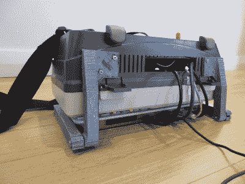

# 2022 年赛博甲板竞赛:示波器甲板

> 原文：<https://hackaday.com/2022/09/30/2022-cyberdeck-contest-the-oscilloscope-deck/>

当[Jak_o_Shadows] Siglent 示波器死亡的时候，他不仅仅是哀悼损失，他看到了一个机会。看，他有一个树莓派 400 已经预留了一个网络平台建设，他刚刚获得了一个新的情况。旧瞄准镜的大部分内部都露出来了，但屏幕和控制旋钮在新版本中保留了下来。一个 HDMI 到 LVDS 的适配器让屏幕恢复了生机，控制旋钮也在进行中。添加到案例中的是一些有趣的东西，比如 LimeSDR，连接到旧的范围输入。PL2303 连接到串行端口，使其也能工作。以这种方式构建保留了原始作用域的功能，这是一个非常好的尝试。

 有很多 3d 打印的东西，像一些内部支架来固定东西。这场展览的真正明星是一个 3d 打印的铰链，将示波器和 Pi 400 固定在一起，使整个包装便于携带。还有一个巧妙的提示，Pi 400 在键盘下有一个巨大的集成热同步。它只是一片金属，所以你可以钻孔和敲击它作为安装点。酷！

这是一个漂亮的构建，当然也是一个有价值的平台，无论你在做什么。重新利用示波器是一种很好的美学。如果[Jak_o_Shadows]可以让他的 STM32 的前面一系列按钮和旋钮工作，这将是一个杀手级的甲板，到处都是控制台牛仔的羡慕。

