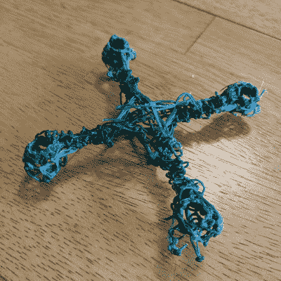

# 3D 笔可以制造几乎可以工作的丑陋的无人机零件

> 原文：<https://hackaday.com/2020/01/05/3d-pens-can-make-ugly-drone-parts-that-almost-work/>

小型业余爱好飞机和轻型塑料零件齐头并进，3D 打印笔制作轻型塑料*东西*没有 CAD 工作和运行 3D 打印机的开销。那么，3D 笔能为小型四轴飞行器创造出有用的塑料零件吗？[迈克尔·尼格尔]决定通过[用装有 ABS 塑料的 3D 笔建造他的无人机部件来寻找答案](https://www.propwashed.com/using-a-3d-pen-for-drone-parts/)。他主要发现，可以礼貌地说，创造出的物体看起来像是一个蹒跚学步的孩子画的草图，但这不是他学到的全部。

他发现，总体而言，创造一件物品比营销材料所暗示的要难。灯丝一离开笔的喷嘴，细小的塑料熔融线就迅速冷却，并做两件事:它有卷曲的趋势，并失去粘着东西的欲望。[迈克尔]发现整个事情的运作不太像“在稀薄的空气中绘画”,而更像管道结霜，或填缝。

An almost functional micro quad frame. The arms aren’t rigid enough to hold the motors vertical when under power.

然而，[迈克尔]试图发现 3D 笔是否可以用来制造任何用途的快速和肮脏的零件。他创造了两个天线支架和一个微型方形框架。所有三个都是混乱的，但一个天线支架是完全可用的。3D 笔确实能够创造出一个形状奇怪的零件，这对于 CAD 来说是一场噩梦。另一个天线部分工作，但没有做任何事情一个拉链不会做得更好。3D 笔中塑料的快速冷却有一个优势:挤出物不会像一团热胶水在硬化前那样“下垂”。

到目前为止，[迈克尔]认为制造任何复杂塑料零件的最佳方法似乎是将各部分画平，一层层地组装起来，然后用笔将各部分焊接在一起，增加体积。他以这种方式制作的微型四框架看起来并不比其他尝试更好，但它确实正确地固定了部件。可悲的是，它不会飞。一旦马达通电，手臂就会扭曲，飞行控制器就无法补偿无法保持直线的马达。这可能是可以克服的，但是虽然最终结果是肮脏的，它肯定不是很快。3D 笔的定位似乎局限于简单、无应力的部分，这些部分不允许在镜子中凝视自己。

如果你有一支 3D 笔，我们想提醒你[这种迷你线轴设计，其零件与笔本身焊接在一起](https://hackaday.com/2017/10/05/mini-spool-system-for-3d-printing-pen-tidies-things-up/)。对于较大的工作，[可以用高温热胶枪代替](https://hackaday.com/2018/02/05/3d-printering-printing-sticks-for-a-pla-hot-glue-gun/)来分配 PLA。