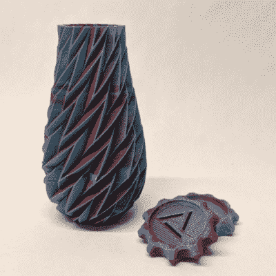

# 3D 打印您自己的多色灯丝

> 原文：<https://hackaday.com/2022/07/06/3d-print-your-own-multi-color-filament/>

有兴趣尝试自己的多色灯丝吗？[Turbo_SunShine]对[说，只需打印自己的照片，然后进行实验！](https://www.thingiverse.com/thing:3565827)现在，如果你认为 3D 打印一些细丝听起来效率很低(甚至是一个噱头),你并不孤单。但是至少有一个用例是有意义的，也许其他用例也是如此。

Printing with bi-color filament results in an object whose color depends on viewing angle, and part geometry.

有一种东西叫做双色灯丝(就像 MatterHackers Quantum PLA ),它可以被认为是从中心分裂成两种不同颜色的灯丝。用这种灯丝打印可以产生一些幻觉，比如[物体的颜色部分取决于观看的角度](https://hackaday.com/2022/05/22/bi-color-filament-kicks-3d-printed-optical-illusions-up-a-notch/)。当然，为了获得最佳效果，购买工厂制造的线轴是有意义的，但是对于光实验，完全可以 3D 打印自己的双色细丝。当[Turbo_SunShine]第一次分享他的结果时，这种东西并不像今天这样现成可用，但在不需要购买整个线轴的情况下，这种技术仍然有意义。

它是这样工作的:细丝的 3D 模型是一个螺旋，这是细丝的正确直径，打印成一个固体物体。这种打印“细丝”的横截面是六边形而不是圆形，这有助于获得一致的结果。要制作双色灯丝，只需用一种颜色印刷物体的前半部分，然后进行颜色变换，最后用第二种颜色完成印刷。最终结果？一个打印的“细丝”的短线圈，有两种颜色，与正常的东西足够相似，可以直接反馈到创建它的打印机中。[_ Icarus]【T1]的这组照片展示了各种可能的结果。

你怎么想呢?3D 打印细丝主要是一种低效率的练习，还是一种对打印机能力的巧妙利用？你是法官，但很明显，从这个过程中可以得到一些有趣的结果。请花几分钟时间观看视频(嵌入在下面)，了解更多背景知识。

 [https://www.youtube.com/embed/6kbjZobJtbM?version=3&rel=1&showsearch=0&showinfo=1&iv_load_policy=1&fs=1&hl=en-US&autohide=2&wmode=transparent](https://www.youtube.com/embed/6kbjZobJtbM?version=3&rel=1&showsearch=0&showinfo=1&iv_load_policy=1&fs=1&hl=en-US&autohide=2&wmode=transparent)

