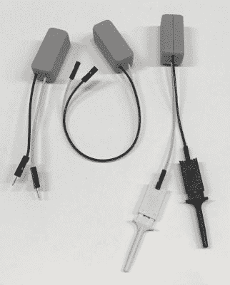

# 3D 可打印范围探头适应您的需求

> 原文：<https://hackaday.com/2021/10/21/3d-printable-scope-probe-adapts-to-your-needs/>

如果有一件东西是我们电子工程师最珍视的，那就是我们的测试设备。这些仪器本身可能贵得令人发指，因为与 DVD 播放机相比，R&D 的所有努力都需要在一个小得多的用户群中得到回报。测试探针本身通常也有令人垂涎的价格标签。以示波器探头为例，几乎每个摆弄硬件的人都会熟悉它。它非常适合四处探索，当你陷入一些调试时拼命寻找灵感，但你只有两只手，没有多余的时间按按钮。

免提探测解决方案是存在的，但是它们可能昂贵、脆弱或者使用起来很痛苦。有时候你只是想焊一根线，让探针连着，希望接地引线不会掉下来，短路什么的。我们已经看到了很多解决方案，所以[这里还有一个你可以自己 3D 打印的](https://www.thingiverse.com/thing:4935122)，所以*几乎*可以免费制作。

由两部分组成的 3D 打印组件在一端嵌入了一对带有 [Molex 0008500113](https://octopart.com/search?q=Molex+0008500113) 弹簧端子的电线，可以使用您选择的引脚、接头或一对普通电线进行端接。一旦你把你选择的线路放进去了，简单地用一点氰基丙烯酸酯把两半粘在一起，你就可以开始了。它专门围绕 Siglent 200MHz PP215 设计，很可能与许多其他品牌兼容。Thingiverse 只有 STL 文件(唉！)因此，要使它适应您的精确探头尺寸可能有些困难，但这个想法至少是好的。

那里不缺乏电子探测解决方案，多年来我们已经覆盖了一些，这里有[一个低成本的电流探针](https://hackaday.com/2020/07/27/a-low-cost-current-probe-for-iot-applications/) , [一个开源的 2 GHz 范围探针](https://hackaday.com/2020/05/07/open-source-2-ghz-oscilloscope-probe/)，如果你想真正 hacky，没有比[2019 Hackaday super co SMD 挑战赛](https://hackaday.com/2019/12/12/supercon-smd-challenge-gets-3d-printed-probes-build-your-own/)更进一步的灵感了。

谢谢[丹尼尔]的提示！