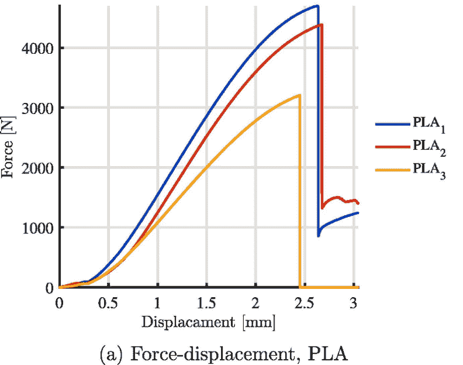

# 3D 打印辐射防护屏经受考验

> 原文：<https://hackaday.com/2022/02/04/3d-printed-radiation-shields-get-put-to-the-test/>

不要太兴奋，3D 打印的辐射盾不会让你在 WWIII 期间免受辐射。但在末日时钟开始敲响午夜钟声之前，你可以通过防止太阳加热你的温度传感器来提高你的自制天气监测站的准确性。但是这有多大的帮助呢？为了制造一个这样的东西，你应该在你的挤压机里装什么材料呢？这些问题，以及更多的问题，[是即将出版的 HardwareX](https://www.sciencedirect.com/science/article/pii/S2468067222000128) 中一篇精彩白皮书的主题。

*环境传感器的 3-D 印刷辐射屏蔽的设计和实施*不仅测试了这些低成本屏蔽与未覆盖的传感器相比的有效性，还解决了关于将 3D 印刷零件留在元件中的具体问题。已经喷过几卷这种材料的读者会知道，普通的聚乳酸(PLA)长丝虽然容易使用，价格也便宜，但并不以其弹性著称。事实上，可再生塑料宣传的特性之一是它是可生物降解的(至少在理论上是这样)，所以不管把它放在外面多长时间，听起来它肯定会变质。

PLA’s mechanical strength dropped rapidly.

长话短说，是的。虽然该团队证明了 PLA 印刷的辐射屏蔽绝对有助于保持安装在内部的温度和湿度传感器的准确性，但该结构本身在紫外线照射下开始迅速变形。进一步的测试确定 PLA 的机械强度在短短 30 天内显示出显著的降低，并且在 90 天后急剧下降。

幸运的是，比赛中不止有一匹塑料马。除了 PLA 印刷的盾牌，研究小组还测试了一种用丙烯腈苯乙烯丙烯酸酯(ASA)印刷的版本，这种版本要好得多。护罩没有可见的变形，90 天后，机械强度的降低可以忽略不计。在屏蔽温度传感器时，它甚至表现得更好，该团队认为这可能是由于材料的光学传输特性。

所以你有它:一个 3D 打印的辐射屏蔽绝对会提高你的天气传感器的准确性，但如果你想让它在外面持续，解放军就不会削减它。另一方面，你也可以通过使用一堆植物托盘来节省大量时间。什么都行。

感谢[tahnok]的提示。