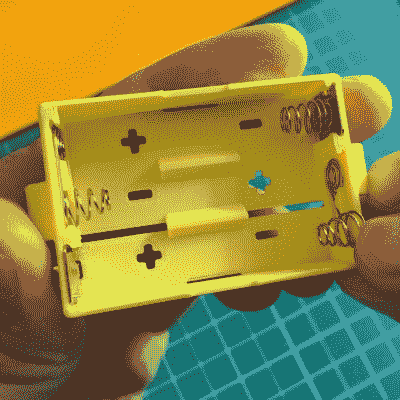

# 3D 打印合成套件分享产品设计见解

> 原文：<https://hackaday.com/2021/09/04/3d-printed-synth-kit-shares-product-design-insights/>

我们总是很高兴看到伴随[Tommy]每一个 synth 产品的深思熟虑和详细的报道，[和他的最新乐器 Scout 的背景，也不例外](https://blog.tommy.sh/posts/scout/)。Scout 是专门为初学者设计的，可以被黑客攻击，并尽可能多地使用 3D 打印的零部件。但是，有效利用 3D 打印作为一种生产方法，不仅仅是简单地生产零件。一切都需要仔细设计和测试，包括 3D 打印电池支架，我们碰巧认为这是一个伟大的想法。

3D printed battery holder, with spring contacts inserted by hand.

[Tommy]还花了一些时间解释他是如何决定包含哪些功能和设计元素以及省略哪些元素的，将 Scout 与他的 [POLY555 synth](https://hackaday.com/2021/03/09/peek-into-this-synths-great-design-and-abandoned-features/) 进行了对比。由于 Scout 的设计价格合理，对初学者友好，太多的功能实际上是一个缺点。零部件成本上升，组装变得不那么简单，更复杂的零件意味着 3D 打印时会有更多的故障点。

[Tommy]选择让 Scout 保持专注，但由于它是完全开源的，具有可攻击的设计，添加功能变得尽可能容易。[Tommy]用 KiCad 设计 PCB，用 OpenSCAD 做其他事情。Scout 使用 ATmega328，可以使用 Arduino IDE 轻松修改。

STL 文件可以在这里下载，所有的源文件都在[项目的 GitHub 库](https://github.com/oskitone/scout)上，其中也包含了详细的组装和修改指南。观看下面嵌入的视频中的实际操作。

[https://player.vimeo.com/video/587660426](https://player.vimeo.com/video/587660426)