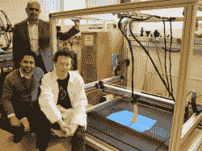

# 3D 打印:巨人

> 原文：<https://hackaday.com/2022/02/28/3d-printering-giants/>

牛顿有句名言:“如果我比别人看得更远，那是因为我站在巨人的肩膀上。”然而，对于 3D 打印来说，情况可能正好相反。如果打印机比其他打印机打印得大，它可能正在使用为较小的打印机开发的作品。现在有各种非常大的 3D 打印机，你经常在媒体上看到“世界上最大的 3D 打印机”的说法 [Roboze](https://www.roboze.com/en/) ，例如，[在每个轴上用 1 米建筑体积做出声明](https://houston.culturemap.com/news/innovation/07-12-21-worlds-largest-3d-printer-houston-roboze-argo-1000-alessio-lorusso/)。

不要争论它们，但是根据你的定义，有更大容量的 FDM 打印机。还有许多其他机器声称大小大致相同，从 3D 平台的 [WORKBENCH XTREME](https://www.3dplatform.com/3D-Printers) 到 re:3D [Terabot](https://shop.re3d.org/collections/gigabot-3d/products/terabot) 。当然，所有这些都要付出很大的代价。但是我们甚至看到了一台带有 800 毫米×500 毫米底座的[自制打印机](https://hackaday.com/2019/12/18/giant-3d-printer-for-giant-projects/)。此外，[无限床打印机](https://hackaday.com/2022/02/03/conveyor-belt-printer-mod-is-nearly-all-printed/)并不罕见，尽管它们确实有一些局限性。特别是，它们通常只在一个轴上较大。

 [https://www.youtube.com/embed/albFKmWW4nA?version=3&rel=1&showsearch=0&showinfo=1&iv_load_policy=1&fs=1&hl=en-US&autohide=2&wmode=transparent](https://www.youtube.com/embed/albFKmWW4nA?version=3&rel=1&showsearch=0&showinfo=1&iv_load_policy=1&fs=1&hl=en-US&autohide=2&wmode=transparent)

然后还有大型工业机器打印出像房屋、桥梁和船只这样的东西。例如，缅因大学的[有一台大型打印机](https://hackaday.com/2019/12/17/humongous-3d-printer-produces-boat-and-challenges/)，它有一个 100 英尺的床，每小时可以打印大约 500 磅塑料！所有这些只需要 250 万美元。你可以在下面的视频中看到，该打印机以一种非常独特的方式冷却零件。

 [https://www.youtube.com/embed/34F71XqvOjg?version=3&rel=1&showsearch=0&showinfo=1&iv_load_policy=1&fs=1&hl=en-US&autohide=2&wmode=transparent](https://www.youtube.com/embed/34F71XqvOjg?version=3&rel=1&showsearch=0&showinfo=1&iv_load_policy=1&fs=1&hl=en-US&autohide=2&wmode=transparent)

## 问题

很容易想到，如果你能制造出一台可以打印明信片大小的打印机，你应该可以毫不费力地将其放大到海报板的大小。但事实并非如此。让我们来关注一下笛卡尔风格的打印机。

你基本上有几个选择。你可以移动床，可以移动打印头，也可以组合使用。例如，许多打印机在 X 和 Z 方向上移动头，然后在 Y 方向上移动床。其他人在 Z 方向移动床，在 X 和 y 方向移动头部。最后一种方案对于核心 XY 力学特别受欢迎。

所以让我们从床开始。如果动了，大床就重了。随着床越来越大，也越来越难找到一张舒适的平板床。没关系。让床保持静止，而不是在 Z 轴上，对吗？它也可能需要加热。如果你曾经有过一个供应不足的廉价打印机，你知道即使是 150 毫米的床热可以是一个挑战。不像加热块，你试图得到一个相当大的面积辐射热量来保持温暖。当你扩大规模时，你就扩大了问题。为了减少电源的负荷，可以选择交流加热器。

床也必须承受更大的重量。当然，对于任何尺寸合理的打印机来说，额外的塑料不太可能太重，但如果你正在制作巨型物体或在高密度材料(如混凝土)上打印，这可能是另一个问题。此外，我们已经看到一个 [3D 打印零件的重量已经超过 1500 磅](https://www.energy.gov/articles/world-s-largest-3d-printed-object)，所以要大胆设想。此外，如果床在 Z 轴上移动，该系统必须提升带有较重加热器的较大的床。

说到床，调平一张大床会比现在更棘手，尽管自动调平可以帮助解决这个问题。另一件可能更糟糕的事情是翘曲。较大的部分收缩时会有更大的力。

## 严格

一张不动的床会更容易支撑，但你仍然有支撑头部的机制。一些非常小的打印机使用悬臂来支撑打印头，但即使是大多数正常尺寸的打印机也支持两端。在某些时候，头部将需要更大的轨道或杆或任何你用来支撑它的东西。

当然，任何对齐问题也会随着你的变大而放大。200 毫米处的 0.5 毫米偏差在 1 米处会大得多。当然，任何种类的错误都会累积起来。随着行程的增加，Z 轴杆上的小摆动或皮带上的一点滑动都会累积起来。

## 热端灾难

假设你不打算做一些奇怪的事情，比如把打印床分成几个区域，你也需要考虑热端。我们已经不喜欢在普通打印机上等待 3D 打印了。巨型打印机可能需要更大的喷嘴和非常高的流速来提高打印速度。但这需要更高的温度。一些较新的 hotends 是为高流量甚至加热而制造的，但这对于非常大的打印机来说将是一个更大的问题。但是考虑一下缅因大学的打印机。它使用 10 毫米的喷嘴在 5 毫米的层中产生 12.5 毫米的线条。

说到高流量，如果真的是为了大型物体拍摄，还有一个顾虑:素材供应。如果您正在给一个线轴供料，它会用完吗？同样，巨大的打印机需要颗粒，这是有道理的。你只需要让料斗装满。

当然，一个答案是[使用一个以上的酒店和](https://hackaday.com/2017/01/08/ces2017-really-fast-3d-printing-for-large-builds/)，尽管这有它自己的一系列问题。我们在 2017 年看到了一个 5 头机器。

 [https://www.youtube.com/embed/51xhIV8taqw?version=3&rel=1&showsearch=0&showinfo=1&iv_load_policy=1&fs=1&hl=en-US&autohide=2&wmode=transparent](https://www.youtube.com/embed/51xhIV8taqw?version=3&rel=1&showsearch=0&showinfo=1&iv_load_policy=1&fs=1&hl=en-US&autohide=2&wmode=transparent)

## 设计行业

权衡是工程的基本部分。我们想要安全的汽车，但是一辆不会毁坏的汽车购买和操作起来都很昂贵。所以你做出了权衡。超大型打印机的设计也是如此。

A very large printer made as part of a Master’s thesis.

当然，我们已经做出了一个你可以重新考虑的基本决定:我们使用普通的 FDM 打印机。机器人手臂或 SCARA 打印机将是另一个选择，尽管你需要做出不同的权衡。没有完美的解决方案。也许真正的大型打印机将是跨在他们的*特设*制造板上的移动机器人，从地面升起或从上面降下？

你制作巨型打印机的计划是什么？如果你想要详细的灵感，有这篇硕士论文详细介绍了大型打印机的建造[。费用是几千美元，但包括一些捐赠的材料。当然，你现在的打印机可以打印巨大的物体。只是](https://www.diva-portal.org/smash/get/diva2:1460398/FULLTEXT01.pdf)[并不是一气呵成](https://hackaday.com/2022/01/16/giant-3d-prints-piece-by-piece/)。无论你做什么，一定要[让我们知道](https://hackaday.com/submit-a-tip/)，这样我们可以帮助你分享你的设计。