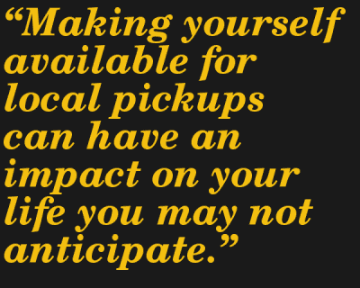
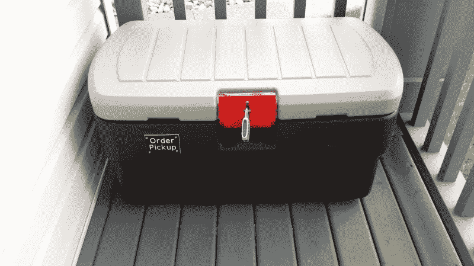

# 3D 打印:出售印刷品，解决取货问题

> 原文：<https://hackaday.com/2020/07/08/3d-printering-selling-prints-and-solving-the-pickup-problem/>

在 3D 打印机启动并运行后，对于一个有事业心的黑客来说，涉足 3D 打印来赚点外快并不罕见。提供本地取货服务是一种常见的创业选择，因为这很简单，而且完全避免了运输。它实际上是为一个伟大的自举实验量身定制的，但任何尝试它的人迟早都会遇到一个关键但看似简单的问题:如何以一种可持续的方式将成品送到客户手中，而这种方式对供应商或客户来说都不是一个麻烦？

接受 3D 文件并在线付款非常容易，但将印刷品送到客户手中并没有一个通用的解决方案。这就是我所说的皮卡问题，如果不解决，它可能会变得不可持续。让我们看看为什么本地拾音器不总是符合标准，然后检查可能的解决方案。

## 本地拾音的问题

印刷工作的本地提货非常好，因为不需要运送物资或承运商。此外，许多 3D 打印在开始时将是相对低价值的工作，反正没有人有兴趣把运费堆在上面。

“您的订单已完成。请到这个地址来取您的订单。”它很简单，而且击中了所有的基地，所以有什么问题呢？

对于一个有员工的企业来说，没有任何问题！但是，如果你是一个有事业心的黑客，尝试把它作为一个兼职，它在几个重要方面是缺乏的。

#### 时间表需要匹配

你需要回家让当地的皮卡工作。可以理解的是，顾客希望能够在方便的时候取货，但是你的时间表需要与之相匹配。任何时候你不在家，有空去开门，本地取件就不管用了，这就把我们带到了下一个问题。

####  规模化和可持续性

时间和注意力是你最宝贵的资源，但是承诺让自己成为当地的常客会以你意想不到的方式影响你的生活和日常事务。你可能会发现自己匆匆忙忙地赶回家，或者为了在家适应皮卡而避免出门。

在家的时候，你可能会发现自己在避免活动，比如推迟任务或者不开始一个项目，因为如果门铃响了，这会干扰你放下手头的工作。这些可以被视为偶尔的成长烦恼，但如果它们成为新常态，这些隐性成本将很快超过任何收益。

#### 位置可能不合适

并不是每个人的家或工作场所都适合让人顺便去取订单。理想情况下，取货地点容易到达，有良好的照明、安全和可及性。并非每个地方都是如此。缺少访客停车位、位置不方便(或者看起来不安全或不欢迎陌生人)的公寓或共管公寓并不适合本地接送。你可能会得到客户，但你不会留住他们。

归根结底，本地接送并不像乍看上去那样“免费”;这涉及到隐性成本，它们将由你来承担。幸运的是，大多数常见问题都有解决方法。

## 潜在的解决方案

在工作环境、地点、时间表或安全方面，每个人的需求都不一样。也许没有一个放之四海而皆准的简单解决方案，但是有事业心的黑客可以混合和匹配一些选项来满足特定的需求。

#### 仅在固定的日期和时间取件

不要试图让自己尽可能的有空，而是按照固定的时间表提供接送服务，并承诺在这段时间内有空。例如，人们可以选择在周二和周四下午 5:00 到 9:30 之间提供本地接送服务。这提供了结构和界限，同时也更容易为每个相关人员进行规划。其余时间，你可以不受干扰或压力地进行日常工作和活动。

#### 提供合理的运输

这增加了成本，也限制了你能接受的工作种类。此外，您还需要获得和管理一些基本的运输用品，如箱子、包装带和包装材料。但回报是让其他人完全处理递送的好处，你将能够服务于更广泛的地区，而不是单独的本地收件。

寻找以折扣包裹价格提供邮政服务的在线运输合作伙伴；这些都是网上卖家常用的。你可以在网上购买运输标签，然后把箱子放在离你最近的邮政网点，或者在某些情况下要求收件。只要记住，当谈到航运，一般来说，更小更轻就意味着更便宜。航运熟练度有点像烤面包；你做得越多，就会越好。

#### 提供某种形式的自助提货服务

随着全球新冠肺炎疫情的全面展开，自助服务和非接触式皮卡是一种更加普遍和公认的做事方式。高度依赖于位置和安全性，它仍然是一个有用的选择。

自助取货的一个很好的例子是一家家庭企业，我最近从这家企业购买了一种特殊的乙烯基板材。他们有一个非常简单的系统:打开他们的邮箱，取回任何有你名字的信封。没有锁或访问控制可言，但他们显然不需要。这非常方便。

在这种情况下，完美可能是好的敌人。混合和匹配解决方案，或者根据需求的变化从一个解决方案转移到另一个解决方案是完全合理的。由于 3D 打印物体的价值相对较低(比如说，与笔记本电脑或金砖相比)，因此更容易接受一些风险，并尝试找到一个好的折中方案。

## 什么对我有效

在尝试了一些不同的事情后，我决定采用自助取货方式，并结合固定的取货时间。

 我买了一个可上锁的户外塑料储藏箱，并在前面贴了一个标志，在后面贴了一个绳锁。每天早上，我把箱子放在前面的甲板上(一个光线充足的地方，从人行道上看不到全部)，用铁锁锁好。晚上，我把它带到室内。

为了便于出入控制，门闩用字锁固定。转动转盘组成正确的单词就能打开它。

订单完成后，我会给客户发电子邮件，告诉他们提货说明和密码。他们会在方便的时候来，取回订单，然后离开。如果有任何问题，我会提供我的手机号码。

我最终认为我在安全性方面做得太过了，去掉了锁这个词。这对客户来说是一个麻烦，如果我遇到问题，我总是可以锁定更多的东西，但我足够幸运，从来没有出现过问题。这个箱子甚至偶尔会兼作其他工作和材料的投放点。

我对这个解决方案非常满意，它运行得很好，直到我不再接受在线打印订单，而是专注于自己的工作，不再需要它。如果我有什么不同的做法，我会把箱子举到齐腰的高度，这样会更舒服，但仅此而已。

## 你遇到过取货问题吗？

无论是对于 3D 打印还是其他，作为卖家还是客户，你有没有遇到过取货的问题？你对此做了什么？如果你有任何见解或经验要分享，请写在评论里，因为我们很想听听。