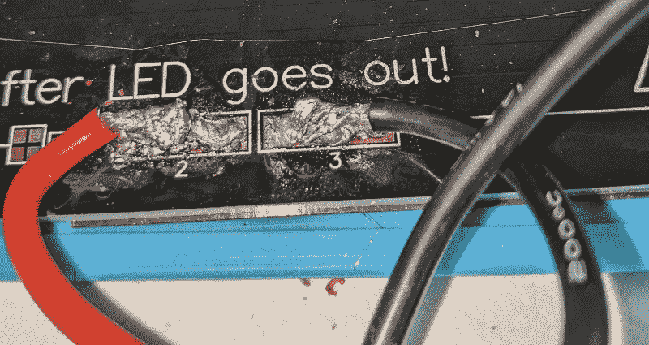
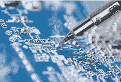

# 3D 打印:焊接加热床

> 原文：<https://hackaday.com/2022/01/11/3d-printering-soldering-a-heated-bed/>

有一句老话，说什么东西是“沧海一粟”这就是我面对用新的 24 V 加热床替换我打印机上的 12 V 加热床时的感受。旧床有一个工厂组装的很好的连接器，尽管我很久以前就因为那个特殊打印机的发热问题更换了电缆。然而，新床只有裸露的铜垫。

我不是焊接新手:我在 20 世纪 70 年代初做了第一个焊点。所以我觉得自己有能力接受挑战，但我也知道我不能用我常用的 Edsyn 熨斗来做这样的工作。由于加热床本质上是这些垫的巨大散热器，我知道它需要大枪。我翻出了我的旧——我的意思是超级旧——韦勒 140 W 焊枪。当然，这就够了，对吧？

## 嗯，越好…

很明显，它没有，否则你现在不会读到这篇文章。可能它只是需要一个新的尖端——这东西太旧了，但它不会让焊盘热到足以让焊料真正流动。我终于把电线粘住了，但焊接点太差了，我无法想象它们能承受住不断的弯曲。

The Weller 140 W gun fails!

我想过尝试热风枪，但我决定尝试更不同的东西:火焰。你可以从不同的地方以不同的价格买到丁烷烙铁和焊炬。因为便宜，我从 Harbor Freight 买了一个施耐德品牌的熨斗。手柄有三个嵌套的附件。一个项圈像火炬一样射出火焰。一个适合衣领的小管让火焰远离，你可以从末端得到热空气。那根管子也可以装烙铁头。

Hard to imagine using this iron for fine SMD work.

我们认为 Harbor Freight 网站上的宣传图片可能有点乐观。我们不推荐使用这种熨斗在 PCB 上进行表面贴装工作。然而，我需要大量的热量，正如下面的视频所讨论的，这东西熄灭了几乎太多的火焰。你可以像视频中的[marshkid1]那样修改它，使它输出得更少，但那不是我的问题。

事实证明，获得丁烷不像以前那么容易了。除此之外，你真的希望丁烷为这种工具，所以它不会堵塞。我决定只用打火机填充丁烷，抓住机会。到目前为止，一切顺利。

只有一个问题。尽管有强烈的火焰，焊料并没有熔化到可以流动的程度。电线上的镀锡会熔化，焊盘的一部分会熔化，但由于 PCB 的整个表面区域都不散热，因此不可能获得良好的连接。

## 怎么办？

我打算用烤箱或电热板加热整块木板。我甚至想过在红外线灯下焊接。最后，我采用了双管齐下的方法。我把烙铁上的烙铁头拿下来，让它在连接处喷射热气。然后我用了 Weller，我终于得到了相当好的焊料流动。然而，仅有热空气是不够的。

Adequate, but not great.

关节不是我做过的最好看的，但似乎即使在使用中也能保持。当然，我用松香浸泡所有东西，把所有东西装罐，确保所有东西都是干净的。热容量太大了。

我可能还会再试一次，尽管它现在已经足够好了。也许我需要一个巨大的汽车烙铁。或者也许我应该用 SMD 热风枪预热接头。我相信我会在评论里找到一些可以尝试的东西。

我觉得[这不是答案](https://hackaday.com/2017/11/17/cheap-flamethrower-is-predictably-worrying/)。也许焊接一个 PCB 加热器需要[一个 PCB 加热器](https://hackaday.com/2021/03/21/pcb-reflow-with-a-pcb/)？

 [https://www.youtube.com/embed/rKuasFZt370?version=3&rel=1&showsearch=0&showinfo=1&iv_load_policy=1&fs=1&hl=en-US&autohide=2&wmode=transparent](https://www.youtube.com/embed/rKuasFZt370?version=3&rel=1&showsearch=0&showinfo=1&iv_load_policy=1&fs=1&hl=en-US&autohide=2&wmode=transparent)

