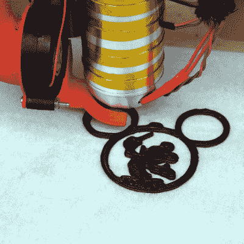
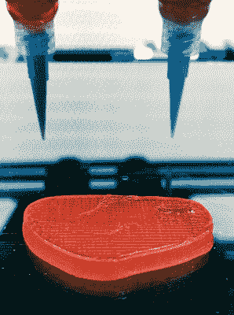

# 3D 打印:探索可打印的食物

> 原文：<https://hackaday.com/2019/04/24/3d-printering-the-quest-for-printable-food/>

最近，一段视频在社交媒体上流传，视频显示了一家名为 NovaMeat 的公司开发的 3D 打印“牛排”。在这个短片中，可以看到一台机器将豌豆和海藻等配料制成的糊状物挤压成与靴底相似的形状，靴底在平底锅中短暂油炸。这种未来派食物的切片被喂给路人，试图证明它确实可以食用。当摄像机转动的时候，没有人吐出来，但是他们脸上的表情可能最好被解释为顺从的礼貌。是的，你可以吃它。但是如果你煮的时间够长，你也可以吃一只真正的靴底。

公平地说，NovaMeat 的目标当然是高尚的。创始人兼首席执行官 Giuseppe Scionti 表示，我们需要开发新的可持续食物来源，以应对当前畜牧系统的环境成本，他认为像 3D 打印牛排这样的肉类替代品可能是答案。事实上，找到减少肉类消费的方法将对环境产生积极影响，但似乎他的团队在普通肉食者被从他的机器中挤出的物体所诱惑之前还有很长的路要走。

但是 NovaMeat 团队并不是第一个尝试从改良的 3D 打印机中哄出食物的人，绝对不是。他们只是最近加入了一个令人惊讶的个人和实体名单，不仅仅是美国军方，已经研究了这个概念。最终，他们一直在追求说服许多黑客和制造商购买他们自己的桌面 3D 打印机的同一件事:按照制造商的严格规格生产东西的能力。一台能够生产出具有特定风味和质地的食物的机器，从本质上来说将是终极厨师，但当然，说起来容易做起来难。

## 定制美食

 应该说，在打印可食用物品方面没有什么神奇之处。从自制机器到商用桌面 3D 打印机的偶尔官方配件，我们已经在业余爱好者的规模上看到过很多次了。在绝对基础的层面上，你只需简单地用一个装满某种可食用的糊状物的注射器替换现有的挤压机和加热器:花生酱、面团、糖霜，等等。

到目前为止，似乎巧克力取得了最大的进展，因为它的某些属性与桌面 3D 打印机设计的热塑性细丝并不完全不同。如果你把它加热到足够的温度，它会挤压成一个漂亮的小珠，一旦它冷却下来，它会回到固态。掌握好温度和时间，结果会令人印象深刻。[在 2018 年 Maker Faire 期间，我们近距离观察了可可榨汁机](https://hackaday.com/2018/09/29/maker-faire-ny-cocoa-press-chocolate-printer/)，这是一个如何利用现有技术将这些技术付诸实践的完美例子。

## 准备挤出的饭菜

制作定制形状的巧克力是一个足够巧妙的技巧，甚至有一些商业应用，但你会受到机器的单一挤压机设计的固有限制。就像塑料打印机一样，下一步是添加多个挤出机或至少能够在挤出机中切换材料。从理论上讲，这将允许你创造复杂的食物，这些食物具有混合的味道、质地，甚至营养价值。

这正是 2014 年美国陆军战斗给养局(CFD)对打印食物感兴趣的原因。他们的想法是，他们不仅可以根据特定士兵的胃口定制战场口粮，还可以确保口粮中含有他们目前缺乏的任何维生素和矿物质。原则上，这意味着他们几乎可以减少食物浪费，同时确保满足前线战斗人员增强的营养需求。

如果这听起来有点异想天开，那是因为它确实如此。首先，能够创造满足个人精确实时营养需求的食物需要一些系统来快速和容易地识别这些需求是什么；计算流体动力学简单假设的一种技术能力将在未来战场上可用。此外，3D 打印机足够复杂，能够完成这样的壮举，同时又足够紧凑和坚固，足以让士兵携带进入战场，这种想法几乎是科幻小说。如果赌注不是如此之高，一名士兵蹲在散兵坑里试图诊断为什么他们的打印机没有挤出特定的味道的心理图像可能是滑稽的。士兵随身携带的任何东西都必须尽可能的可靠和坚固，任何不足都可能成为致命的负担。

也就是说，该计划的其他目标:通过定制食物减少浪费，通过允许士兵创造他们真正想吃的食物类型来提高士气，是印刷食物确实有希望的领域。正如我们以前多次看到的那样， [3D 打印在用于创建某样东西的一次性定制实例时效果最佳](https://hackaday.com/2015/09/25/hackaday-prize-semifinalist-individualized-breathing-apparatus/)，无论你打印的是 PLA 还是大豆蛋白，情况都是如此。

## 时间问题

 一台机器可以根据请求者的营养需求专门制作一顿饭，这更像是《星际迷航》中的复制人*，而不是在可预见的未来我们厨房里可能有的任何东西。但是，一台可以把捣碎的豌豆喷射成你想要的任何大小的牛排形状的机器显然是我们用当代技术能够做到的。那么，为什么我们不能从最新的威廉姆斯索诺马目录中订购一个呢？和 3D 打印没有取代传统制造业的原因一样:它慢得令人痛苦。*

 *在目前的 NovaMeat 打印机中，打印牛排的时间可能是烹饪牛排的两倍。对于概念验证来说，这可能是可以接受的，但它永远不会成为商业产品。这对餐馆来说更不实际，对大规模生产来说完全不现实。该过程受到移动挤出机的物理约束的限制，虽然肯定可以进行一些优化(例如使用更大的喷嘴)，但这些只会让你到此为止。FDM 印刷术固有的“速度限制”阻止了它取代传统制造业，也将阻止它准备我们的食物。至少在不久的将来是这样。*