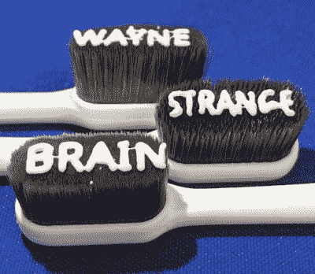

# 以科学的名义 3D 打印牙膏

> 原文：<https://hackaday.com/2021/10/14/3d-printing-toothpaste-in-the-name-of-science/>

虽然我们不常在业余爱好者社区看到它们，但可以挤出凝胶和粘性液体的 3D 打印机已经在商业上存在多年，并越来越多地用于生物研究。[【Ahron Wayne】最近一直在研究这样一台打印机](https://www.youtube.com/watch?v=Js_h3voZ04U)作为一个项目的一部分，该项目旨在开发一种由蜂蜜和凝血蛋白制成的打印伤口敷料，但出于实践目的，他希望找到一种更便宜、更常见的具有类似挤压特性的材料。

 他选定的材料最终是普通的牙膏。在下面的视频中，你可以看到他在 CELLINK INKREDIBLE+ bioprinter 的墨盒中装入薄荷糖，然后通过压缩空气将薄荷糖从一根细钝头针中挤出。在使用这种材料打印出各种形状和文字后，通常是直接打印在牙刷的刷毛上，他想出了一系列打印类似粘性物质的技巧。

首先，慢慢来。[Ahron]说材料在挤压后需要一段时间来收缩，如果它有希望支撑下一层印刷的话。厚层高度是必要的，因为这是避免在你的设计急剧弯曲。他还指出，必须避免悬垂，尽管这可能是不言而喻的，但他澄清说，牙膏印刷的物体永远无法支撑超过其自身重量的任何东西。

这些年来，除了为数不多的合法 DIY 生物打印机增光添彩外，[我们偶尔还会看到巧克力 3D 打印机](https://hackaday.com/2018/09/29/maker-faire-ny-cocoa-press-chocolate-printer/)，它们以类似的原理生产定制食物，因此【Ahron】学到的经验并没有完全被黑客和制造商群体遗忘。谁知道呢？也许有一天，当你试图用一台[改装的 3D 打印机来打印焊膏](https://hackaday.com/2014/04/02/dispensing-solder-paste-with-a-3d-printer/)时，你会发现自己在查阅这个视频。

 [https://www.youtube.com/embed/Js_h3voZ04U?version=3&rel=1&showsearch=0&showinfo=1&iv_load_policy=1&fs=1&hl=en-US&autohide=2&wmode=transparent](https://www.youtube.com/embed/Js_h3voZ04U?version=3&rel=1&showsearch=0&showinfo=1&iv_load_policy=1&fs=1&hl=en-US&autohide=2&wmode=transparent)

