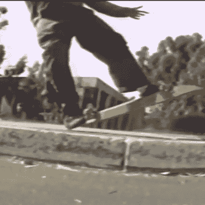

# 99%的灵感、99%的汗水和 99%的合作

> 原文：<https://hackaday.com/2021/03/06/99-inspiration-99-perspiration-and-99-collaboration/>

我正在看 Rodney Mullen 的老式 TEDx 演讲，Rodney Mullen 可能是有史以来最具创新精神的街头滑板手，但这不是重点，也不是他最好的演讲。一路走来，他声称想法是最重要的事情，尤其是一个特定的滑板技巧甚至是可能的想法。

他在滑板之旅中环游世界，他的经验是，有数以百万计的孩子足够聪明，当他们看到一个视频，证明一个特定的技巧想法是可能的，他们可以在短时间内复制它。不是因为视频向他们展示了如何做，而是因为它扩展了他们对可能性的看法。他们已经准备好了，所以把他们推到边缘的是灵感。

在街道的另一边，我们有托马斯·爱迪生和他的“1%的灵感，99%的汗水”的惯例。众所周知，爱迪生在选定钨丝配方之前尝试了数十亿种灯丝配方，并将其成功归因于“投入时间”或“老式的努力工作”或类似的东西。那么谁是对的呢？

 卡斯帕幻灯片和留声机的发明者都是对的。罗德尼认为这些孩子投入时间是理所当然的；他们毕竟是溜冰者，他们溜冰。他看不到 99%的汗水，因为这是自然背景，而灵感在灵光一现时闪现。

同样，托马斯 E. *way* 低估了灵感。他已经迷上了这个新奇的想法，拿起一个弧光灯，把它装在一个玻璃封套里——毕竟，那是他花费了所有汗水的东西。但是没有那个关键的灵感，他只会汗流浃背。

他们也都错了！他们都缺少第三个要素:协作。当然，马伦一生都和其他溜冰者在一起，教他们他所知道的，并反过来从他们那里学习，他不会说溜冰者群体没有塑造他。即使在孤独的滑冰运动中，也没有人是孤独的。爱迪生呢？他的公司从更广泛的科学进步和科学文献中获益匪浅。[门洛帕克](https://www.menloparkmuseum.org/history)的存在是为了把聪明、训练有素的头脑集中到一个地方，一起分享、教学和工作。它体现了合作创新的理念，也是他的一些最佳作品完成的地方。

所以我和艾萨克·牛顿，“[站在巨人的肩膀上](https://en.wikipedia.org/wiki/Standing_on_the_shoulders_of_giants)”。成功是 99%的协作。这给我们留下了一个问题:这些百分比并不一致。但对我来说没关系。

This article is part of the Hackaday.com newsletter, delivered every seven days for each of the last 200+ weeks. It also includes our favorite articles from the last seven days that you can see on [the web version of the newsletter](https://mailchi.mp/hackaday.com/hackaday-newsletter-649368). Want this type of article to hit your inbox every Friday morning? [You should sign up](http://eepurl.com/gTMxQf)!