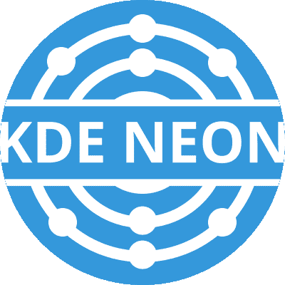

# 99 美元的 Pinebook 获得 KDE 霓虹港

> 原文：<https://hackaday.com/2018/08/29/99-pinebook-gets-kde-neon-port/>

如果你是那种喜欢小巧便宜的 Linux 设备的人，你肯定是生活在历史的完美时刻。似乎每隔几个月，我们就有另一个小小的 Linux 板为我们的口袋改变而竞争，所有人都不顾一切地试图废黜已经将价格设定得异常高(或低，视情况而定)的树莓派。我们甚至已经开始看到这些 Linux 主板进入适当的廉价笔记本电脑，尽管到目前为止还没有一个真正给人留下如此深刻的印象。

 但多亏了 Blue Systems 和 Pine64 的努力，情况可能会有所改善:[他们曾合作为售价 99 美元的 Pinebook 打造 KDE 霓虹灯。](https://forum.pine64.org/showthread.php?tid=6443)事实上，他们已经得到了等离子，KDE 的现代桌面环境，在相当平庸的硬件上运行本身就是一项成就。但他们也开始为 Pinebook 定制整个系统，从内核和图形驱动一直到 Qt 和等离子调整。

在一篇宣布操作系统候选版本的博客文章中，Neon 开发人员[Jonathan Riddell]说，这些从上到下的改进表明，如果你真的愿意进入并优化它，你可以将一台超级便宜的 Linux 笔记本电脑变成一台实用的电脑。他还说，这个项目是双向的，因为对 Pinebook 构建的改进也应用到了上游开发中。

上一次我们看这本小册子时，我们持谨慎乐观的态度。这不是很好，但考虑到价格，这已经是你能想到的最好的了。如果更多的开发者愿意冒险开始优化他们的设备软件，它可能会成为一个非常有希望的低成本移动黑客平台。