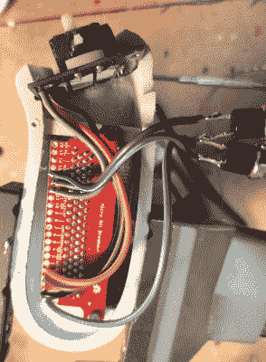

# 3D 打印微型双截棍

> 原文：<https://hackaday.com/2019/07/08/a-3d-printed-microbit-nunchuk/>

正如[Paul Bardini]在[Thingiverse 页面上为他的“Micro:Bit Hand Controller”](https://www.thingiverse.com/thing:3728487)解释的那样，内置于 BBC 教育微控制器中的蓝牙无线电使其成为远程控制事物的理想选择。你只需要给它一个漂亮的外壳，一个操纵杆，几个按钮，你就可以走了。您甚至可以将集成加速度计用作另一个控制轴。这听起来有点耳熟，尤其是对游戏玩家来说。

 虽然它可能没有任天堂官方的质量认证，但 3D 可打印外壳【保罗】已经为 Micro:Bit 设计出来了，它肯定从 Wii 标志性的“双节棍”控制器中汲取了不少灵感。他对操纵杆和瞬时按钮的位置做了一些改动，但它仍然具有标志性的单手人体工程学造型。

在一个特别好的接触中，[Paul]围绕 SparkFun 的 Micro:Bit 分线板构建了他的控制器，允许您通过其 edge 连接器插入微控制器。这意味着你可以把板子拔出来，然后在其他项目中使用。控制器的另一个连接通向电池，电池使用两针 JST-PH 插头，可以很容易地拆除。

由于这种分线板，内部布线非常简单。操纵杆(PS2 控制器中使用的类型)和按钮直接焊接在分线板上的引脚上。不需要无源器件，只需要几根短的软线就可以蜿蜒穿过印刷外壳。

Thingiverse 页面只有控制器两部分的 STL，没有 Micro:Bit 本身的源代码。但是，将基本功能与到处流传的示例代码拼凑在一起应该不会太难。[尤其是现在你可以在上面运行 Python 了](https://hackaday.com/2015/10/20/bbcs-microbit-gets-python/)。当然，[如果你不打算重新发明~~轮子~~双节棍，你也可以在最初的 Wii 版本](https://hackaday.com/2011/02/18/bluetooth-enabled-wii-nunchuck/)中加入蓝牙。