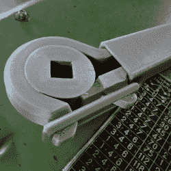

# 一个 3D 打印的棘轮可以真正承受扭矩

> 原文：<https://hackaday.com/2022/10/15/a-3d-printed-ratchet-that-can-really-take-the-torque/>

打印工具并不以其耐用性而闻名，但[Gladius]向我们展示了通过一些深思熟虑的设计，[有可能打印出能够处理惊人扭矩的棘轮扳手](https://www.printables.com/model/294886-3d-printed-ratcheting-wrench-with-30nm-max-torque)。

Look closely, and you can see that the parts are almost entirely made up of perimeters (click to enlarge).

这种特殊的扳手的灵感来自于[美国宇航局的 3D 打印棘轮扳手](https://hackaday.com/2014/12/20/first-ever-parts-emailed-to-space/)，以及[20 世纪早期的设计](https://patents.google.com/patent/US928719A/en)。它有一个 1/2 英寸的方形插座，可以安装现代的适配器，让那些钢铁部件完成它们的工作，而扳手本身则提供肌肉。

[Gladius]发现最强的结果来自切片部分——尤其是手柄——因此它们几乎完全由周边组成，几乎没有传统的填充。想了解更多？reddit 上有一个讨论，其中[Gladius]详细介绍了测量和性能。

多年来，我们已经看到了我们的强大的打印份额。例如，深红斧手能做的事情看起来完全令人生畏。说到打印移动的东西，我们想提醒你这个方便的提示，通过(错误地)使用爪式联轴器，轻松可靠地[将电机轴连接到打印的零件上。](https://hackaday.com/2019/09/02/misuse-this-part-to-attach-3d-printed-stuff-to-a-shaft/)