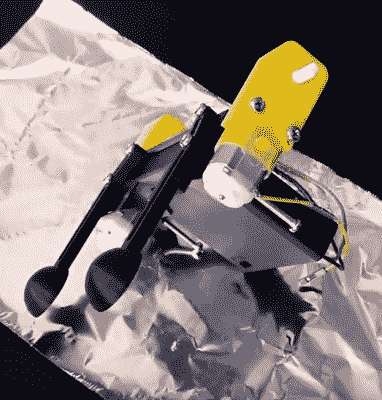

# 你的手机 3D 打印机器人战车

> 原文：<https://hackaday.com/2019/02/01/a-3d-printed-robotic-chariot-for-your-phone/>

正如我们过去多次说过的，低成本模块化组件的广泛可用性确实降低了许多复杂项目的准入门槛，而这些项目在以前对于业余爱好者来说几乎是不可能完成的。机器人领域在过去几年里尤其迅猛发展，因为现在甚至 100 美元就可以组装一个强大的机器人实验平台，而这在十年前可能是 DARPA 资助的对象。

 但是如果你想走得更低呢？组装像远程呈现机器人这样的东西最便宜、最简单的方法是什么？[这正是【高级机器人】在他们的最新项目中着手确定](https://www.thingiverse.com/thing:3379011)的东西，这个小工具的最终形式可能会有些令人惊讶。利用几乎每个人口袋里都有一个能够进行视频通话的设备这一事实，该套件使用简单的硬件和 3D 打印组件来生产一辆可以随身携带智能手机的汽车。有了电话提供的音频和视频链接，机器人只需要按照操作者的命令滚动。

机器人底盘由几个简单的 3D 打印组件组成，包括支撑手机和电子设备的底座、轮子和两个后部“勺子”，后者用于提供一种低摩擦的方式来保持两轮设备垂直。为了让它滚动，两个标准的 DC 齿轮马达被固定在两侧。打印机灯丝的成本很低，而且这些马达在网上只要 2 美元就能买到，很难想象还有比这更便宜的方式让你的电子设备运转起来。

至于电子设备，[Advance Robotics]正在使用 Wemos D1 Mini ESP8266 开发板以及 L298N 电机控制器，这是另一种成本非常低的解决方案。所提供的源代码汇集了一些开源库和示例，以提供一个简单的基于 web 的用户界面，允许操作员从他们的浏览器连接到机器人，只需点击几下鼠标即可移动它。

如果你喜欢[打印漫游车来探索你的客厅](https://hackaday.com/2018/10/29/low-cost-autonomous-rover-will-drive-your-projects/)的想法，但[想要更高级一点的东西](https://hackaday.com/2018/06/17/fpv-rover-2-0-has-3d-printed-treads-and-plenty-of-zip/)，我们已经看到[可打印机器人平台肯定能满足你的需求](https://hackaday.com/2018/07/15/watney-a-fully-3d-printed-rover-platform/)，无论你的技能水平如何。

 [https://www.youtube.com/embed/LvdjESPrVUQ?version=3&rel=1&showsearch=0&showinfo=1&iv_load_policy=1&fs=1&hl=en-US&autohide=2&wmode=transparent](https://www.youtube.com/embed/LvdjESPrVUQ?version=3&rel=1&showsearch=0&showinfo=1&iv_load_policy=1&fs=1&hl=en-US&autohide=2&wmode=transparent)

