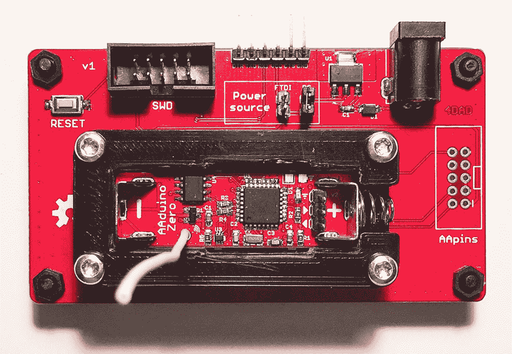

# 更好的电池 Arduino

> 原文：<https://hackaday.com/2018/10/01/a-better-battery-arduino/>

我们以前见过[Johan]的 AA 电池大小的 Arduino/电池跨界车，但很快(我们希望！)将会有[一个新版本](https://johan.kanflo.com/the-aaduino-zero/)在相同的独特外形中具有更多 MIPS！[原装 Aarduino](https://hackaday.com/2016/04/18/the-aaduino-is-an-arduino-in-an-aa-battery/) 遵循经典 arduino 部件选择，设计为作为 3 芯电池座中的第三个“电池”运行，通过 HopeRF RFM69CW 中继温度读数。但是正如[Johan]注意到的，事实证明现在 ARM 开发工具很便宜。有些情况下*很*便宜而*很* [开源](https://1bitsquared.com/products/black-magic-probe)。那么，为什么不将一个出色的设计更新为马力更大的设计呢？

Aarduino Zero 使用相同的大 PTH 电池端子，并遵循与原始设计相同的模式；用户将它插在电池座中获取电力，它使用 RFM69CW 进行无线通信。但现在的核心是一个 [STM32L052](https://www.st.com/en/microcontrollers/stm32l052t6.html) ，一个简洁的低功耗 Cortex-M0+与一个小 EEPROM 板载。[Johan]还增加了一个中等大小的串行闪存，以方便离线数据记录或 OTA 固件更新。此外，还有一个光滑的新测试夹具来配合这一切。

那么你如何得到一个呢？嗯……这就是问题所在。看起来当这篇文章最初在 2017 年底发布时，[Johan]正计划发起[一场人群供应活动](https://www.crowdsupply.com/johan-kanflo/aaduino-zero)，但尚未完全实现。在那之前,[的软件源对于零](https://github.com/kanflo/aaduino-zero/)是可用的，并且总是有[的源来自最初的 Aarduino](https://github.com/kanflo/aaduino) 来检查。