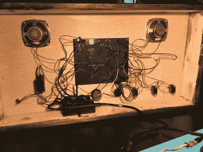

# 有感官需求的儿童的指挥中心

> 原文：<https://hackaday.com/2020/01/25/a-commmand-center-for-children-with-sensory-needs/>

给孩子的玩具应该是有趣和互动的，但是如果它们也有教育意义就更好了。对于[carrola1]来说，一个患有医疗残疾、感官需求和自闭症的 4 岁孩子的父母，更个性化的方法似乎是最好的。电气工程师建造了一个[壁挂式指挥中心](https://hackaday.io/project/169293-command-center),里面有大量的开关、按钮和旋钮，可以让任何孩子开心。

除了基本的输入，该设备还有一个颜色传感器——指挥中心可以要求孩子提供一个特定颜色的物体，并在他们成功获得一个物体时用一首歌来祝贺他们。

对于 STM32L0 系列 MCU，用于音频和灯光控制的软件是用 C 编写的，CMSIS 作为硬件抽象层，STM32CubeIDE 作为 IDE。该设计使用 SPI 和 I2C 进行串行通信，使用 I2S 进行数字音频设备之间的通信。物理输入包括拨动开关、旋转开关和按键开关，以提供多样性，所有物理硬件都连接到定制 PCB 上的 MCU。

来自 wav 文件库的音频输出似乎是构建中最具挑战性的部分:放大器需要从左声道单声道配置更改为立体声，输出必须经过 LC 滤波，并且必须优化代码大小以允许音频文件播放。

你可以在 Reddit 帖子上查看指挥中心的视频。