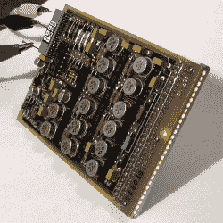
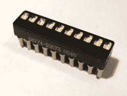

# 在 70 年代，日光可读的条形图显示器并不便宜

> 原文：<https://hackaday.com/2018/11/11/a-daylight-readable-bar-graph-display-in-the-70s-wasnt-cheap/>

The driver board with display attached; the row of lamps is visible on the right hand side.

led 并不总是显示器和指示器的简单解决方案。[Industrial Alchemy]的精英们分享了一种设备的照片，展示了在 70 年代制作高亮度条形图显示器所付出的努力和成本，当时 led 既昂贵又不太亮。让显示器在日光下可读并没有什么奇怪的材料或方法，但它揭示了解决我们今天认为理所当然的问题有时是如何花费大量费用和精力的。

显示器是一排 28 个小白炽灯泡，安装在一个印刷电路板中，并容纳在一个加工铝框架中。金属外壳的顶部和前面都有观察灯泡的孔，这使得该装置可以安装在不同的方向。它被做成一个可更换的模块，它的 56 个机加工的金插脚与驱动板上的插座相匹配。驱动板本身由 14 个 LM119 双通道比较器组成，每个比较器控制显示器上的两个灯泡。

一个 Wamco minitron 条形图显示的例子。每个窗口包含一个白炽灯丝。【来源:industrialalchemy.org】

【工业炼金术】认为显示单元本身可能以其自己的方式有点黑客。根据驱动板的引脚间距和尺寸，他们认为它可能是为了容纳一排称为 Wamco minitron 条形图显示器的模块化单元而设计的。这里有一个例子:它们类似于蘸片，可以并排叠放，形成任意长度的显示屏。每个窗口都有一个白炽灯丝，放在一个反射井中，每盏灯都可以单独控制。

这些 minitron 条形图单元只能从顶部查看，显然成本高，可用性低。尽管需要做大量的工作，但避开这些限制可能是值得的。

多年来，显示技术发生了许多不同的变化，你可以在[马戏钟](https://hackaday.com/2018/01/03/celebrate-display-diversity-for-a-circuit-circus-clock/)的一个地方看到许多这样的例子，它用不同的技术告诉每个数字的时间:一个[谢妮](https://hackaday.com/2013/11/07/homemade-nixie-tubes/)，一个[努米顿](https://hackaday.com/2018/08/16/a-surprisingly-practical-numitron-watch/)，一个 7 段闸流管，一个 VFD，一个 LED 点显示器，一个[背投显示器](https://hackaday.com/2018/01/07/retro-rear-projection-numeric-display-gets-a-teardown/)。