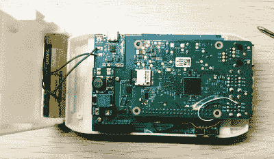

# 一个神奇的树莓皮掌上电脑刚刚变得更好

> 原文：<https://hackaday.com/2020/04/09/a-fantastic-raspberry-pi-handheld-just-got-better/>

去年，我们带来了[rahmanshaber]的《MutantC》一书。Raspberry Pi 掌上电脑的灵感来自经典的 T-Mobile Sidekick，带有滑动显示屏和物理 QWERTY 键盘。这个设计有点粗糙，缺少一些关键的功能，但是很明显这个项目有很大的潜力。

今天，[我们很高兴地宣布[rahmanshaber]正式发布了 MutantC_v2](https://mutantc.gitlab.io/mutantC_V2.html) 。看起来这款掌上电脑的新版本，也许更适合归类为超移动个人电脑(UMPC)，成功地解决了原版中发现的一些缺点；因此，如果你去年没有建造 3D 打印机，你现在可能要开始预热 3D 打印机了。

 对原始设备的主要改进是包含了电池，这使得该设备真正具有移动性。这是我们提到过的[【rahmanshaber】在发布第一个版本](https://hackaday.com/2019/09/30/meet-mutantc-your-raspberry-pi-sidekick/)时所做的工作，因为这无疑是社区中最受欢迎的功能。我们当然不会说微型掌上电脑如果必须拴着就完全没用，但毫无疑问，能够随身携带是最理想的。

这个设计的升级版本现在也正式支持 Raspberry Pi 4，这是以前[rahmanshaber]由于过热的担忧而反对的。在每个黑客最喜欢的 Linux 单板计算机的最新和最伟大的版本中插入插槽肯定会将事情提升一个档次，尽管我们想象旧的和不太耗电的 Pi 迭代将足以完成你可能在这样的小工具上做的那种任务。

如果你喜欢在你的工作台触手可及的地方拥有一台小巧的 Linux 电脑的想法，但不一定致力于建造像 MutantC、[这样的东西，你肯定可以从](https://hackaday.com/2020/03/13/this-compact-pi-terminal-will-show-you-the-way/)开始更简单的设计。

 [https://www.youtube.com/embed/XMayyOv0mS8?version=3&rel=1&showsearch=0&showinfo=1&iv_load_policy=1&fs=1&hl=en-US&autohide=2&wmode=transparent](https://www.youtube.com/embed/XMayyOv0mS8?version=3&rel=1&showsearch=0&showinfo=1&iv_load_policy=1&fs=1&hl=en-US&autohide=2&wmode=transparent)

