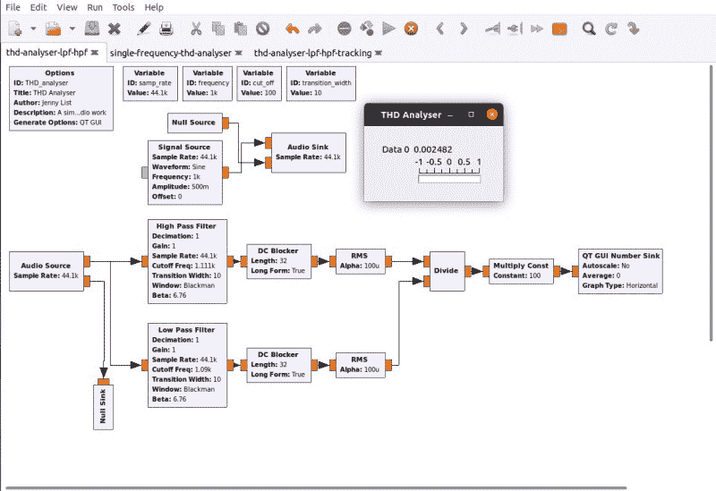

# 我最喜欢的几样东西:业余无线电

> 原文：<https://hackaday.com/2021/01/21/a-few-of-my-favorite-things-amateur-radio/>

Hackaday 的员工中有相当数量的作家也持有业余无线电执照。我们本质上是硬件爱好者，所以我们喜欢自制的收音机，当我们在高频率下工作时，我们最开心了。

业余无线电是一个多方面的爱好，有太多令人难以置信的有趣之处。遗憾的是，作为一个社区，我们有时会在争论细节时陷入负面情绪。所以今天我们来谈谈业余无线电爱好中我最喜欢的几件事。我希望你会觉得它们有趣和有娱乐性，并在下面的评论中分享你自己最喜欢的东西。

## 小型自制收音机

This book was where it all started for me.

竞赛和灾难准备可能会让我冷淡，但当涉及到无线电时，在最小程度上有魔力。20 世纪 70 年代的某个时候，我对电子学的了解是以最简单的收音机的形式出现的，当时我爸爸给我买了一本乔治·多布斯的《制作晶体管收音机[】的书，并向我展示了如何制作一台水晶电视机。如此少的零件可以组成一个工作的收音机，从空气中提取信号并进入我的耳机，而不需要电池，这足以让一个 9 岁的我着迷。](https://hackaday.com/2017/02/03/books-you-should-read-making-a-transistor-radio/)

将它升级为锗晶体管[再生接收器](https://hackaday.com/2017/02/01/everyone-should-build-at-least-one-regenerative-radio-receiver/)让我走上了大学道路，获得了电子工程学位，并最终在 Hackaday 写作。从字面上来看，用相对较小的材料制造的收音机可以打开整个世界，尽管我有时[对这种设计有点墨守成规的趋势感到愤怒](https://hackaday.com/2017/12/07/radio-amateuring-like-its-1975/)，但极简主义收音机没有理由不能与时俱进。声卡 SDR [的正交前端可以由一堆 74 系列芯片](https://hackaday.com/2017/05/16/if-the-i-and-q-of-software-defined-radio-are-your-nemesis-read-on/)制成，这是一个特别吸引人的例子。

## 报废电视是射频设计的必由之路

A UHF construction kit in every dumpster

我拿到业余无线电执照还是在很久以前，当时英国贸易和工业部只发放两种文件。有 A 类执照或 B 类执照，区别在于前者你必须通过莫尔斯电码测试，但可以使用高频波段，而后者你没有莫尔斯电码，但被限制在 144 兆赫及以上。因此，老人们可以在 80 米上平静地谈论战争，2 米波段是一个活跃的地方。

我对莫尔斯电码毫无兴趣，所以我有一个 B 级执照，因为无线电建设是我的热情所在，所以现在我开始建设甚高频和超高频波段。我没有成年人的预算，所以我的零部件供应仅限于我能从废弃的消费电子产品中获得的东西，这意味着大量 20 世纪 70 年代的 PAL 电视机和偶尔出现的早期型号的录像机。有大量支持 VHF 的电感器和晶体管，每个电视调谐器和 VCR 调制器都有一组支持 UHF 的晶体管，所以 2 米和 70 厘米波段都在我的掌握之中。

在所有这些回忆中有一个明智的观点，它来自于 RF 设计技术的彻底基础。RF 被许多工程师视为一门黑暗的艺术，虽然在这些频率上肯定有一些设计元素会渗入到复杂的设计中，但一旦你对基础有了感觉，它就很容易掌握。当你通过用铜线和马口铁组装带状线电路来学习带状线电路时，你会学到很多关于屏蔽、阻抗、路由和相邻电路之间的相互作用的知识。当然，很容易出错，但在有烙铁的介质中，尝试替代设计直到性能提高也同样容易。如此多的 UHF 和更高的 RF 电路现在被封装到硅中，以至于我摆弄的晶体管电路类型已经变得相当过时，并且你的 UHF 工作更可能在 PCB 上而不是一块马口铁上，但同样的原理也适用。我想念 70 年代废弃电视机上的 BF180 射频放大器晶体管。

## 作为数字游乐场的 SDR

自制 RF 修补程序的时代可能已经结束，至少以我开始的方式。在 21 世纪 20 年代，处于无线电前沿的人不太可能摆弄分立晶体管电路，除非他们可能正在研究毫米波长的极其奇特的器件。这都是软件定义的无线电，不透明的黑色塑料盒，在计算机上提供有用的无线电体验，但仅此而已。不再自制，不再修补。

This would have taken a long time to build and get right as physical components.

你可能会同意前一段，但 SDRs 为我提供了另一个我最喜欢的无线电方面的东西，即使用 GNU Radio，我现在有了一个通用的数字信号处理平台。再加上一个非常便宜的 RTL-SDR 棒，它让我能够在我的电脑上以闪电般的速度玩我过去用烙铁玩的所有相同的积木和更多的积木。我可以马上做出一台收音机，并随意改变它的参数！最棒的是，它不仅仅局限于收音机。GNU radio 可以在任何可以被其输入设备数字化的频率上工作，如果那碰巧是一个声卡，那么它也可以处理音频。去年愚人节，大多数读者可能在一英里之外就发现了我的假黄金 USB 线，但可能很少有人知道 GNU Radio 中的简单音频分析器是完全真实的。它的灵感来自于迈克·奥斯曼和凯特·特姆金的《T2》超级演唱会，如果你没有看过那场演唱会，我建议你看一看。

所以，是的，业余无线电爱好者中有很多让其他业余无线电爱好者感兴趣但从未让我感兴趣的东西，而且这一爱好的某些方面仍然可以受到合理的批评。但是业余无线电确实是一个非常广泛的领域，上面你已经看到了一些让我对它保持兴趣的事情。现在轮到你了，请在评论中告诉我们:什么样的收音机能帮你做到这一点？