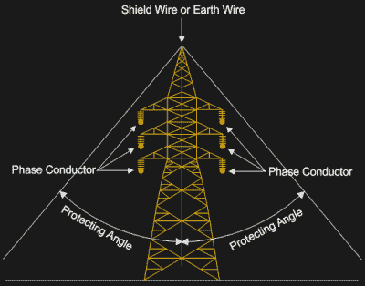
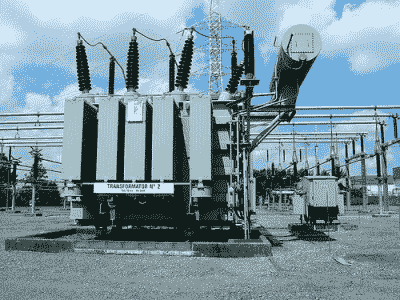
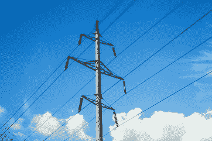
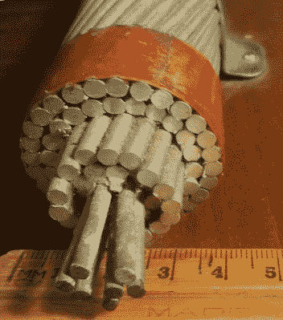
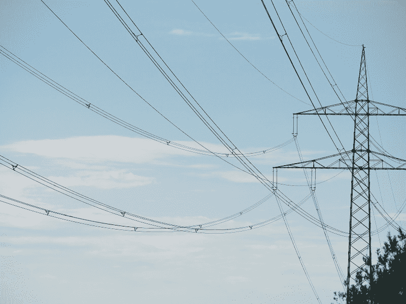

# 传输线现场指南

> 原文：<https://hackaday.com/2019/06/11/a-field-guide-to-transmission-lines/>

无论你住在哪里，电网都是一头复杂的野兽。发电厂必须以恒定的频率和电压向所有客户输送能量(无论任何时候的需求如何)，为此他们需要大量的设备。从变压器和电压调节器到线路电抗器和电容器、断路器和熔断器，以及固态和专用机械继电器，几乎工程的每个分支都可以在电网中找到。当然，我们不应该忽略网格中最明显的部分:实际上构成网格本身的电线。

## 输电线路和配电线路的区别

组成电网的电力线通常有两种类型，可以根据它们的功能进行划分。一组由较小的低压线路(大多数情况下低于 30 千伏)组成，为家庭和企业输送电力。这些被称为配电线路，可以埋在新社区的地下，或者挂在大约 40 英尺高的小电线杆上。它们上面的能量传送线的数量是三条或更少(每条电路，一些配电杆传送不止一条三相电路),并且它们还倾向于在其上保持其他设备，例如变压器、保险丝、开关，甚至电话线和电缆线。

A simple sketch of a transmission line, with three phases per circuit and a single ground wire at the top. This illustrates the area and equipment which are protected from lightning strikes by the ground wire which is only designed to carry energy in the case of a fault like a lightning strike.

这种划分的另一面是更大、更高电压的输电线，称为输电线。通过其较大的尺寸，可以很容易地将它们与配电网区分开来，但还有一些其他指标表明，你看到的是输电线路，而不是配电线路。传输线总是由三根导线组成，在结构顶部有一根或两根可选的小导线作为防雷保护。虽然典型的住宅服务可能只包括单相，但电网本身是一个三相系统，输电线路经过精心平衡，因此三相上的电流量相等。

传输结构上也没有任何连接到电力线的设备。配电线路可能有保险丝、变压器、电压调节器、电容器、[自动开关](https://en.wikipedia.org/wiki/Recloser)或任何数量的其他设备连接到电力线本身。传输线几乎不会有任何东西附着在导体上，尽管有时不相关的设备会附着在像手机信号塔这样的结构上。

## 应对难以置信的电压水平

发电机升压变压器
【图片来源:[电工](https://www.electrotechnik.net/2015/07/generator-step-up-transformers-overview.html)

输电线路相对简单的部分原因是，它们的唯一目的是连接变电站和其他变电站，并提供大容量电力输送。每个常规发电厂至少有一个变电站，变电站配有称为发电机升压变压器(GSU)的专用变压器。电力从那里流向其他变电站，这些变电站可以进一步提高电压以进行远距离传输，或者降低电压以分配给家庭和企业。然而，在电厂，电力是在低压(大约 10 千伏)下产生的，并通过 gsu 输送，以提高电压。对于给定的能量，较高的电压会降低电流，从而减少导线中的电流量，减少导线产生的热量，并减少电阻损耗。

这是电压开始有点失控的地方。如果你注意到了，到目前为止，我将 10 kV 称为“低电压”，将 30 kV 称为“更低电压”，大多数工程师或业余爱好者都无法安全处理。在任何其他世界，这些将被认为是极高的电压。然而，对于处理大容量电力的输电线路来说，电压可能高达 500 千伏，但仍能输送数千安培的电流。举例来说，这对于将能量从 40 亿瓦的核电厂输送到数十或数百英里外的人口中心是必要的。不过，要让所有的电力都运转起来而不造成重大问题，需要一些特殊的设备。

## 传输塔

从下往上，第一件设备是电路要连接的杆或塔。这些建筑可能有 50 到 100 英尺高或者更高(世界上最高的建筑在中国超过 1200 英尺高),由于高度的增加，生产成本会很高。从价值的角度来看，平衡结构的强度和结构本身的总数是有意义的。这种经济的方法往往会导致电压等级较低的线路(60-200 kV)的塔间距为八分之一英里或更小，而电压等级较高的线路(如 500 kV 线路)的塔间距高达四分之一英里。支撑四分之一英里长的钢丝也不容易，尤其是如果电路转弯，或者如果它穿越山脉或其他障碍。

为了获得所需的强度，一些输电线路建在格子塔上。这可能是最常用的跨越景观的传输线路结构，因为建造它们相对便宜，并且它们可以根据情况的需要很容易地设计成不同的高度和强度。它们也可以在最终位置组装，这使得将这些结构运送到难以到达的位置变得容易，例如偏僻的山谷或人烟稀少的沙漠。然而，也有一些不利之处。在某些情况下，格构塔不是最坚固的可用结构，占地面积大，通常无法适应城市环境，在某些情况下，钢可能是非常糟糕的材料选择，特别是在盐雾的沿海地区或高湿度的沼泽地区。

 [![Steel transmission pole [Image Source: Bajaj Electricals Ltd.]](img/f597c152c77d3c1cf0e96d72d2fb5a1c.png "steel-transmission-pole")](https://hackaday.com/2019/06/11/a-field-guide-to-transmission-lines/steel-transmission-pole/) Steel transmission pole [Image Source: [Bajaj Electricals Ltd.](https://www.bajajelectricals.com/power-transmission/monopoles/)]  Concrete transmission pole

为了弥补格构塔的缺点，还有其他结构可供选择。当强度是优先考虑的因素时，一个流行的选择是由混凝土和预拉伸钢筋制成的电杆。混凝土电杆在易受飓风袭击的地区具有优越的性能([和令人惊讶的柔韧性](https://www.youtube.com/watch?v=b_zE_md-Axc))，比类似高度的格子塔占地面积更小，也更容易安装。缺点是它们通常更贵，而且必须用专门的设备建造，然后用卡车运到现场。钢杆也可以用类似混凝土的性能特征来生产，有些甚至是用一种叫做耐候钢(有时称为 corten steel，一种商标名)的特殊合金建造的，这种合金只在杆的表面形成一层保护性的锈层，保护下面的结构钢。钢的另一个优点是，对于最大的传输线，它可以更容易地生产具有多个电极(通过某种横担支撑电线)的结构。

## 高压绝缘体

连接到塔上的是电线，但是为了防止大规模的直接故障，电线必须用绝缘体连接到塔上。然而，在这些电压下，仅仅一块简单的玻璃或塑料不会切断它，因为空气本身会被电离，并形成电流流动的接地路径。需要能够承受巨大电压的特殊绝缘体。在现代聚合物工业出现之前，长长的玻璃“钟”链被串在一起，附在塔上。这些绝缘体沉重、昂贵、易碎，并且需要一些时间在现场组装。现在有了更先进的绝缘体，通常是一片塑料橡胶聚合物，既足够坚固，可以承受电力本身，更不用说电力线的极端重量和张力，又足够长，可以防止周围的空气电离到塔的完整电路。事实上，根据绝缘子的长度，通常可以对线路电压做出相对准确的估计。

## 非常坚固的电线

An example of an ACSR (aluminum cable, steel-reinforced) transmission line. The center strands are steel, with aluminum outer strands. [Image by ClarkMills](https://commons.wikimedia.org/wiki/File:Sample_cross-section_of_high_tension_power_(pylon)_line.jpg) CC BY-SA 3.0

可以想象，在长达四分之一英里的跨度上架设数百英里的实际电线的逻辑会变得有点有趣。

大多数优质和/或经济有效的导体的抗拉强度通常达不到这一任务，因此发现了一些有趣的解决方案来降低成本和电阻损耗，而不会将电线拉伸到其断裂点。钢在满足这些需求方面没有问题，但与铝或铜等其他金属相比，钢不是一种非常有效的导体。为了更好地利用电线，有些电线采用绞合钢芯，然后用铝外层包裹，以提高其导电能力。交流电的一个有趣特征是，电流往往在导体的外表面上流动，而不是均匀地通过整条导线，这意味着混合金属的导线可以获得钢的所有强度，同时具有固体铝的几乎所有导电性。

当然，基于流过线路的电流量，不同的传输线路将具有不同的厚度。这些线路的一个主要设计考虑因素是它们在重负载下会“下垂”多少，因为它们承载的电流越大，它们会变热并膨胀得越多，并且导线会更接近地面。在某些情况下，超负荷的输电线路会因高温而下垂，导致树木或输电线路上的其他物体发生故障，并导致大面积停电。

A typical transmission line with bundled conductors, these with three wires per phase.  Photo:  Kreuzschnabel/Wikimedia Commons, Licence: Cc-by-sa-3.0

对于给定的电流量，较粗的导线发热较少，增加了电路的载流量。增加导体有效厚度的一种解决方案是将几个导体彼此分开几英寸“捆”在一起，与尺寸简单翻倍的导体相比，允许以更低的成本更大幅度地增加电流。

## 越来越不寻常的输电方式

此处介绍的传输线概述有几个值得注意的例外。首先，并不是所有的输电线路都附着在塔或杆上。一些埋在地下，尽管专用绝缘导线的成本比架空结构贵几个数量级，因此只安装在有极端需求的地方，如城市地区、河流或渠道下，或任何建造结构成本过高的地方。由于交流电行为的[问题，也几乎不可能构建一条超过约 40 英里的线路，导致这些类型电路的设计限制更多。](https://circuitglobe.com/charging-current-in-transmission-line.html)

A crossing of two HVDC circuits in North Dakota. [Image by Wtshymanski](https://commons.wikimedia.org/wiki/File:HVDC_Crossover_North-Dakota.jpg) CC BY-SA 3.0

输电线路的第二个不规则之处是高压直流电路(HVDC)。由于从交流电到 DC 的转换成本很高，这些线路只在需要将电力输送到非常远的地方时才修建。DC 线不是三根导线一组，而是两根导线一组。它们还不受困扰交流输电线路的充电损耗的影响，这也允许建造更长距离的地下电路。

## 提高技术水平的障碍

展望未来，很难说电网还能现代化到什么程度，因为基本原理非常简单:每个电路三相，结构足够大，以防止它们陷入可能导致故障的东西。有很多关于智能电网的讨论，但电力系统大多数问题的解决方案往往只是随着电力需求的增加而建造更多的电路。这是一个很难解决的问题，尤其是随着电网本身的老化，在某些时候，这就变成了一个数字游戏，看有多少瓦特可以从一个地方转移到另一个地方。